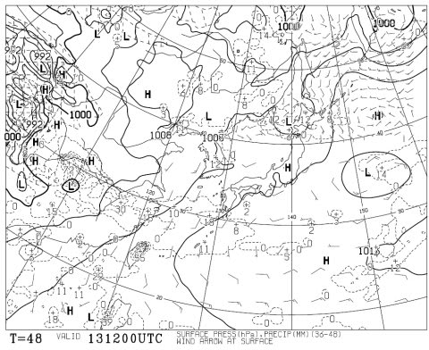
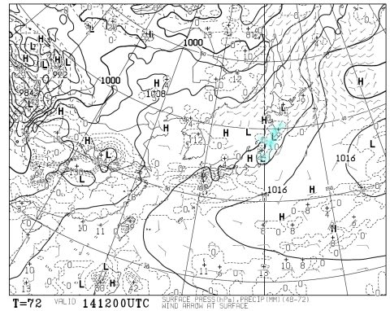

# 今シーズンラスト！今週末の月山の天気は…微妙…

📅 投稿日時: 2015-06-12 00:51:28

ということで．

今シーズンも，長らく続いたスキー天気予想ですが．

大変悲しいことに，雪が少ない今年．

おそらく今週末が，私にとって今シーズンラストの

スキーとなりそうなので．

…スキー天気予想も，今回が今シーズンのラストとなりそうです…

＃ってか，もうスキー天気予想なんて見る人いないだろ←自己突込み

とりあえず．

天気予想を見たい人がいなかったとしても．

この週末の天気図を見てみるのだ．

…土曜の地上天気図はこんな感じなので…

まぁ，雨は降らなさそう．

ふーーむ．

朝のうちは雲（ガス？）が残るかもしれないけど…

昼間は時々日が射す，晴れたり曇ったりの天気かな…

気温自体は平年並みなので，晴れれば暑いよ！

…曇れば，ちょいと肌寒く感じるかも…

で．

日曜の地上天気図はこんな感じで…

水色で塗ってみた，降水が予想される領域．

…大変残念ですが，山形にかかってます（涙）．

…だもんで．

朝のうち日が射すタイミングもあるかもしれないけど．

基本的には曇り．時々雨，かな…

ヘタすると，時折ざっと降るかも…

もう少し，あと少しだけ低気圧が北に行くと

雨が降らずに済みそうなんだけど…

ということで．

まとめると．

土曜：朝は曇り．山頂はガスかも？午前中に晴れはじめるかな．

　　曇ったり晴れたりの天気．気温は晴れれば暑く感じ，日が陰るとちょっと肌寒い．

日曜：朝は麓は日が射してるかもしれないけど…

　　基本的に曇り．山頂は時折ガスがかかるか？？

　　時折雨がザっとふる可能性も．

　　この日に月山に行く人の日ごろの行いが良ければ，

　　雨に降られずに済むかも．

…という感じで．

今週末，月山に滑りに行く人は．

くれぐれも日常の行いにご注意ください．

＃今回もこのオチかっ！←とりあえず自己突込み
