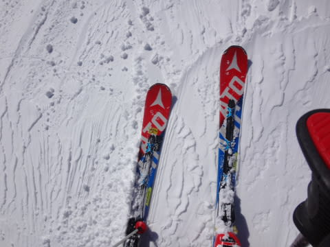
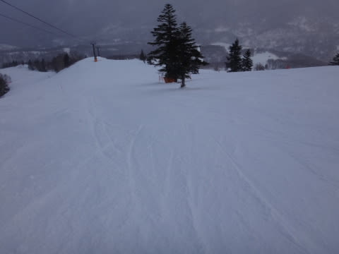

# 1月22日（日）の志賀高原詳細レポート…雪よし，天気よし，ガラガラの3拍子．ふはははは！最高！最高だよ！

📅 投稿日時: 2017-01-24 02:26:13

どうやら，本日．

日曜の帰りごろから降り始めた雪が

結構積もって．

またまた本日の志賀高原は．

パウダーデーだったようですね…

そして．

今晩もかなり積もりそうなので．

明日もまたパウダーデーになりそう！

いやー．

焼額の公式積雪も3mに達しようとしているので．

これで今年は雪不足の心配もなくなったかな？？

ってことで．

昨日速報した，日曜の志賀高原．

詳細モードでのレポートへ参りましょうか…

とりあえず．

日曜の朝は，すっきり晴天でスタート！

朝イチでラブゴンをGetでき，

うーん．

今日はいいことありそうな予感っ！

で．

山頂に出ると…

気温はマイナス9℃ですか．

…昨日ほど寒くはないけど．

最高雪質を保証してくれる冷え冷え具合っ！！

で．

すっきり晴天のゲレンデへ，いざ行かんっ！！！

…今日は，別料金のファーストトラックが開催されていたので．

ピカピカまっさらシマシマではなかったけど…

…でも…

これは…

ふははははははははははははははははははははっはははは！

これは…

これは，笑いが…笑いが止まらんよっ！！！

シーズンにそう何度もないレベルの，

いい感じに締まって，最高にエッジが食いつく．

激烈快感脳内麻薬出まくりハイスピード圧雪バーン！！！

あぁ…

この世にこれ以上の快感があるだろうか…！

シマシマバーンをかっ飛ばす，

この悦楽…

んもう，シアワセ！！

なんにしろ，天気は最高！

そして，シマシマタイムが終わって．

午前11時近くになっても…

まだバーンは完全フラット！

そして，雪質は最高のままなので…

お昼近くまで，大回り板で超気持ちいい

ロングターンを楽しめましたよ～！！

なんて…

何てシアワセなんだろう…

そして．

ゴンドラ待ちは，一回だけ駅舎の外にまで待ちが

あったタイミングもあったけど．

それ以外は，ほぼ待ちなしで乗れるほどの

ガラガラなんですけど…！

いいの？

こんなに晴天，最高雪質の日に．

ゲレンデが，こんなにガラガラでいいの？？

さらに．

午前11時半を過ぎると…

ゲレンデにホントにに人がいなくなっちゃったんですが？？

なんで？

何で，こんなバーンを貸し切りで滑れるの？？

＃焼額，経営大丈夫か～っ！？？？

おかげで…

いつまでたっても最高雪質のフラットバーンを

飛ばしたい放題！

こんなシアワセなコンディション，シーズンそうそう

なかなかないよ！

気温は，昼も-5℃までしか上がらず．

そのおかげで．

日差しが降り注いでいるにもかかわらず．

午後まで，雪質は最高級ハイグレードプレミアムシルキースノーを

キープしてくれて…

それでこんなガラガラなんだから．

もう，シアワセすぎるんですけど！？？

で．

この日は．

ちょいと理由があって，午後は奥志賀に旅立ってみましたが…

午後2時過ぎのエキスパートコース．

ちょっと雲が増えて来ましたね～．

コースはちょっと凸凹してましたが．

でも，午後のエキスパートコースとしては，

この程度の凸凹なら，かなりフラットな方かな～．

そして．

午後3時ごろには…

あら．

ちょいと雪がぱらつき始めてきましたか…

その後，焼額に戻り．

さすがに，夕方のゲレンデは多少凸凹してましたが…

でも．

まだまだ問題なく大回り可能！

夕方ラストまで，人のいないGSコースを．

気持ちよくかっ飛ばし続けたのでした…

…ってことで．

本日は．

天気よし，雪質最高，ガラガラ，

ゲレンデは荒れず，夕方まで大回りしたい放題で…

もうホントに．

最高の一日でした！！

あぁ…

これから毎日，ずーーーっとこんなコンディションが続くと

いいなぁ…←いや，毎日こんなガラガラだったら，焼額つぶれちゃうから

PS.

この日の午後．

焼額の呪いを乗り越えてまで，なぜ奥志賀に行ったかというと…

[この素晴らしいキレキレターンをする少女](https://www.youtube.com/user/Bathurstdream)を探しに行ったのですが…

残念ながら，会えずじまい（ちょっと涙）．

いやーーー．

この娘に会ってみたい！！

＃というより，このお父さんにぜひお会いしてみたい…

## 💬 コメント一覧

### 💬 コメント by (つーちゃん)
**タイトル**: Unknown
**投稿日**: 2017-01-24 13:10:11

いやーほんとにあの娘は上手いですよね

加えて楽しそうに滑るのが良い！

私も見かけた事はあるのですが

声を掛けるには至ってません

### 💬 コメント by (KENKEN)
**タイトル**: あの少女は・・・・・
**投稿日**: 2017-01-24 22:39:04

週末は最高でしたね。

自分は土曜の新雪も意外と楽しんでました。

自分も奥志賀で偶然に”キレキレターン少女”をリフトから見ました。

志賀高原で多くのスキーヤーを見ましたが

この娘には一瞬で目を奪われました。

ＳさんとＧokuさんとこの娘のトリオ動画を見てみたいです。

### 💬 コメント by (Goku)
**タイトル**: Unknown
**投稿日**: 2017-01-25 00:11:25

日曜日は涙物の超しあわせな一日でしたね～。

奥志賀の女の子と一緒に滑った動画を近々youtubeにアップ予定です。

しかし、あの子についていくには小回りスペシャルが必要です(笑)

Sさんの動画も昨日アップしたもの以外にも素材があるので、追々編集してアップしますね。

お楽しみに！

### 💬 コメント by (Skier_S)
**タイトル**: 最高の週末でしたね！
**投稿日**: 2017-01-25 00:37:02

＞つーちゃんさま

いやー．

ビデオ見てると気持ちよさそうですよね～！！

ぜひ一度，一緒に滑ってみたいところ…

＞KENKENさま

土曜の新雪，ちょいと重めでしたが

私も楽しんでました（笑）

しかし，KENKENさんもキレキレ少女さん，

ご覧になりましたか！

たぶん，実際に見るとかなりインパクト

あるでしょうねぇ…

＞Gokuさま

いやーーーー

ほんとに涙ちょちょぎれレベルの最高週末でしたね！

…動画ありがとうございました！

もう，何回も繰り返し見てます…

しかし．

自分の滑り，特徴ありすぎですね（笑）

我ながらなんというか…傾いてる（＾＾；

あと，撮影者がぴったり私の真後ろに

つき続けているところがすごいです（感動）

追加素材，楽しみにしています～！！

