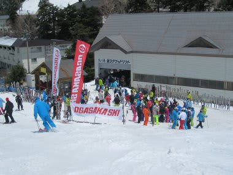
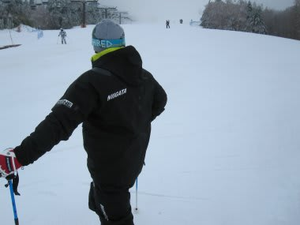

# この週末はオガサカキャンプに参加してきたのだが

📅 投稿日時: 2012-05-16 02:16:25

ってことで．

実は．

この週末，OGASAKAキャンプに参加していたんですね～．

このOGASAKAキャンプ．

1泊2日で，オガサカチームのトップ選手にスキーをじっくり

教えてもらえるだけでなく．

同時にオガサカスキーの試乗もできて，

さらに夜は講師の皆さんをまじえての宴会で盛り上がり，

さらに商品争奪じゃんけん大会で白熱するといった．

(シーズン最後なので，選手の皆さんが実際に使った

　ストックやらゴーグルやらが放出される！)

かなりおいしいキャンプです．

で．このキャンプ．

GW過ぎてのキャンプということもあり．

シーズン中では絶対一同に介すことのない，

すさまじいレベルの講師陣が集まるんですね～．

今年は，デモ＆元デモだけで，

佐藤久哉さん，猪俣一之さん，岡田慎さん，徳竹剛さん，

竹田征吾さん，佐藤秀明さん，藤田順子さん，太田真由美さん…

といった顔ぶれ．

うーん．

なんて贅沢な講師陣なんでしょう…

私は昨シーズンからオガサカに返り咲いたS藤T和さんの班になったんですが．

いやー．

実に．

新鮮なレッスンでした…

目的は，しっかりとエッジングできる，ハイスピードで

強い滑りを目指す，ってことで．

「スキー操作は外足！」

「外足は，股関節よりひざ，ひざより足首が後ろ．

　それが板にしっかり加重できるポジション」

「内足に乗らない．内足をたたむ動作は『腰を落とす』

　ではなく，『足を引き上げる』．立った姿勢から

　足を上げると足首が前に行く．内足はその位置が正解」

「…つまり，内足が前，外足が後ろに行く前後差が出る」

「ターン後半までしっかりエッジングする．早くからエッジを

　外さない」

「切り替えは山足に乗ってから！」

…という，某S○Jの方針とはかなり異なるものでした．

まぁ「楽なスキー」と「しっかりエッジングした強いスキー」

という，目指すものがまったく正反対なので，まったく違う運動になる

理屈ですかね．

まる2日間，じっくりとレッスンを受けましたが．

いやいやこれがどうして．

なかなか驚きの連続で，得るところが多いレッスンでした…

スキーってのは，正解はひとつじゃなく，いろんな方向性が

あるんだなぁ…

やっぱりスキーは奥が深い．

でも．

この滑り．

私の[スキー仲間](http://blog.goo.ne.jp/suma_shikao)が主張している滑りそのものだったので．

ちょっとびっくり．

## 💬 コメント一覧

### 💬 コメント by (HT)
**タイトル**: Unknown
**投稿日**: 2012-05-16 12:12:11

呼ばれて飛び出てジャジャジャジャーン♪

さすがS藤T和・元デモ、分かってらっしゃる

冗談です、ごめんなさいごめんなさいm(_ _)m

しかしSちゃんまだ滑るの～？

### 💬 コメント by (Skier_S)
**タイトル**: まだまだ滑りますよ～
**投稿日**: 2012-05-17 00:24:47

いやー．

4月下旬に一緒に滑ったときに言われた前後差滑り

そのものだったので，びっくりしましたよ．

股関節の前の筋肉をストレッチするような感じで

外足を伸ばしていき，ターン中は太ももを内旋させるとのこと．

で．

今週，来週とかぐらで滑ってます～

シーズンはまだまだ続きますよ～

