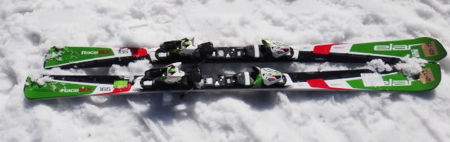
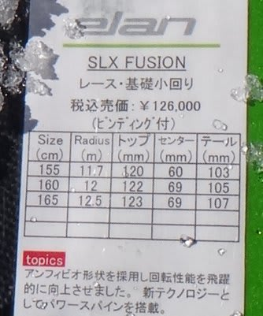
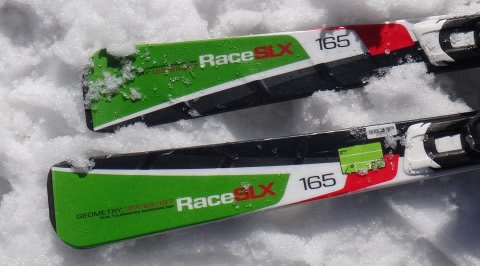

# これで一区切り！2014シーズンモデルのスキー試乗レポートその7…ELAN編

📅 投稿日時: 2013-04-04 00:28:32

えー．

3月16日に試乗した板のレポートは，これで一区切り．

でも．

来週からは，この週末の試乗会で乗る板のレポートが始まる予定…

では，今回はELAN編です．

どうぞ～

----

○ELAN RACE SLX Fusion 165cm

SL競技用．

なんと．

ELANは競技板にも，アンフィビオ形状を採用してきましたね～．

このアンフィビオ形状とは，インサイドがキャンバー，アウトサイドが

ロッカーという，[微妙にねじれた形状の板](eac5c46fe8db23369670dbe0a13823556.md)なんですが．

これは…

面白い．

くるくる回る．

基礎用小回りよりまわる．

こんなに回っていいの？ってほど回ります．

わずかに傾くだけで，エッジがカツンとグリップして，

くりんくりん回っていきます．

超オートマチック．

R=10mとか，その程度では？ってほど．R=12.5ってよりずっと小さく感じます．

トップからテールまで，それも外足インサイド・内足アウトサイド共に

きれいにグリップして，エッジの線に乗って回ります．

谷回りからコンパスの円のように一定半径でくるりと回っていけます．

SL競技用って，こんな回っちゃっていいの…？

当然，競技用なのでグリップレベルもスピード耐性もかなり高いです．

あまりズラシでコントロールしていく板ではないですね～．

でも，ずらす必要を感じないほど，ありえないほど小さい半径でスイスイ回ります．

うひゃー！って感じで，ものすごく傾いていけます．

小回りしかやらないってなら，ゲレンデ履きとしても面白いかと．

とても競技用とは思えない．

これは今回の試乗会での衝撃No.1板でした．
