# 2024年8月，5度目の子連れモアルボアル，コロナ後初の海外へ！その6…朝ごはんを食べたら，ダイビングショップへ！

📅 投稿日時: 2024-10-12 00:42:18

🏷️ カテゴリ: [ダイビング日記](ce3a7a8d424d112fce83ee85c81a0e344.md)

今日はご無体新幹線日帰り出張で，

それも東京から800km離れた出張先での

会議を午前中で終え，その後東京の

オフィスに戻って午後7時からの会議に

出るというご無体日程…

往復1600kmの新幹線移動を終え，

午後7時前に，帰宅する人々の流れに

逆らって駅からオフィスに向かう，

このむなしさ…

あぁ…皆さんは普通にこれから家に

帰るんですよね．

私は午前中にここから800km離れた所で

会議してて，今から出社ですよ…（涙）

と，涙を流しながら出社して，

夜からの会議に参加して．

さっき帰宅しました…

ご無体な一日だった…

今日はもう寝る！！

と言っておきながら．

いつも通り，モアルボアル旅行記は

しっかり書くのだった…

ーーー

（[前回はこちら](e76e32de38e28de6d6ae036f9faa218b8.md)）

ということで．

朝ごはんを食べに，レストランへ向かいますが…

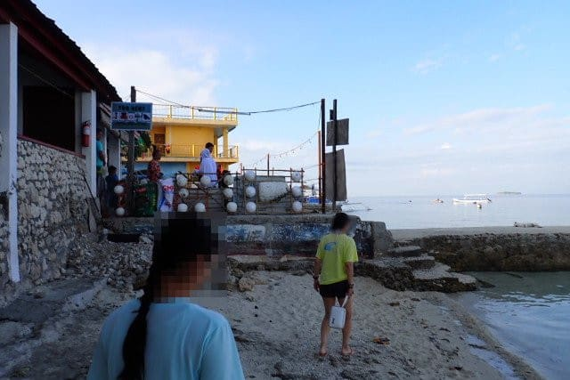

家族も，目の前に見えた水上デッキが

なくなっていることにちょっと衝撃を

受けていたようです…

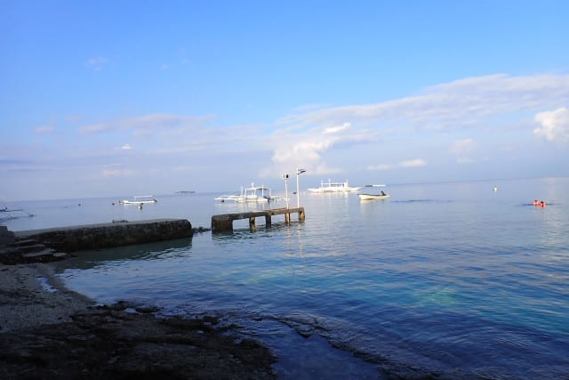

そして．

この目の前に見えていたはずの，屋根が

あったレストランスペースがなくなって

いることにも驚いてましたが．

とりあえず，今日は風もあり，屋根のない

このスペースのテーブルで食事するのはちょっと

どうかということで…

レストランの建物の中で朝ごはんを

食べることにしました．

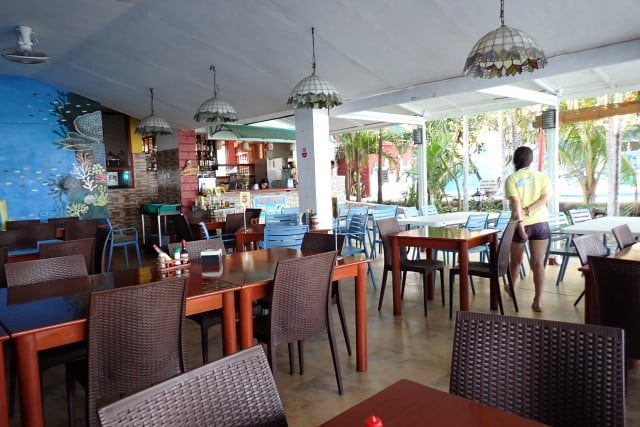

朝ごはんのメニューは…

だいたいこれまで通り，

パンと卵とベーコンかコンビーフのアメリカン，

米と卵とソーセージかコンビーフのフィリピン風，

ジャム付きパンのみの3パターンで．

以前あった，フルーツの朝食がなくなって

ますね…（涙）

フルーツの朝ごはん，おいしかったのに…

で．こいつがアメリカン．

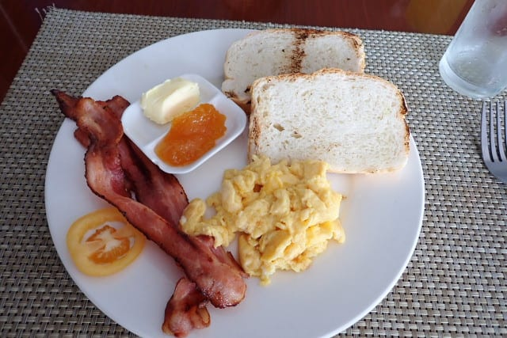

こいつがフィリピン風になりますか…

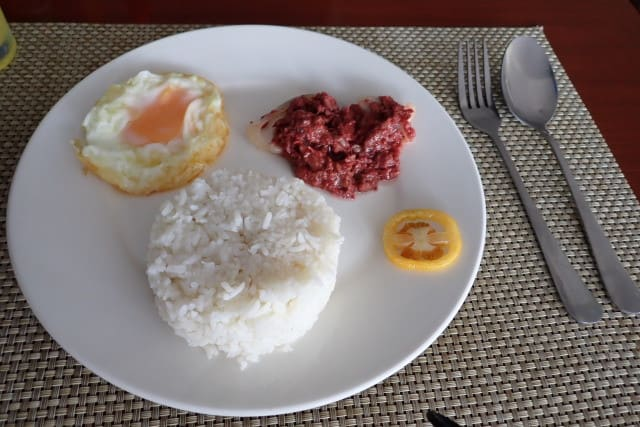

一応，建物の中からも海が見えるので，

そこまで寂しい朝ごはんではないですが．

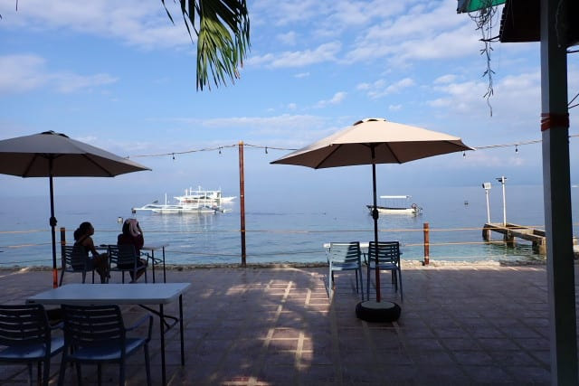

やはり食後，部屋に帰るときに，

この残骸を見ると…

ちょっと寂しくなります．

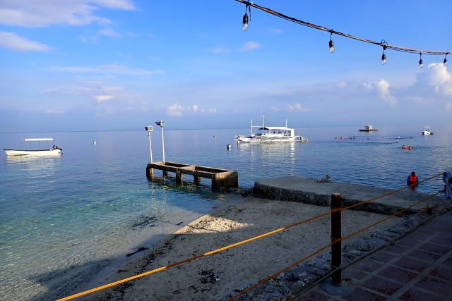

ってなことで．

食事を終えたら，8時にはダイビングショップの

人が迎えに来てくれるので…

ダイビング器材をもってもらって，

自分たちはカメラと小物だけをもって

ダイビングショップへ向かいます．

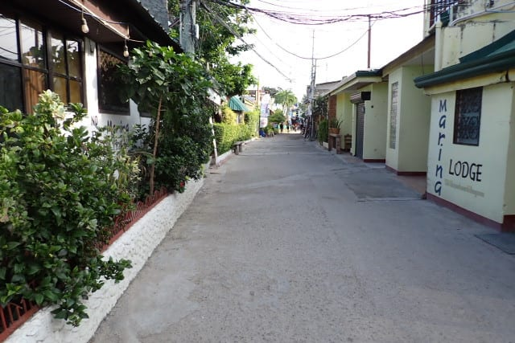

うーん．

ホテルからショップまで，徒歩2分くらいの

短い距離だけど…

この距離でも，以前とかなり店が入れ替わって

いるのがわかりますね…

ってなことで．

これもまた5年ぶりの，エメラルドグリーン

ダイビングショップへ到着！

…いや…なつかしい…

手前の建物の形が変わったらしく，

入口の場所がちょっと変わってましたが．

中身は全く変わっておらず，

相変わらずきれいな建物で

一安心…

そして．

安全についての説明やら，健康状態の

チェックシートやらを記入しますが…

日本人向けダイビングショップで，

すべて日本語なので安心！

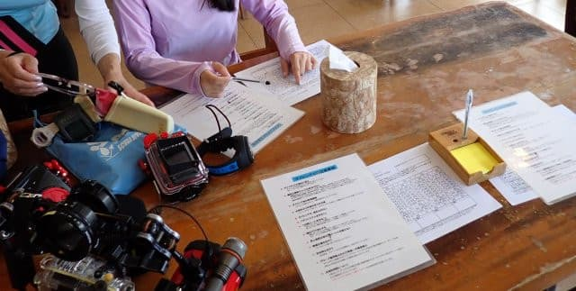

一通り手続きを終えたら，ダイビングポイントの

説明を受けて…

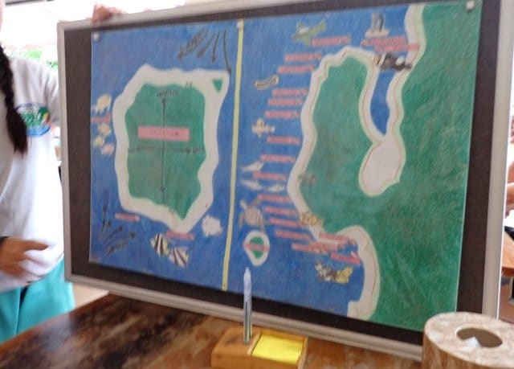

ウェットスーツを着たら．

ショップを出て．

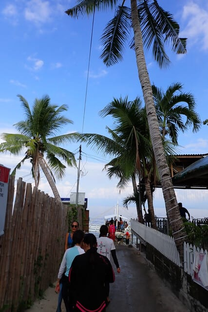

ショップからすぐの海で，ボートに乗り込みます．

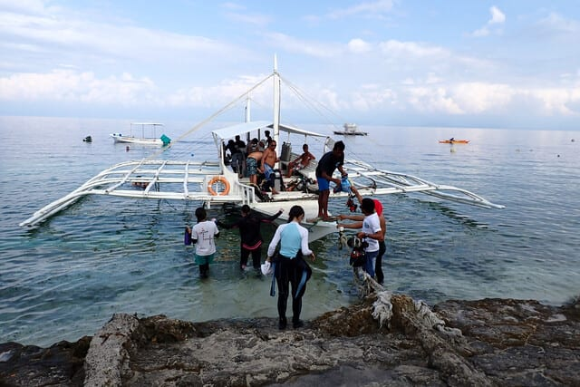

ボートに乗り込んだら…

本日一本目のポイントは，ペスカドール島．

向こうに見えるペスカドール島へ向かって，

Go！

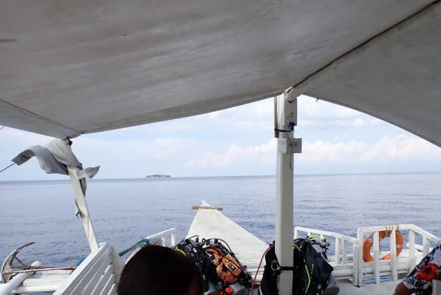

（[続く](eb4d7fe5c6cbfc110b23a2b014eb118ad.md)）

## 💬 コメント一覧

### 💬 コメント by (1kamakura)
**タイトル**: Unknown
**投稿日**: 2024-10-12 07:03:34

江戸の秋

以前の素敵さをご存知だから、なんだかな〜、ですよね。

なんか沖縄の方が素敵…ごめんなさい🙏

しかし、出張！

ハードですね。

せめて一泊して朝帰らせてほしいですね。

### 💬 コメント by (Skier_S)
**タイトル**: ＞江戸の秋さま
**投稿日**: 2024-10-12 22:55:33

うーん．

我が家で泊まったホテル，リゾート感があってよかったのですが．

モアルボアルではビーチ沿いのホテルはほとんどなくて，ダイバー向けの

「施設がきれいならOK!]ってなところが多いですね…

我が家も3人ともダイビングメインなので，次のホテルはビーチ沿いのRISATAじゃない

安いホテルにしてみようかな…と思ってます．

ダイビングの海は文句なく最高なので！

