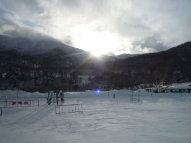
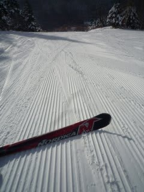
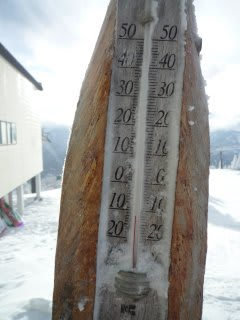
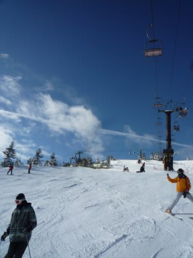

# 元日の志賀高原

📅 投稿日時: 2011-01-01 22:16:20

あけましておめでとうございます．

元日の志賀は…

午前中は穏やかな晴天でした．

2011年の初日の出です．

うーーん．

荒れる予想だったのになぁ…

期待した積雪もなし．

というわけで，朝イチパウダーはなりませんでしたが．

最高のシマシマ圧雪を楽しめました．

気温はマイナス12度とひくいけど，

風も穏やかで，太陽がぽかぽかと暖かく，

背負われている娘も寝ちゃうほど．

午前中は晴天の中，快適でした…

しかし．

午後は一転，曇りで視界が悪く，小雪も

ぱらつきます．

うーん．

どかっと降ってくれるならあきらめもつくが，

ちょっと中途半端．

リフト待ちは昨日より少ないですね．

午前中1時間ほど，焼額第一ゴンドラは10分弱

待ちになりましたが，それ以外は0－3分待ち．

やっぱり，元日はゆっくりしようって人が多いんですかね．

結局．今日も積もるほどは降りませんでした．

今も雪はやんでます．

うーん．この3日間で20cmくらいしか積もってないなぁ…

山陰は大雪らしいけど…
