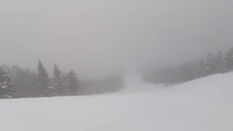
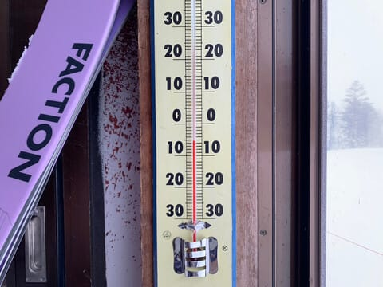
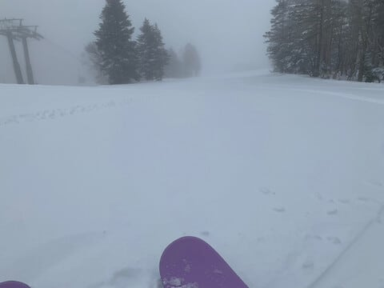
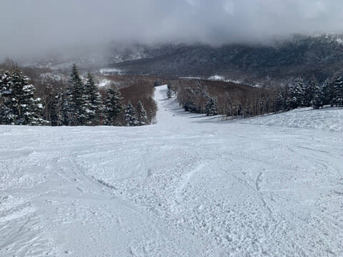
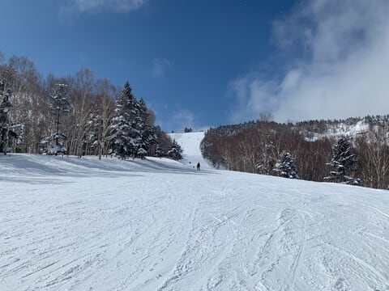
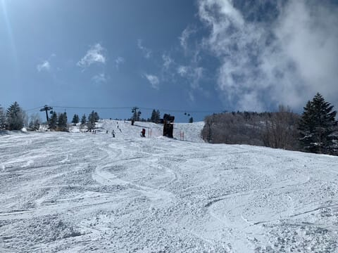
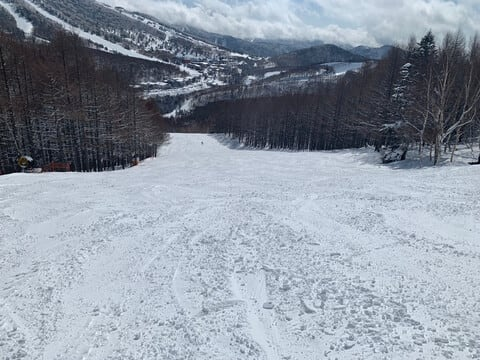
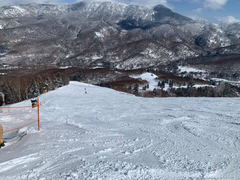

# 3月1日（金）の志賀高原スキー場の特派員情報！…朝の積雪10cm，朝は雪だけど昼過ぎから晴れ，午後は穏やかでGood コンディション

📅 投稿日時: 2024-03-02 05:25:43

🏷️ カテゴリ: [日記](cc4b5682fb7b8b144980957a978653fb0.md)

ってなことで．

今週はかなりクリティカルかつ

いろいろFatalな状況が続いているのですが．

木曜は，もしかしたら討ち死にするかも

という修羅場を何とか満身創痍で

乗り越えたものの．

まだまだ炎上案件が次々やってくるという，

大炎上祭り状態で…

もう，Blog更新するどころではなく．

(というか，今週は木曜以外毎日更新していたのは

ホントに奇跡に近い…執念のなせる業)

気づいたら夜中…というか明け方で，

またまた床で意識を失ってました…

ってなことで．

昨日はBlogを更新できませんでしたが，

本日は何とか更新！

そして，相変わらず謎の更新時間…

で．

金曜日も特派員から志賀高原の写真が

送られてきましたが…

あさイチは雪降り＆ガスで始まったらしい

本日．

あさイチの気温は-5℃と，この時期にしては

ちょいと高めの気温でスタート．

で，予想では積雪は10cm，運が良ければ

20cmという予想だったけど…

どうやら積雪は5cm程度と，そんなに

積もらなかったみたいです（泣）

そして，予想では一日雪降りで冷え冷え，

風も強めのはずだった本日．

なぜか昼頃には雲が切れて…

午後は完全にすっきり晴天になったようです…！

うぎゃーーー！！

雪も良さそうで，人も少なくて

晴天で…

うらやましい～！！！

ただ，昼間の最高気温が０℃とちょいと

高めで．

また午後は日差しも強かったので，

南斜面は多少しっとりした雪に

なったみたいですが…

でも，全体的に雪質もよく，夕方まで

それほど雪も荒れず，

かなりいいコンディションで滑れた

みたいです！！

…どうやら，思ったより風が西に回って

しまったようで．冷え冷え終日雪降り

＆強風という予想を見事に外して

しまったようですが．

でも，いい方向に外れたから良しと

してやってください…

でも．

今日滑れた人がうらやましい…

いいなぁ…

しかし．

明日の土曜も，冷え冷え雪降りの

根性のないスキーヤーふるい落とし機能

発動デーか？？

と水曜段階では予想したところ．

最新の天気図では，かなり風も西に

回ったので…

土曜：朝は小雪がちらつく．

　昼間は曇り時々小雪，

　午後は晴れ間も．

　あさの積雪は10cm．

　あさイチは結構冷えたいい雪が

　圧雪されたトップシーズン柔らか

　圧雪バーン！！

　朝は-15℃近い冷え，

　最高気温も-7℃程度と

　しっかり冷えるので，

　雪も終日冷え冷え，かなりいい

　コンディションで滑れそう…！！

　午後は斜度のある所はちょっと

　凸凹が出てくるかも．

　でも柔らか雪なので凸凹もそこまで

　気にならない．

日曜：朝は雲が多めかもしれないけど，

　晴れてそう…

　あさイチの気温は-9℃くらいか？

　朝までに1-2cmのうっすら積雪が

　あるかも．

　あさイチのゲレンデはトップシーズンの

　冷え冷えの超いい感じのシマシマ！！

　今シーズントップクラスの雪質．

　昼間も-3℃程度と気温はそこまで

　上がらず，終日いい雪質をキープ．

　昼前から雲が増えて曇り空になりそう

　だけど，終日冷え冷えのいい雪を

　滑れる1日になりそう…

ということで．

雪不足＆暖冬の今シーズンとしては．

久しぶりに良い感じの週末になりそう…！！！

焼額は今週末でイーストやミドルコースも

終わるので，今週末は行くべし！！

…だけど．

なのに．

私が今週末は，滑りに行けないのだ（激涙）

なぜか，こんないい感じになりそうな

恵まれた週末に限って，滑りに行けない

のか…（泣）

あぁ…悔しい…

ムチャクチャ悔しい…

ということなので．

この週末の志賀高原の天気は．

私の呪いのおかげで，上記予想とは

ずれる可能性が高いです．

今週末の志賀高原，暴風＆雨，

高温で雪がドロドロに融けて

朝はガチガチアイスバーンに

なるようなことがあったら．

それは私の呪いです

滑りに行きたかった…

## 💬 コメント一覧

### 💬 コメント by (ねも)
**タイトル**: Unknown
**投稿日**: 2024-03-02 17:56:42

Ｓさん

こんな良さそうな週末に×とは、お気の毒💧　いっそスキー関連業界に転職されては？(笑)

私は、地元の梅まつりで昼間から飲食してハッピーでした🍷

### 💬 コメント by (大阪のK)
**タイトル**: Unknown
**投稿日**: 2024-03-02 18:24:39

Sさん、お気の毒です😢

と書きながら、私も今週は志賀高原に行けません。

海外からのお客様のアテンドで、昨晩飲みすぎました。

来週は参戦しますので、焼額山でお会いしましょう。

### 💬 コメント by (アツシ)
**タイトル**: Unknown
**投稿日**: 2024-03-03 01:07:23

お仕事、大変ですね。

私もこれで8週連続で週末に志賀高原に来ています。大阪から土曜日の朝イチに間に合うためには金曜日に仕事から帰ってすぐ出発し、小布施PAで3時間ほど仮眠してヤケビに向かいます。帰りも日曜日のラストまで滑ったら、飲まず食わず、途中休憩もせず500km走り続けてやっと23時台に帰宅、洗車して荷物片付けてお風呂入って晩ご飯食べて寝たらもう朝で、金曜日に定時で帰るために毎日残業して、金曜日の夜9時に出発...を毎週繰り返してます。

どこか、北信地方でいい就職先あったら一緒に転職しましょうか(笑)

### 💬 コメント by (Skier_S)
**タイトル**: 今日の志賀は良かったみたいですね
**投稿日**: 2024-03-03 02:32:08

＞ねもさま

スキー業界に転職したら，遊びとしてスキーができなくなりそうなので…

スキーは趣味にしておくため，スキー関係の仕事にはつかないことにしています．

特にスキー場で働いたら，人がスキーで遊んでるのに自分が働いてるなんて我慢できません（笑）

＞大阪のKさま

あら？珍しい．今週は志賀に行ってないのですね．

私も来週は参戦予定です~！！

＞アツシさま

ええ？8週連続で志賀ですか…！！

そして，週末休むために平日頑張るというのも私と同じですね．

体壊さないようにしてくださいね…

