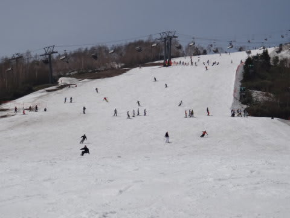

# 5月26日のかぐらファイナル詳細…今週で終わりなんてもったいない！

📅 投稿日時: 2013-05-28 00:03:48

えー．

昨日は速報でしたが，本日は，詳細バージョンにてお送りいたします…

ということで．

かぐら営業最終日．

いつもどおり，朝7時半の営業開始前からロープウェーに

並びますが…

運転開始時にはロープウェー4-5回は待つかなぁ，って

感じの人が待ってましたけど．

うーーん．

皆さん，こんな時期というのにスキーに来るなんて…

アホですねぇ←お前が言うな

んで．

まだ，みつまたクワッド乗り場に十分雪があるのがおどろき！

でも，さすがにみつまたリフトからゴンドラまでの廊下はこんな感じで…

そろそろやばそうなのを硫安攻撃で何とか持たせている感じで．

ここはさすが今週が限度でしょう…

ということで．

ロープウェー→みつまたクワッド→ゴンドラとはるばる乗り継いで．

やってきました，かぐらメインバーン！

うーむ．

ここから見る分には，まだ雪がいっぱいありますね…

で，和田小屋からクワッドリフト乗り場に向かうところも…

うむ．

まだ，雪がいっぱいあるなぁ…

…と，思ったところ．

な，なんだ！？これはっ！！

がびょーーーーん．

先週まで，ほぼ全面滑れたテクニカルコースが，

土だらけだっ！

（↓参考に，これが先週の状況)

なんとーっ！

なんと．1週間でここまで雪が減るとは…(涙） 

ジャイアントも…

なんだか，土が出てきましたね～．

でも．

でも．

朝イチリフトにのって登ったメインバーンは…

コースの端っこはちょっと土が出てきましたが…

うむ．

うむ．

うむ！

5月下旬と考えれば．

この3月の「GWまで雪がもたないかも…」

という状況から考えれば．

これは…シアワセだっ！！！

9時半ごろまでは幸せタイムが続きましたが…

それ以降はリフトも5分待ち以上になり…

ゲレンデ人口密度も，ちょいと高くなります(涙)．

当然，雪はやわらかいわけなので．

これだけの人がいるということは…

じきにコブになっちゃうということで．

10時半ごろには，コブが出始めてきて…

うむ？

なんだか，危険なかほりが漂ってきてますね…

雪がところどころ，薄くなっているように見えるのですが…

昼ごろには，かなーりのコブコブになってしまい…

コブ溝には，あまりお会いしたくない土さんがコンニチハしてきました．

コース幅全面に雪がありますが，厚さという点で見ると，

かなり先週に比べ雪が薄くなってしまったようで…(涙）．

ジャイアントコースも…

あら．

あららー．

先週まで全面OKだったとは思えない…

って感じで．

コース状況が悪化したせいで，昼からリフトはかなりすいてましたね～

しかし．

スキーバ○なみなさんがまだいっぱい残っていて．

スキー○カな皆さんは，夕方までコブ溝の土も

ものともせず，ひたすらコブの掘削作業にいそしんでおられ

ました←お前もそのスキーバ○の一人だったのでは？（自己突っ込み）

しかし．

まぁ．

この時期までメインバーンいっぱいに滑ることができたし．

パークも最後まで残ってたし．

なんてったって，ゴンドラコースもみつまたリフトも滑って

降りれたんですから．

新緑がまぶしい5月最終週まで，こんないい状況で滑れて．

満足の5月を過ごせたのでした…

うーむ

まだ雪がたっぷりある，これで営業終了とは信じられない…

今週末も営業してくれないかな(懇願)．
