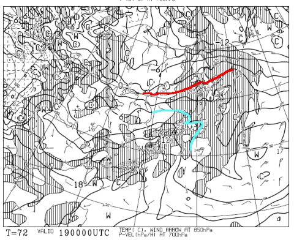
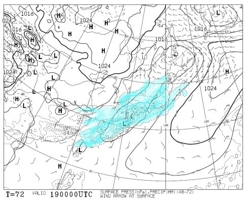
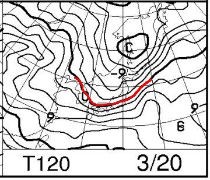
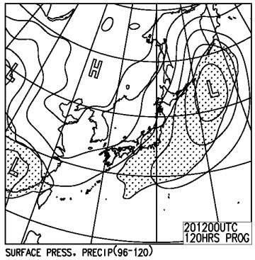
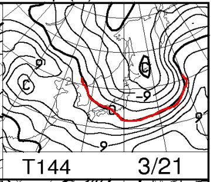
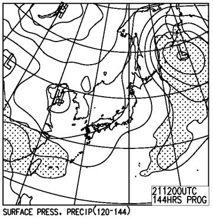

# 3月19日から3連休！この週末の天気は…19日は雨だよ（涙）．20，21日は冷えるけど，アイスバーンか？？

📅 投稿日時: 2016-03-17 02:37:12

…今シーズン．

そろそろあきらめの境地に陥りつつある今日この頃．

皆様いかがお過ごしでしょうか…

…ダメだ…

ダメだよ．

奇跡は起きないのか…っ？？？

行きますよ～．

覚悟してくださいね～．

19日，土曜朝9時の850hpa気温図は…

はい．

0℃線は北海道付近．

志賀高原は，水色の+6℃線が近づいてますよ～

そして，地上天気図は…

どどーん．

はいはいはい．

水色で塗った降水域，日本全土を覆ってますよ～．

…ダメだ（激涙）．

雨だよ…

ただ．

現時点では，降水量は少なめの予想なのだ！

だから，降るとしてもぽつぽつ，時折パラパラ程度で．

ザーザーぶりにならないと信じるのだっ！！！

で．

20日，3連休中日の850hpa気温図は…

ふむ．日本の南まで0℃線が下がり，この日は冷えそう…

この日の地上天気図は…

網掛けが微妙に志賀に掛かってるっぽいけど，

この降水域を示す網掛けは，19日の夜9時から20日の

夜9時までの降水量を指しているので．

おそらく19日夜は降るかもしれないけど，20日は

降らないんじゃないかな…

まぁ，降ったとしても雪ですので，ご安心を…

そして．

最終日21日は…

ふむ．この日も志賀高原は-3℃線がかかっているレベル

なので…冷えそうですね．

地上天気図を見てみると．

まぁ，高気圧が張り出してるので，晴れそうでもある…

でも，気圧配置自体は冬型っぽいので，

雲が多少出るかも…

ってことで．

まとめると．

土曜：気温は朝からプラスで，異常に暖かく…

　　で．朝から．雨ですね（涙）．時折パラパラとぱらつく程度．

　　降り止む時間がまだ正確に予測できないけど．早ければ夕方に

　　止むかもしれないけど…夜まで続く可能性も．

　　ナイターまで雨は避けたいところ…

　　雪質は，言うまでもなく．

　　朝から，水を吸った春の雪でしょう．

　　この日の雨で，クローズするコースがまた出てくるかも…（涙）．

日曜：一気に気温が冷える．朝は-5度近くまで冷えるか？

　　最高気温も0℃まで上がるかどうか…というレベル．

　　基本的に曇り．午前中は時折雪がぱらつく可能性も．

　　朝は，前日の雨で溶けた雪が固まったアイスバーン．

　　昼間も気温が上がらないので，終日固いバーンコンディションでしょう…

月曜：朝はかなり冷える．天気は時折雲が飛んでくるものの晴れそう！

　　朝イチはガッチリ固めの圧雪．

　　この日も終日固めのコンディション．

　　天気は晴れていても，気温もそれほど上がらず．

　　雪はそれほどひどく緩むことはないでしょう．

…ってことで．

なぜなのだか．

どうしたわけなのだか．

今シーズン．

週末に狙ったように雨が降り，

そのあとアイスバーンに悩まされる

というパターンが多い気がするのだが…（泣）．

今週末は，冷え冷え踊りを踊っても冷えなさそうなので．

せめて，

雨になったとしてもそんなにザーザー降らず，

ぽつぽつ程度で留まってくれる踊り

をみんなで天気の神に捧げて．

ひどい雨で雪がドボドボになるのを避けましょうか…←だんだんいろいろあきらめモードに入ってきている

## 💬 コメント一覧

### 💬 コメント by (まいる)
**タイトル**: 土曜日は・・・
**投稿日**: 2016-03-17 06:42:22

お疲れ様です。

土曜日は雨ですか・・・(-_-;)

Sさんの予報はかなり正しいので、せめて、ザーザー降らないことを祈りましょう。

ゲレンデでの合流は、Sさんをみつける目印(板か？)が難しいかもです。

こちらは、希少な？アルペンスノーボードなので分かりやすいかも？？

### 💬 コメント by (はなげ親分)
**タイトル**: ふ～ん！
**投稿日**: 2016-03-17 19:55:47

なるほどねぇ～（薄笑）

週末になると高温＆雨っていうのに慣れてしまった自分が怖いです。

それにしても今シーズンの天気、どこかの誰かが悪魔に魂と天気を何かと引き換えに渡したに違いない！

### 💬 コメント by (Skier_S)
**タイトル**: いろいろあきらめの境地
**投稿日**: 2016-03-18 00:08:53

＞まいるさま

土曜は降れば雨ですが…

今のところ，ほんとにぽつぽつと降る程度なんじゃないかと

楽観しています．

…私を見つける目印は…

1．焼額で第1ゴンドラをかなりのスピードの深回りターンで滑っている

2．いつもの写真に写っている板を履いている

…大体の人が，1．の特徴で見つけるパターンが

多いようです（笑）

すぐわかるらしいので，探してやってください（ホントにこれで見つかるのか…？？？）

＞はなげ親分さま

そうか！だれかが悪魔に魂と引き換えに…

では，はなげ親分さまの魂を悪魔と引き換えてもらえば，

来シーズンは最高雪質のふわふわパウダーが

11月からGWまで続くように…

…

…だめですかね．やっぱり．

