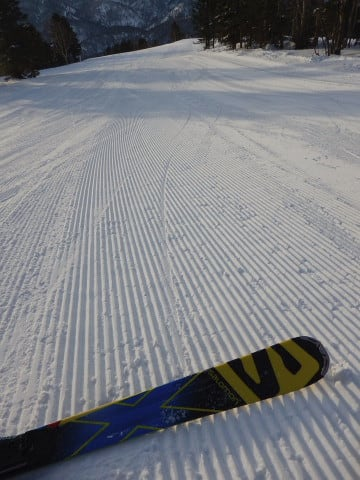

# 2019/3/10(日)の志賀高原スキー場，詳細レポート！…朝の天気は晴天最高！昼から曇ってきたけど，ガラガラで雪もそれほど緩まなかったよ！

📅 投稿日時: 2019-03-13 08:08:19

🏷️ カテゴリ: [2019スキー滑走日記](c3e4496fc0fb7f9c17ff21214a35b1ace.md)

えー．

昨日は帰宅後死んだように寝てしまったので．

急いで朝に更新！

ってことで．

湿った雪が降りまくった月曜ですが．

夕方あたりから気温も冷え．

冷えた雪になったようで．

火曜の志賀高原，ゲレンデコンディションは

最高だったようですね…

水曜夜から木曜朝にかけて，

また冷えてちょっと雪が降りそうなので．

今週末も，雪はいいんじゃないかな～！

…ってことで．

今さらながらの日曜の志賀高原レポートです！

まず．

朝ですが…

うむ？

なぜ，まだ暗いうちに第1ゴンドラ前に

いるのだ？

…昨日は夜9時までナイターを

滑っていたというのに．

気づいたら，6:30スタートの

早朝営業に来てしまっていたようです！

…今週から早朝営業開始なのですが．

ナイターも早朝営業もやっている

この時期は，ちょいと危険だ…

あまり体に良くないかも(笑)

ってことで．

まだ日が昇る前から，

ゴンドラに乗りますが．

ゴンドラから見える朝イチの

ゲレンデは．

うはーーー！

誰も滑ってない！

シマシマっ！！

ってことで．

まだ太陽が顔を出したばかりの

山頂に到着すると…

気温は-5℃と．

早朝としてはちょいと高めですが．

でも，-5℃ならば，雪は十分冷えて

ますし，いい感じの締まり気味の圧雪！！

うはははははははは．

早朝のまっさらの，最高級シマシマ．

いただきま～す！！

うひゃーーーー！

雪は冷えたいい雪が適度に圧雪され，

しっかり締まった超快楽脳内麻薬

放出バーン！！

人も少なくて，好きなラインで

大回りし放題！

最高っ！！！

早朝最高！！！

8:30の通常営業開始まで．

人もほとんどいないし．

雪は冷えてて最高だし…

なんて素晴らしいんだ…！！

さすがに早朝営業が終わるころには．

シマシマは完全に崩れたけど…

でも，雪はガンガンエッジが効いて，

好き放題倒しこめる，ガラガラ

快楽バーンが続くよ！！

…そして．

8:30の通常営業が始まると．

早朝営業以外のコースがオープン

されるので．

今度は第2ゴンドラ側のパノラマコースへ！

そうすれば．

またもう一度，誰も滑ってないシマシマを

堪能できるのだ！！

朝から2時間以上滑った後に．

また朝イチの最高シマシマが味わえる

なんて…

シアワセ．

ビバ，早朝営業っ！！

天気もいいし．

雪もいいし．

今日はいい日になりそう…

いや．

でもホントにこんなに天気がいい中．

最高の雪質で滑れるだけでも

シアワセなのに．

朝6:30から雪質のいい時間にたっぷり

滑れて．

早朝はいいなぁ～

（前日にナイターをするとかなりきついけど（涙））

さすがに，10時近くになると，ちょっと

ゲレンデの人は増えてきたけど…

でも，ゴンドラ待ちは最大で

ゲートの外に出るか出ないか．

一人乗りレーンなら1-2分待ちで

乗れちゃいます．

それも．

混んだのは10時～11時過ぎくらいまで．

それ以外は，完全ゴンドラ飛び乗り

ガラガラ！

そして．

午前中は天気も良く．

雪もいい感じで締まっていたので…

いや．

この2月，ダメダメな感じだったけど．

3月に入って，いい感じの週末が

続いているじゃありませんか！！

…と，思っていたら．

さすがに昼ごろには，最高気温が+5℃と

結構上がってしまったこともあり（泣）

ちょいと雪が緩み始めたかな…

しかし．

12時ごろには．

私の予想通り←ここすごく強調しておくところ

雲が増え始め…

うす曇りになってきたので．

強い日差しは和らいで．

そのせいで，雪はベタベタした感じに

まで緩むことなく．

日が当たるバーンでも，

「ちょっとしっとりしてるな」

って感じの，滑りやすい程度を

キープ！

ただ，一昨日の夜に圧雪車故障で

新雪が踏まれていなかった

オリンピックコースのみ．

本日は圧雪がかかっていたけど…

それでも，昨日は圧雪がかかっていない

せいで．雪が柔らかめで．

そこに朝日が当たるので…

かなりモサモサした感じに

緩んでしまっていて．

このコースだけ，ちょいと手ごわい

感じだったかな…

でも，オリンピックコース以外は．

そんなに雪も緩まず．

夕方まで滑り良かったですよ～！！

そして．

日曜午後は．

「ゴーストタウンか？」

と思うほど，人がいなくなり…

この時期としては，割といい雪で．

最後まで比較的ゲレンデは

荒れないままでいてくれて．

営業終了直前に，

ちょっと雪がぱらついたけど．

先週に恐れていた，液体が

空から落ちてくることもなく．

朝6:30から，ゴンドラ営業終了まで．

昼ご飯を取ることも忘れて．

いい感じだった最高の今日一日．

しっかり滑り倒したのでした…

いやーーー．

良かった．

先週，雨が降る予想だった時は．

最悪の日曜になりそう…（涙）

と，思ったけど．

当初予想とは全く逆の，最高の

日曜日でしたよ～！

ふはははは．

そうです．

これも，私の日ごろの行いのおかげ…(パーーン）←読者に狙撃された音

## 💬 コメント一覧

### 💬 コメント by (パパは初心者)
**タイトル**: 今週末もヤケビ
**投稿日**: 2019-03-13 14:11:25

いつも楽しく拝見させていただいております

また天気情報もとても参考になります。

９．１０日と家族で奥志賀メイン時々焼額で滑らせていただきました。ブログの写真に写っている７歳児の二人組と娘も滑走させていただきましたがとてもててもレベルが違いました。もしかしてお連れ様でしょうか？　ゴンドラ内でお話しさせていただいたかも？と。。

### 💬 コメント by (naoちゃんねる)
**タイトル**: Unknown
**投稿日**: 2019-03-13 16:28:52

今週末も娘共々お世話になりました～

日曜の早朝は初参戦でしたが、これはクセになりますね！

娘もこれからは早朝から連れていけと言ってます(汗)

こんな週末がずっと続いてくれるといいなぁ…

⬇️パパは初心者様

二人組の7歳児の一人はもしかしたらうちかもしれません。

https://www.youtube.com/channel/UC4h8jCqOLdiJoA09G5q3F5g

こいつでしょうか。

早朝営業の１ゴンで相乗りしてお話したお母さまですかね。

娘さんも年長さんにしてはかなりのスピードで頑張っていました。あの後…お怪我は無かったか心配です。

Sさん、blog内で失礼しましたm(_ _)m

### 💬 コメント by (パパは初心者)
**タイトル**: Unknown
**投稿日**: 2019-03-13 20:48:47

S様ブログ内で失礼します。

naoちゃんパパさま、年長暴走ムスメの父の方です。

娘は元気いっぱいです、しかし他人様に迷惑をかけるわけにはいきませんので、今インカムの準備と基礎練に打ち込むよう算段しております。

土曜の焼額奥志賀が今シーズン最後になりそうですが、S様の許可をいただけましたら娘ともどもホームゲレンデを湯沢から志賀にうつそうかと思います。

我が家も、奥志賀のサクラちゃん動画から志賀に吸い寄せられたクチです。まさかサクラちゃんの上をいく子がいたとは、、、

今後とも御指導御鞭撻よろしくお願いします。

### 💬 コメント by (ゴン太(gonta)@SALLOT CLUB)
**タイトル**: 現場検証
**投稿日**: 2019-03-13 22:22:45

日曜日の正午過ぎ、オリンピックコース分岐先のGSで、ヤケビスタッフと一緒にスノーモービルで上がってきたお巡りさんが、コースの上に交通事故の際に見かける黒の番号札を置いて、写真撮りながら現場検証らしきことをしていました。

スキー場で初めて見る光景でした。

### 💬 コメント by (Skier_S)
**タイトル**: 今週末は雪は良さそう！
**投稿日**: 2019-03-14 00:44:03

＞パパは初心者さま

あら．

年長の末っ子さんと一緒に滑ってたお父さんですか！

小1二人組より大きい感じの年長さんでしたよね…

あの小1キッズ二人について行くのは，大人でも

厳しいですから，おそらく普通の幼稚園児には

厳しいかと…（笑）

小1キッズ二人も，年長さんの1年前はここまで

速くなかったのに，この1年ですごいスピードが上がりましたし．

今は無理でも，あと一年経てば，びっくりするくらい

上手くなると思いますよ．

私が許可するものではないのですが（笑），ぜひ

志賀高原をホームゲレンデにしてやってください．

＞naoちゃんねるさま

この週末は楽しかったですね～！

それも，早朝がむちゃくちゃ良かったですね！

しかし，まさかnaoちゃんも早朝からリフトストップ

まで滑り続けるとは…

なんとも恐ろしい小学1年生ですね（笑）．

今後どうなることやら…

＞ゴン太さま

現場検証の前に，スキーヤーとボーダーが衝突した

ようで，

人がしばらく倒れていたのを見かけたのですが…

怪我して運ばれている程度なら何度も見たことありますが，

スキーヤーの衝突で警察の出動とは，私も初めて見ました…

### 💬 コメント by (ほっぽ)
**タイトル**: Unknown
**投稿日**: 2019-03-14 08:10:17

10日の日曜日午前中、イーストのヘッドポール占有の場所に海外の人、ボーダーが良く分からずに入ってしまい、

上から滑ってきたレーサーと激突して、警察呼ぶって言ってました。

ポールの真横に居たのでレーサーも避けられなかったと思います。丁度斜面の変わり目でした。

警察呼ぶと言ってたのはポールの係の人でしたけど。

その後どうなったかは不明です。

海外の人にポール占有、立ち入り禁止って周知するの、

難しいなと感じました

