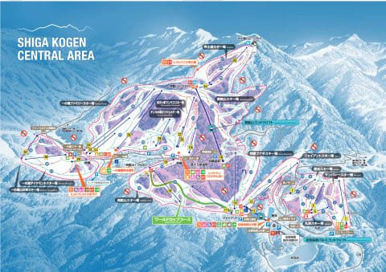
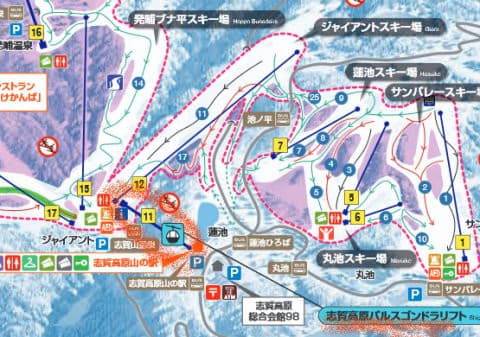
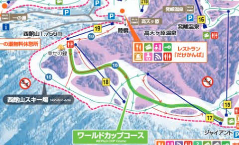
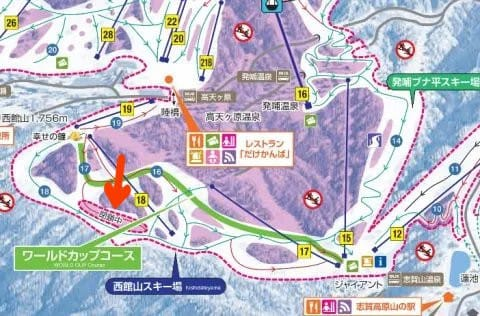
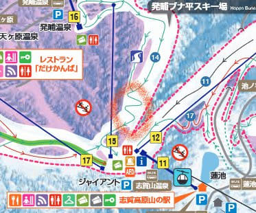
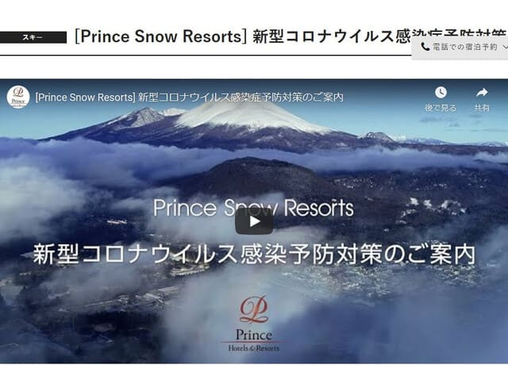
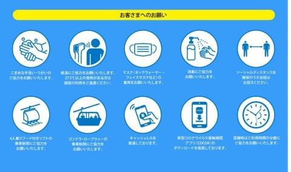
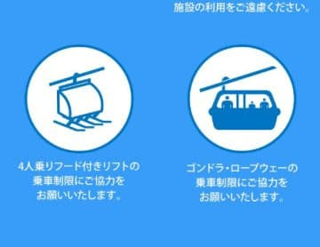

# 志賀高原スキー場，中央エリアのゲレンデマップが2021シーズン版になってたよ！…いろいろ読み解いてみる

📅 投稿日時: 2020-10-14 00:57:48

本日，志賀高原中央エリアのWebページを

見に行ったところ．

さりげなく，ゲレンデマップが

2021シーズンのマップ

に入れ替わってました…！！

（[志賀高原中央エリアWebページ](http://shigakogen.co.jp/highlight/896-2)より引用，以下同じ）

となれば．

当然，昨シーズンと何が変わっているかを

読み解くべく，じっくり見るわけですが…

まず，一番目につくのは．

当然，これまで何度も話題になっていた，

パルスゴンドラ．

当然のごとく，こいつが地図に追加

されてます…！

これまで減る一方だったリフト．

2シーズン前のダイヤモンド

連絡ペアに続く増設ですが…

ダイヤモンドペアも，パルスゴンドラのどちらも，．

コースを滑るためのリフトじゃない

というのは寂しいですね…

そして．

もう一つ気になる，西館中級コース．

一昨年の台風19号に伴う崖崩れで

シーズンイン直前にコースに大穴が

あいてしまい．

シーズンインまでに修理が間に合わない…

ということで，昨シーズンはオープンせず，

この夏に修復する予定になっていたはずですが…

…修復していたはずなんですが…

…

あれ…

…

無いっ！

地図に，西館中級コースが無い！！！

ちなみに，昨シーズンは矢印で示した

こんな感じで

「閉鎖中」

という案内が出たまま，コースマップに

載っていたのに…

今シーズンはマップから落ちてしまった！？？

これは…

もしかしたら，コロナ禍の来訪者激減の

あおりを食らって，もうこの中級コース，

修理せず放棄しちゃうのか！？？

…それはマズい．

あのコースが無ければ，西館に行く

モチベーションが無くなるので…

うーむ．西館山，人気がちょっと落ちそう…

そして．

ブナ平下の，昔はリトルジャイアントと言われた

急斜面．

ぐにゃぐにゃ七曲りルートになって以来，

評判が悪いのですが…

ここはまだ，七曲りのまま残るようです…（涙）

残念…

ってな感じで．

来シーズンは．

パルスゴンドラができるものの．

2019シーズンにクローズだった西館

中級コースはそのまま閉鎖みたいだし．

ブナ平下の七曲りもそのままだし．

コースは全く一切全然変化なく．

パルスゴンドラ以外は全く昨年のまま

というのが分かりました…

まぁ，このコロナでの来客減の状況の中，

コースやリフトが減らなかっただけ

良しとしなくてはならないのかな…

あ，そうそう．

そういえば，焼額山のホームページを見に行った時．

「新型コロナウイルス感染症予防対策のご案内」という

ページがあったのですが．

（[プリンスホテル新型コロナウイルス感染症予防対策のご案内ページ](https://www.princehotels.co.jp/informations/ski_coronavirus/)より）

このページにあった案内図を見ると…

うむ．

こんな対策を打つのね…

（[プリンスホテル新型コロナウイルス感染症予防対策のご案内ページ](https://www.princehotels.co.jp/informations/ski_coronavirus/)より）

…

…って，

ええ？

ゴンドラ乗車制限は分かるけど…

フード付きクワッドも，定員以下に

制限されちゃうの！？？？

…とりあえず．

今シーズン，スキー場が異常に混雑せず，

それでいてスキー場にお金を落とすお客さんが

いっぱい集まるように…

と，両立が難しいお願いを神様にしないといけない，

厳しいシーズンになりそう…（涙）

せめて．

せめて，昨シーズンのような雪不足には

なりませんように…っ！！！

## 💬 コメント一覧

### 💬 コメント by (西舘)
**タイトル**: Unknown
**投稿日**: 2020-10-14 06:41:31

呼ばれた気が、呼ばれた気がするのですが！号泣

西舘フーディも乗車制限するのかしら。

我が家は1月末迄の宿予約は完了しました。

長野県は愛知県の隣接県なので、愛知県で地域振興券も使えるらしいです。上手くいくかどうかはともかく。

### 💬 コメント by (ありが)
**タイトル**: 2回目だ！
**投稿日**: 2020-10-14 07:00:58

2回目だ！

また「▶再生」をクリックしてしまった。

トリックがあるブログだと注意していたのに、油断してしまった。

志賀高原が好きなのですね。うれしいです！

### 💬 コメント by (ikkun)
**タイトル**: Unknown
**投稿日**: 2020-10-14 16:32:07

あれま？西舘私しも意外に好きですが？コースはなかなか分かりません(笑) 我がスキー場は最後まで営業出来ましたが…降りすぎないこと願うばかりですちなみに我がゲレンデも昨season 4人乗りに2人乗り、ペアは一人乗りとなりました。昨年度と同じようにとは行かないにしても、普通に営業して頂いてと考えてますやはり国からの支援も必要ですかね？

### 💬 コメント by (Northfox)
**タイトル**: Unknown
**投稿日**: 2020-10-15 01:01:27

う～ん、西舘の中級コース復活しないんですか。楽しみにしていたのにガッカリです。

新しいゴンドラ．．．それよりジャイアントのリフトを高速化してくれたほうが嬉しいのですけどね。

### 💬 コメント by (Skier_S)
**タイトル**: 今日は10周年
**投稿日**: 2020-10-15 01:26:38

＞西舘さま

おそらく反応してくれるかと思ってました（笑）．

西館フーディーは昨シーズンは制限してなかったですよね…

今シーズンはするのかな？？

しかし，1月末までの予約完了ですか！

私は正月以外の予約を全くやっていません…

娘の部活の関係上，いつ家族と一緒に行けて，いつ一人で

行くことになるかまだ全く読めないので（涙）

＞ありがさま

すいません．トラップに嵌めてしまいましたね（笑）．

志賀高原愛は，多分そんじょそこらの人には負けてないと思います…

忠誠心はかなり高いです（笑）．

＞ikkunさま

西館は私も昔はよく行ったのですが…最近は焼額から

出ることが減って，西館まで行くのはシーズン2-3回となってしまいました．

しかし，ペアリフトが一人乗りになったら，輸送力すごい減りますね…

今年は長野県はスキー場のリフト券補助予算を組んで，割引するんじゃないか

という話もありますが，それで人が増えても乗車制限で

すごい列になって，逆にスキーが嫌になったりしないか心配です…

＞Northfoxさま

私も，西館のコースは復活すると信じていたのですが．

少なくとも，中央エリアのマップからは消えました（涙）．

パルスゴンドラ作るよりも，西館中級コースの復活と

ジャイアントリフトの高速化してほしいです…（泣）

### 💬 コメント by (ikkun)
**タイトル**: Unknown
**投稿日**: 2020-10-19 12:44:06

ぇ～何回も？志賀高原に(・・;)まさにスキー馬鹿(すいません(笑)  雪なしから来られる方々には、上げる頭はありませんm(__)m修学旅行は多分壊滅的？ですが？個人や同じ地区からのスキー授業等は来て頂いてって😱💦ちなみにスキーclubのスキーは3月末？に焼額山でしたよ❤️コブもありで楽しかったですが普段滑りやすいゲレンデなので午前中は疲れました(笑)

### 💬 コメント by (のぶネット魚沼)
**タイトル**: Unknown
**投稿日**: 2021-01-24 06:01:51

パルスゴンドラなんて滑降用でもないゴンドラ、作ったって誰が乗るんだ！…と悪態吐きつつ、気が付けばモノ珍しさからついつい乗ってしまう自分がいる😅

山の駅のトイレでも行ってくるか。

