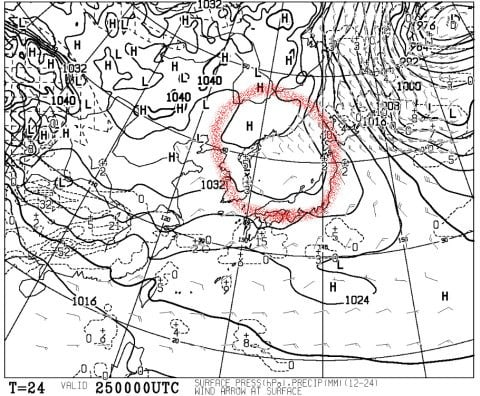
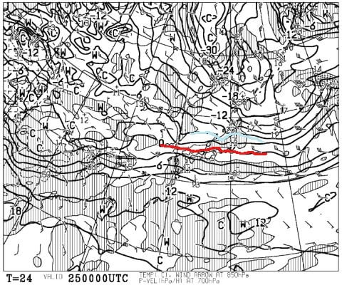
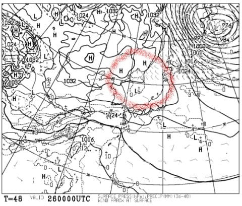
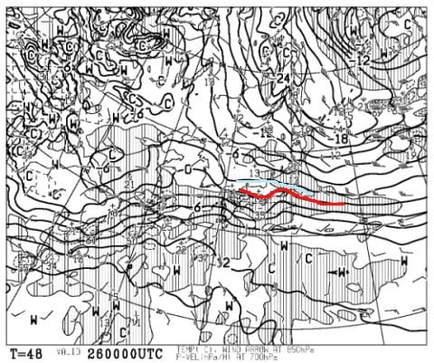
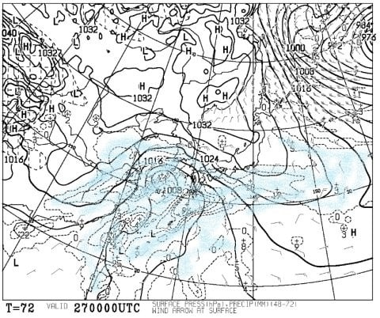
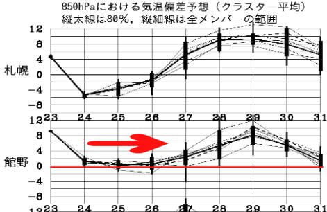
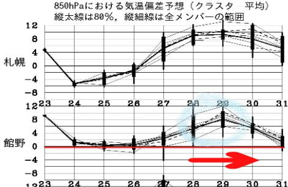

# 志賀高原スキー場の天気，この土日の予想が変わって晴れそうな予感！…そして私はまた焼額で滑ってます

📅 投稿日時: 2020-01-24 23:48:41

🏷️ カテゴリ: [日記](cc4b5682fb7b8b144980957a978653fb0.md)

えー．

いつも通り，私は今週末も

志賀高原で滑ってくるわけですが．

…なんだか．

この土日の予想天気図が，

昨日の予想よりちょっと

変わってるんですが？？

…形の上ではちょっとの違いだけど．

志賀高原には大きく影響しそうな

感じで…

まず，土曜日の25日の地上天気図．

降水域が志賀にかかってないので，

土曜は降らなさそう…という予想は

変わらないんだけど．

赤く囲った部分，等圧線が張り出した

形になってる部分が，実質の高気圧で．

…これが日本海沿岸にかかっているので．

これ，志賀高原．

朝から晴れるかも！？？？

土曜の朝の気温は，こんな感じで

水色の-6℃線が志賀にかかるくらいなので．

あさイチの志賀は，-10℃近い冷え冷えですね．

…そして．

今日夕方にわずかとはいえ雪が

降ったので．

ゲレンデは超ガリガリの最悪コンディション

から多少回復して．

土曜のあさイチは，硬めに締まった，

いい感じの晴天シマシマバーンを

滑れるかも！？？

…朝イチ以外は，ちょっとところどころ

コロコロが出てきたり，

午後になると急斜面の一部は磨かれて

ツルツルになるかもしれないけど…

でも，

スキー場全面完全無欠のガリガリアイスバーン祭り

という，最悪状態は回避できて．

それも一日晴れのゲレンデを滑れそう！！

そして．

26日日曜も．低気圧の接近が当初予想より

かなり遅くなったようで…

この日も，赤く囲った高気圧に覆われる

予想図に変わってるんですが？？

昨日の記事に載せた，26日の予想

天気図と全然違うんですが！？？

この日も，これだと朝から晴れて，

いい感じの締まったバーンを

滑れそう…っ！！

この日も，気温は-3℃線が志賀に近づいて

いるレベルなので．

朝はそこそこの冷え込み！

日曜も，フワフワトップシーズンの柔らか雪

とは言えないけど．

天気も良く，そこそこ冷えた雪の，

締まって荒れにくいバーンで，

思ったより楽しめるかも…？？

昨日の予想では，日曜26日の昼には

志賀に低気圧が接近するはずが．

今日の予想では，27日の朝9時になっても，

まだ低気圧は九州の西．降水域は，

九州・四国にかかる程度．

志賀高原に低気圧が近づくのは，

27日月曜の夜ごろになりそう…

ってことで．

この週末の志賀高原．

そこそこ冷えた晴れの週末になりそう…！！！

まとめると．

25日（土）：朝から晴れ！朝は放射冷却で

　-10℃くらいまで冷え込み，

　硬めながらもエッジが効く，

　超ハイスピードシマシマ！！

　場所によってはコロコロが出てくる

　かもしれないけど，

　ガリガリでどうしようもない

　アイスバーンというより，

　エッジが効く程度のカリカリバーン．

　ただ，急斜面ではスキーヤーに磨かれて，

　下地がだんだんツルツルになっていきそう…

　昼間も-5℃程度までしか上がらず，雪は

　終日緩まず．バーンがしっかり硬めなので，

　午後になっても凸凹にはならなさそう．

　バーンは硬めながらも，太陽のもと

　気持ちよく滑れそうな一日

26日(日）：この日も朝から晴れ！朝の気温は-5~6℃．

　この日も朝は締まり気味のいい感じの

　ハイスピードシマシマバーン！

　前日にいい感じで冷えてるので，バーンは

　前日より砕けて柔らかくなっており，

　硬めながらもエッジが効く，

　いい感じのハイスピードバーン．

　ただ，急斜面は下地のアイスバーンが

　出てくるかも…

　昼間は0℃近くまで気温が上がるが，

　マイナス気温キープ．

　南向き斜面は，日差しで雪の表面が

　ちょっとしっとりしてくるかも．

　夕方にちょっと雲が増えてくるかもしれないけど…

　基本的には終日晴れの，いい感じのスキー日和．

　あとは，雪が柔らかければ最高なんだけどな…

と言った感じで．

ちょっと，前日までの予想とは

変わりました～！！

そもそも，かなりの高温が予想されていた

24~27日の間でしたが．

実際にフタを開けてみると．

赤矢印で示すように，平年並みの気温に

なりましたね…！！

そうです．

これは．

私がひたすら祈ったおかげです！！！

皆さん，私に感謝…（ドス）←読者に殴り殺される音

PS.ただし．

28日以降は，また高温が予想されてます…（涙）

これも，私の祈りによって何とかならないか，

ちょっと祈り続けてみます…

## 💬 コメント一覧

### 💬 コメント by (レインボー)
**タイトル**: Unknown
**投稿日**: 2020-01-25 09:32:31

奥志賀最高。たたし、ダウンヒルじゃが芋畑。是非一度はお試し下さい。足裏マッサージに最適

### 💬 コメント by (なるなる)
**タイトル**: Unknown
**投稿日**: 2020-01-25 15:47:20

明日から1泊(日・月)で行く予定です。

月曜日の天気も教えていただけると幸いです。

うーん、先週末が飛ばしまくれる状況で大満足だったのですが、

そろそろフカフカ雪も滑りたいよなぁ～なんて、贅沢な事を考えてしまったから、

液体が落ちてきたのかもと反省しています。すいません…w

### 💬 コメント by (ほっぽ)
**タイトル**: 1/25志賀高原
**投稿日**: 2020-01-25 21:45:30

Ｓさん

今日は一の瀬から滑り込んでいきなりお会いできました。

私はサンバレーまで旅に出てヤケビラスゴンでＧＳを疾走するＳさんを確認しました。

いよいよ長期休暇ラストの明日は、一気に奥志賀まで滑りこもうと思っています。

ダウンヒルのジャガイモ畑を散策してきます。(^^;

http://www2.tokai.or.jp/nana_hoppo/

### 💬 コメント by (Skier_S)
**タイトル**: 今日は　意外と良かった…
**投稿日**: 2020-01-25 23:42:54

＞レインボーさま

今日はエキスパート良かったです～！

教えてくれてありがとうございました！

＞なるなるさま

27日月曜は，意外と曇り空くらいで，雪はそんなに降らなさそうです…

降るのは28日かな

29日に今度は雨になりそうと，かなり目まぐるしい天気です．

＞ほっぽさま

今日は1本お会いできましたね．

また明日，焼額でお会いしましょう！

