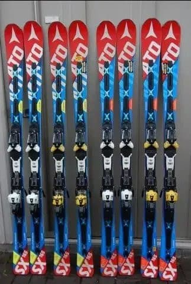
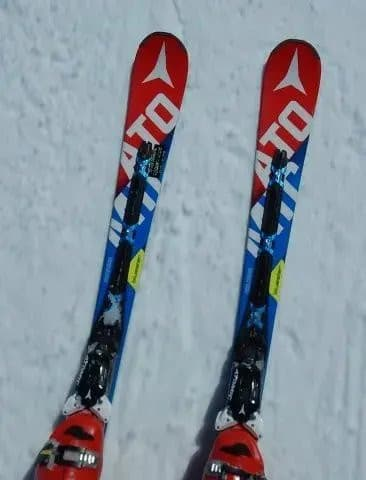
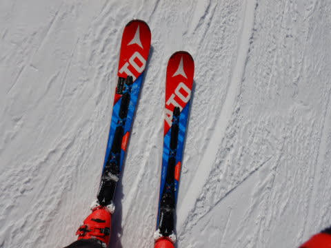
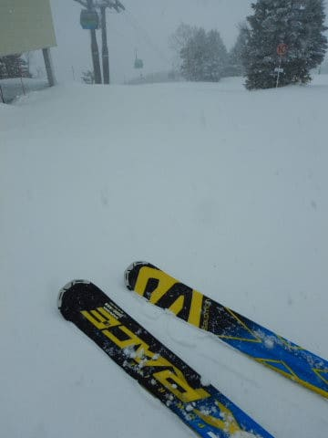
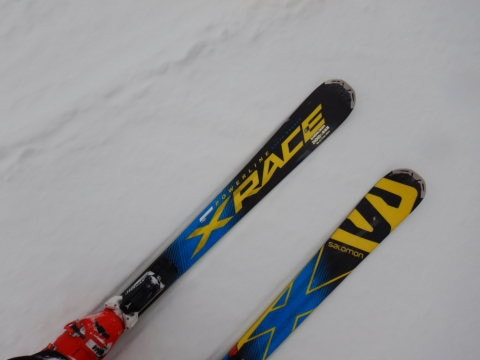
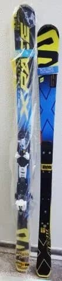
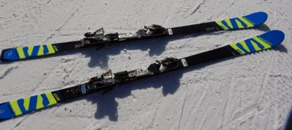

# SX四朗君を履いて1か月…そして大体予想通りのオチに

📅 投稿日時: 2020-03-04 01:14:17

🏷️ カテゴリ: [スキー雑談](c1f9d2cb7478308da16419928ea3945e9.md)

ということで．

なぜか私は，ATOMICの’16と’17モデルの

Bluester SXを4セットも揃えてしまい．

ここ数年，ひたすらSXを履き続けて

いるわけですが…

昨シーズン1月から履き始めた3台目の三郎君．

Yetiでは二郎君を履いていたので，

今シーズンは11月末の志賀高原から

三郎君を履き始めており．

…そして，雪が少なかった今シーズン．

なかなか大回り板を出動させられる

コンディションにならなくて．

ひたすら小回り板のSXばかり履いていた

ところ…

雪不足が解消されたこの1月，

ようやく大回り用のX-Raceを出動させることが

出来たわけですが．

この大回り用のX-Raceと履き比べると，

[三郎君のグリップが強烈に劣っている](ef0c360ac12bd72263d69f111b44fb947.md)ことに

気づいてしまい…

一月末に，[四朗君をデビュー](e6c31e0b2668b576d145d37cb92d0c912.md)させて．

「をを！！全然グリップ力が違う！

　これは楽しいっ！！」

と．

それはたいそう喜んだわけで…

もう，強烈なグリップ，どこまでも倒せる

安心感，スピード耐性…

やっぱり，新しい板はいいっ！！！

…と，しばらく気持ちよく滑っていた

わけですが．

…はい．そうです．

もう，ここから先は完全にオチが読めますが．

そのあと，大回り用のX-raceを履くと…

「…この板，もしかするとトップとテールの

　グリップ，弱まってる？？（涙）」

いや．

それなりの重量があって，しっかり噛みこんで

くれはするんだけど．

硬い斜面になった時のトップとテールの

グリップの抜け，

スピードを出した時のトップのバタつきと

安定のなさ，

そして，いとも簡単にずらせるように

なっているマイルドさ…

…これは．

これは．

考えたくもないけど．

X-Race君も，実はへたってたのね…（激涙）

…ということで．

これまで，2代目X-Raceがまだ元気だったので，

この2代目X-Raceに頑張ってもらってましたが．

（2015シーズンから2017シーズン途中まで初代，

　2017シーズンからこれまで2代目を利用）

この3連休から，

[第8回物欲選手権](ea2109ba25f451ea3cb1d5d935d899b91.md)の結果，昨シーズンに

すでに購入していた，

3台目のX-Raceとなる，X-race Master182cm．

こいつをデビューさせました～！！

まぁｘ，詳細レポートは追ってやりますが

…やっぱり，2代目X-Race．

かなりお疲れの様子だったんだなぁ…

この，3代目X-race.

素晴らしいグリップ，

トップからテールまでのエッジがすべて

効いて，バタつきがない滑らかさ，

どこまでもこらえていくスピード耐性…

とりあえず．

今回も．

新しい板はいい

という結論に達したのでした…

## 💬 コメント一覧

### 💬 コメント by (ほっぽ)
**タイトル**: 予備機が必要
**投稿日**: 2020-03-04 07:10:34

Ｓさん

危険です！

四郎君に３代目投入となると、予備機が無いじゃないですか！

五郎君代替の新機種と４代目をＧＥＴして、

何時ヘタっても代替できるよう準備しておかねば。。。(^^;

### 💬 コメント by (まーくん)
**タイトル**: Unknown
**投稿日**: 2020-03-04 07:19:07

やっぱりそうでしたかー

サロモンの板にLABって書いてあるのが不可解で、普通のx-raceには確か書いてなかった気がするので。

### 💬 コメント by (いか)
**タイトル**: Unknown
**投稿日**: 2020-03-04 12:21:12

土曜日はどうもでした〜。1ゴン前に怪しい板があるな、と思ったら、やっぱりSさんのだったんですね。

やはり新しい板はいいですね〜。SXからS-Raceに浮気中ですが、よく似た走りで楽しいです。…さて、2代目X-RaceのXビンディングの乗せ換え先を考えないといけませんね…！？(無限ループ)

### 💬 コメント by (西館)
**タイトル**: 流石です！
**投稿日**: 2020-03-04 22:51:28

Sさま、一緒にスキー業界の発展に協力しましょう

♪

我が家も今週末の試乗後にスピン用でレール乗り用の板を各自購入予定です。

以前、もっと固い板にした方が安定してスピード出せて楽しいですよと頂いたアドバイスを全く活かしていません！

いや、そちらは来シーズンまでに準備すると思います。

クレジットで５％還元中には！

（もしかして今回の騒動で消費税下がらんかなぁ、少なくとも５％還元期間が延長されるのでは。なんて甘いかなぁ）

### 💬 コメント by (しんちゃん)
**タイトル**: 次期試乗記が楽しみ
**投稿日**: 2020-03-05 00:50:57

いよいよ大回り機もお疲れになってしまっていたのですね。次期戦闘機選びが気になってきます。

来季の試乗記を楽しみにしています。

昨今の状況から、試乗会の開催が気になりますが、どこかの試乗会を貸し切っていっぱい試乗してみてはいかがでしょう（アラジンに出てくるジーニーに頼まないと叶わないかもしれませんね(笑)）

### 💬 コメント by (Skier_S)
**タイトル**: 今週末はそこそこ良さそう
**投稿日**: 2020-03-05 01:20:26

＞ほっぽさま

無いですから…

SX五郎君は無いですから！！！

あと，大回り板は3シーズンくらいはもってくれると

信じています…

＞まーくんさま

普通のX-raceには，確かにLABマークは無いですね…

FISモデルなど，主に選手向けにつくのですが，

このMastersにはなぜかLABマークがつきますね．

ワールドワイドには，デュアルスラローム向けの板らしいのですが…

＞いかさま

そうです．

私の板でした…

…そして．ご指摘の通り．

次もXビンディングが使える板だと，ビンディング代かからずに済むなぁ…

と思ってます（笑）．

＞西館さま

ええ？？

パーク用のモデル購入ですか？？

日本経済に貢献してますね…（笑）．

さらに，ハイスピードに耐えるしっかりした板もお買い上げいただき，

ぜひ，さらなる日本経済への貢献をお願いします（笑）．

### 💬 コメント by (Skier_S)
**タイトル**: ＞しんちゃんさま
**投稿日**: 2020-03-05 01:23:08

今シーズン，アルペンの試乗会は今のところ中止に

なっていないので，何とか試乗レポート書けるかな…

と思ってます．

…そうです．

試乗会は，皆さんのためのレポートを書くために参加しているので．

決して自分の物欲のためではありません…

