# 3月27.28日の週末の志賀高原スキー場の天気は…微妙！日曜は降らないで欲しい．そして2021/3/24の特派員情報！

📅 投稿日時: 2021-03-25 03:06:18

えー．

本日も志賀高原特派員からレポートが

届いているわけですが．

…恒例の朝のおこみん写真．

今日はおこみんが三つ子に

増えてました…っ！！！

なんと！

おこみんは，誰かのスキー板のSXみたいに，

[勝手に増殖して増える](e8a53c5e38b2ebcf1a084dc391aaad69d.md)ようです！

昨日は双子で，今日は三つ子だから…

明日四つ子に増えているかどうか，

楽しみに待ちましょう…(笑)

ってなことで．

本日の朝イチの焼額山頂は０℃と，

朝にしては高めの気温（涙）

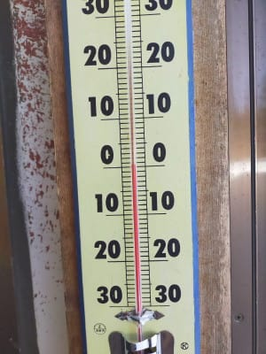

だもんで．

朝イチバーンはシマシマながらも

それほど硬くなく．

朝の数本は硬めのバーンが

ちょうどいい感じで緩んだ感じで

良かったようですが…

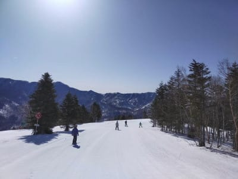

日当たりのいいバーンは，

すぐに雪が緩んでいったようです…

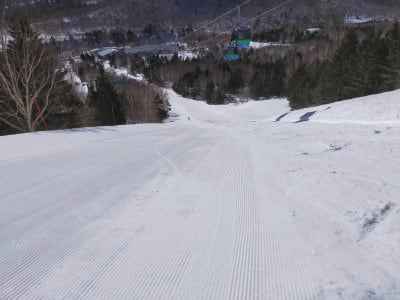

本日は日差しも強く，昼間の気温も

+５℃近くまで上がったようなので．

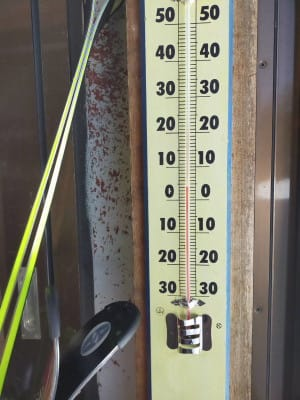

かなり雪が緩んだようですが，

滑っている人が少ないため，

結構フラットで，それほどひどく

荒れてないように見えますね…

でも，やはり雪はザブザブになっていき．

GSコースの一番下，ショートカットの

急斜面は，ちょっと土が出始めて

きてたようです…

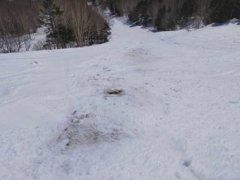

でも，寺小屋は昼になっても結構

いい感じの雪をキープしたみたいで．

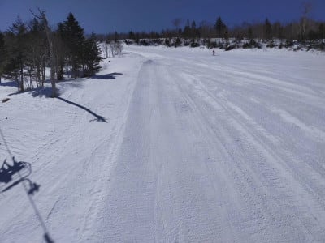

11時ごろでもこんな感じだったようです…！

…ってなことで．

2016年の雪不足の年や去年よりは

まだ雪は残っている感じですが．

ここ数日の日差しで，確実に

雪は減っているようです…

この3月まともに雪が積もって

ませんから(涙)

ってなことで．

これから週末にかけて．

ドサドサ雪が積もってまた真冬に

戻ってくれるのか？←期待薄だから…ってか，そんなわけないから

天気図を読み解いてみましょうか…

まず．

明日25日(木)の850hpa図ですが．

うーむ．

赤い0℃線は北海道まで上がっていて．

明日も気温は上がりそう…

朝から雪が重めの一日ですね(涙）

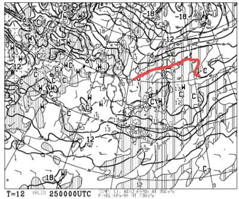

地上天気図では，西から水色の

降水域が近づいてきているので．

この日は曇り空かな…

運が悪ければ，午後一瞬液体が

パラっとくるかもしれないけど…

まぁ，曇り空のまま一日が

終わってくれるはず．

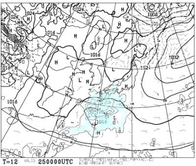

そして，26日(金)の850hpa図を見ると．

うーむ．この日は0℃線はギリギリ

志賀高原付近まで下がってますね…

この日は昼間も+2-3℃くらいまでしか

あがらない，ここ数日では珍しく気温が

低めの一日になりそう．

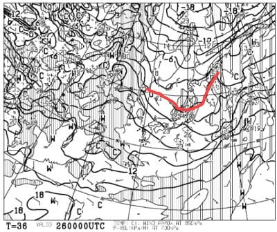

ただ，降水域は志賀高原にかかってないので…

志賀ではほとんど降らなさそう．

もしかすると，一瞬雪がちらつくか

もしれないけど．

この日は曇り空．午後は日も射すかも…

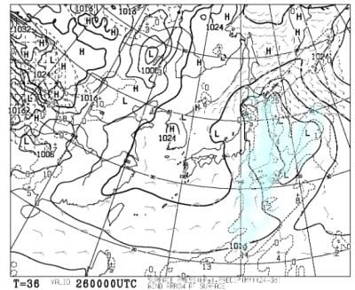

で．肝心な週末の，27日土曜日ですが．

…赤い0℃線は北海道まで上がり，

水色の+6℃線が志賀に近づいているので．

この日も，最高気温は+7~8℃くらいまで

上がりそう…

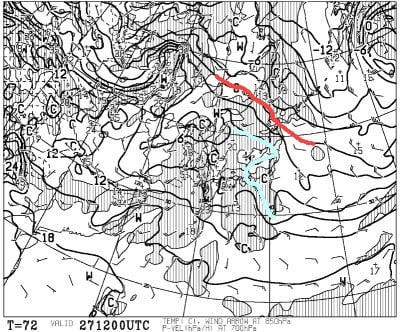

地上天気図は，高気圧が覆っている

ようなので．

雲が多かったとしても，基本的に

晴れるんじゃないかな．

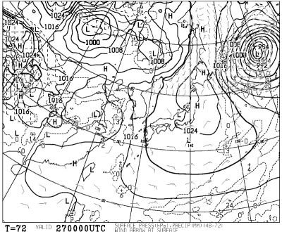

そして．

危険な日曜ですが…

850hpa気温では，水色の+9℃線が

志賀に近づくレベルなので．

昼間は+10℃突破コースですね（涙）

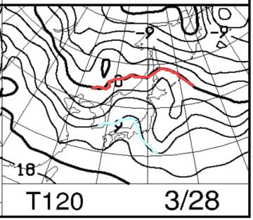

で，地上天気図は…

うぐぐぐぐぐぐ…

志賀高原に降水域がかかってる…

降れば確実に液体の気温なので，

ヤバいのですが．

でも，運がよければ4時のリフト営業

終了まで降らずにもってくれるかも．

運が悪ければ…

…

その先は考えないことにしよう…

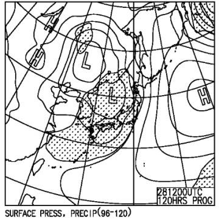

ってなことで．

まとめると．

25日(木)：朝から気温は+2℃程度か．

　終日曇りの一日．

　雪は朝から緩み気味．昼間は+5-6℃

　まで上がり，湿った重い雪が

　バーン全面を覆う．

　運が悪いと…ちょっとぽつっと

　液体が落ちる一瞬があるかも

26日(金)：朝の気温は-3℃程度．

　朝は曇り空．一瞬雪がぱらつくかも？

　朝イチバーンはカリカリ．

　昼間も+2℃程度までしか上がらず，

　標高の高いところはそれほどひどく

　緩まなさそう．

　でも，表面は緩んで重い雪になる．

　午後は天気が回復していき，

　日も射す．

27日(土)：朝から晴れ！

　だけど気温は+3℃程度と，朝から

　雪は緩い．

　昼間は+7~8℃まで上がるか？

　雲が多めかもしれないけど晴れそう

　なので，昼間の雪はずっしり重い，

　水を吸ったザブザブ春の雪．

　一部滑りが悪くなりそう…

　暑いくらいの，雪も重い4月並みの

　春スキーの一日．

28日(日)：朝は晴れか，曇か…

　あさイチから気温はプラス．

　朝は表面はわずかに固まってるか

　もしれないけど，緩めの雪でスタート．

　すぐに全面ザブザブの重い雪に．

　昼間の気温は+10℃を超えるが，

　午後に向かって南風が強まり，

　天気が悪くなっていく．

　運がよければリフト営業終了まで

　降らない．

　運が悪ければ…

　リフト営業が終わる前から，

　液体が空から落ちてくる．　

って感じでしょうか…

うーむ．

まだ，日曜の天気が読み切れませんが．

どちらにしろ，土日は4月中旬からGW

並みの，激烈高温のザブザブ雪を

覚悟しておいた方がいい感じです…（涙）

あぁ．

今シーズンも，まともな真冬の雪を

滑らないうちにコロナで終わっていって

しまう…

…このままではシーズンは終われない．

諦められないのだ！！

やっぱり，ここは必殺技の，

「冷え冷えよもう一度！

　これから真冬に戻って

　パウダードサドサウハウハ踊り」

を全身全霊を込めて踊ってみなければ

ならないようだな…←一体どんな必殺技だ！？？

## 💬 コメント一覧

### 💬 コメント by (レインボー73)
**タイトル**: Unknown
**投稿日**: 2021-03-25 11:25:57

木曜日の志賀高原情報

朝の上林２℃　蓮池６℃。今日も緩みそうかと勘違いして太板ヘッドKORE99 180cmを用意。そういえば曇り空だっけ。

今日明日と高校生270人程が滑るとか。

2ゴン上３℃、高い！

夜圧雪の感じの硬めのパノラマからカラマツへ行くと、さすがの270人がゲレンデいっぱいに広がっている。勿論１ゴンへ逃亡します。

１ゴン上２℃。

オリンピックは非圧雪。入口に注意の看板が。ＧＳは硬いけど空いてる。最後の壁が半分非圧雪。

ＧＳを回していると、９時半には快適バーンに。

その後パノラマから１ゴン回し。相当柔かくなっている。

そろそろ一ノ瀬かな。

パーフェクタはポール閉鎖中。ファミリーはアイスバーンにさらさら雪が。へいたんなので滑りやすい。

寺子屋が地獄バーン。曇って斜面が全く見えない。しかも硬い。

ファミリーから大勝軒初体験へ。昨年までファミリーのそば屋ファンだったので、これまで敬遠してたけど、美味い！　gotoeat非対応なのが残念だけど、950円ラーメンは悪くない。

実はそば屋の主人をここで見たとの目撃情報から来てみたのだけど、また来ようという味でした。

### 💬 コメント by (アリス)
**タイトル**: もう積雪なさそうですね
**投稿日**: 2021-03-25 14:15:44

Skier_S様　　　レインボー様

連日の詳細情報ありがとうございます。

まだまだ、時間と場所選びをすればいい雪で滑れそうですね。

4月からは、奥志賀は孤立化ですか。

右足のブーツ脱ぎ履きは面倒ですが、車で移動しながらのスキー場選びします。

朝一は奥ゴンか２ゴンどちらかのスタートしかなさそうみたいです。

### 💬 コメント by (ダウンヒル)
**タイトル**: Unknown
**投稿日**: 2021-03-25 15:54:49

ブログ更新を欠かさないS様ならびに取材にあたる特派員の皆様、日々お疲れ様です。以前より増して過去記事を掘り起こしてはケタケタと笑いながら拝見しております。

おこみんが３匹になるとは‼️

自分は、元祖？戦隊もの｢ゴレンジャー」的な行く末を期待しております。

赤おこみん···桃おこみん···黄おこみん。

５匹揃って···みたいな。

### 💬 コメント by (レインボー73)
**タイトル**: Unknown
**投稿日**: 2021-03-25 18:39:51

木曜日の志賀高原情報２

昼食後は帰路まっしぐら。サウスはボコボコだけど滑りやすい。4ロマの従業員が暇してたので、お話しするために4ロマを一本。

あれっ！2ゴンが速い。考えてみれば、2ゴンが動いている時に、4ロマに乗ることはないわけで、私には珍八景でした。

その後も滑った友人によると、ヤケビは結構遅くまで、特にカラマツは快適だったとのことです。

ああ、だんだん終末が迫る！

### 💬 コメント by (Skier_S)
**タイトル**: 今週は土日で志賀参戦予定！
**投稿日**: 2021-03-26 02:17:19

＞レインボー73さま

今日は2ゴン動いてたのに4ロマも回ってたんですね…

4ロマじゃなく3高動かしてほしいですよね(笑)．

2ゴンが動いていて，よっぽど混んでなければ4ロマ乗る人いないでしょうから…

＞アリスさま

4月からは，奥志賀も焼額も完全孤立です(涙）

また，右足だけブーツを脱いでの移動が必要になりそうです…

早朝滑るなら，奥志賀がいいかも．

焼額早朝も悪くないけど，お値段高いですし…

＞ダウンヒルさま

自分で読んでも，時々面白い過去記事ありますよね(笑)．

おこみんは今日は4つ子になってました．

明日は五つ子に増えるのか？？

こうご期待！

