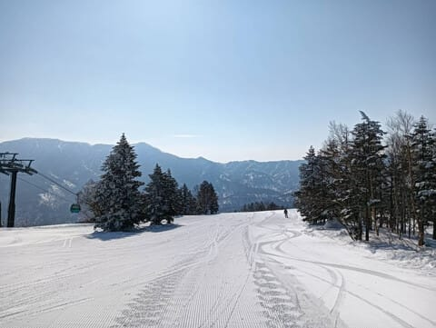
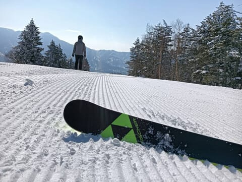

# 中1日でまた志賀高原スキー場へ復活！土日の志賀高原はともに晴れて気温が上がりそう

📅 投稿日時: 2025-03-22 00:08:24

ということで．

木曜日帰りで志賀高原で滑り，深夜に戻り．

金曜の本日，一日仕事をやっつけて…

（実は完全に今日の仕事が終わってなかったり

　するが，必殺 終わったことにする

　という技を使う）

そして明日の朝…というか，これから3時間半後に

また家を出て志賀高原へ舞い戻ります～！！

…金曜，仕事休みたかった…

でも，今日はいろいろトラブルがあって，

出先だと対処できなかったと思うので…

休まないでよかった

ということにしておこう…（遠くを見る目）

無駄に志賀高原1往復して．

この交通費を払うなら，宿代を払って

志賀高原で金曜も滑ったほうがマシだと

分かっていながらも．

うん．

今日のこのトラブルは，出先では対応

できなかった．

志賀高原で滑ってなくてよかった…

と，自分に必死に言い聞かせて．

またこれから300km運転して

志賀高原へ向かうのだ！！！

…ってなことで．

休日の谷間の平日の本日．

志賀高原で滑っている焼額メンバーも

多数いたようですが…

今日も朝イチはすっきり晴天！！

そして，朝イチはかなり締まった感じの，

いい感じのハイスピードバーンだった

みたいで…

硬めながらも，かなり良かったみたいです！

…いいんだ…

仕事が大変だったから，今日は滑れなくて

仕方なかったんだ…

ただ，昼はちょっと気温が上がり，

バーンはザブザブとまではいかないものの，

結構しっとりした感じで緩んだみたいなので…

明日の朝のバーンはかなり硬めかな．

予想は，水曜の段階から大きく変わらず．

22日(土)：3日連続の晴れ！

　朝から気温は高く，朝イチから0℃近い．

　朝イチは締まり気味のハイスピード

　バーン．

　運が悪ければコロコロも出るかも

　しれないけど，朝から気温が高く，

　日が当たるバーンは朝早く

　から表面が緩んで滑りやすくなる．

　昼間は山頂でも+8~9℃くらいまで

　上がるので，日差しのいいバーンは

　午前中から，日差しの悪いバーンも

　昼頃には雪が緩んで，春の重い

　ねっとりした雪になり，バーンが

　荒れていく．

　春スキーの一日．

23日(日)：おそらくこの日も終日晴れ．

　昼間に曇るタイミングもあるかも…

　朝はかなり硬めのカリカリバーン．

　でも，朝から気温が0℃くらいなので，

　日差しもあって雪はすぐ緩む．

　朝のうちは硬いのがだんだん緩んだ

　エッジが効いていくいい感じだけど，

　昼前にはユルユルに緩んでいく．

　ただ，土曜よりはわずかに気温が低く，

　雪が緩むタイミングは土曜より遅いか．

　どちらにしろ，午後は3月末らしい，

　重い春の雪になっていく．

　この日も春スキーの一日．

という感じでしょうか…

ということで．

睡眠不足の中1日でまた志賀に舞い戻るため，

今日はもう寝ます．

あと3時間後に起きないといけないけど…

おやすみなさい…

## 💬 コメント一覧

### 💬 コメント by (副院長)
**タイトル**: Unknown
**投稿日**: 2025-03-22 12:45:44

志賀高原のシーズンが終了した、私です。ライブカメラ見てると青空がいいなぁ　滑りたいなぁと思っていましたが、気温を見ると　えっ、10度？。妖怪もでるし、ザブザブにもなるし、後悔ずるゾと言い聞かせています。午後からタイヤ履き替えに行きます。まだ、志賀、ヤケビ、道路気象カメラから離れられないでいます。

### 💬 コメント by (レインボー77)
**タイトル**: Unknown
**投稿日**: 2025-03-22 14:44:29

土曜日の志賀高原情報

朝の蓮池+5℃。晴れ渡って気持ちいいけど暖かすぎるので、標高の高い渋峠を目指します。一年ぶりの横手山。第一パークは既に満杯。帰りに分かったんだけど、道路にも沢山停めれたみたい。第二パーク(陽坂)に何とか駐車。休日は早めにですね。

第一まで滑り降りると、程なく乗車できて渋峠へ。雪がいい！快楽快楽。でも、10時を過ぎると徐々にリフト待ちが発生。第三リフト降り場の上で珈琲タイム。珈琲は量があって500円とお値打ち。スキーTVで海和さんと岡部さんが誉めてたラグレット1600円も美味。同じ物を食べても上手くはならないよね。そのあと下まで気持ちよく滑れて終了。明日は横手は強風だけど、平日は今後は渋横かなあ。

それと、副院長様、お互い来シーズンまで生きていましょうね。お元気で！

### 💬 コメント by (Skier_S)
**タイトル**: 今日は完全春スキー（涙）
**投稿日**: 2025-03-22 21:17:35

＞副院長さま

シーズン終了お疲れ様でした！！

今日は完全に春スキーでした…かなり残念な感じです．

もうシーズン終盤ですね…

＞レインボー77さま

横手山は良かったんですね…

焼額も朝だけは良かったんですが，昼頃になるとかなり雪が重く

なってきました…

この時期になると，そろそろ早朝かあるいは横手・渋か…

という感じになってきますね…

### 💬 コメント by (ねも)
**タイトル**: Unknown
**投稿日**: 2025-03-23 05:41:15

あちこち失礼します。

この天気予報でＳさんの状況なら、私は今週末のスキーをやめます(笑)　Ｓさんのスキー愛は、誰も及びません👍

今日は、Ｓさんのスキー愛に報いる天気を、野沢温泉にいる私のためにも願っています✌️

### 💬 コメント by (Skier_S)
**タイトル**: ＞ねもさま
**投稿日**: 2025-03-24 01:37:14

いや…春の雪はそんなに嫌いじゃないので，晴れれば喜んで滑りに行きます（笑）．

そして，日曜もかなり春の雪でしたね…

