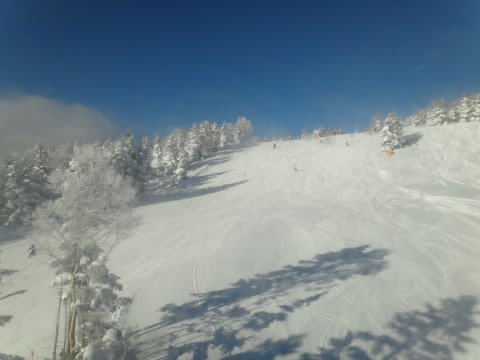
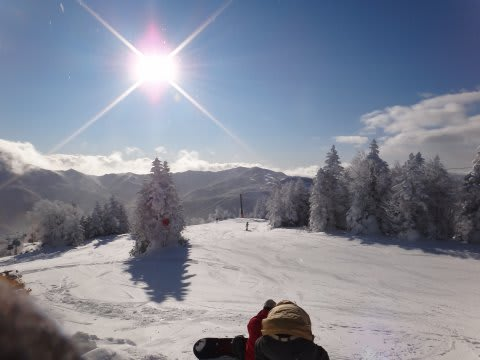
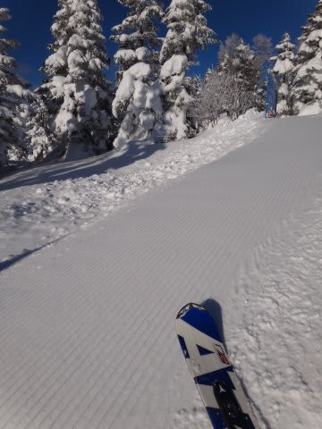
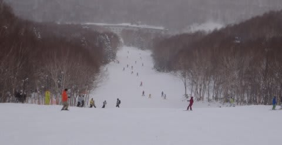
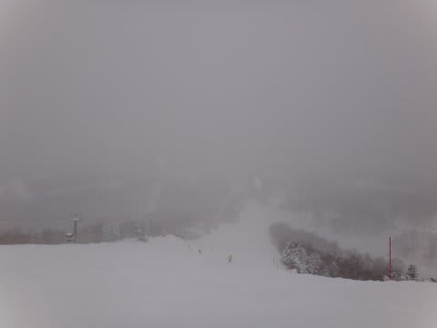

# 12月30日の志賀高原の状況は…

📅 投稿日時: 2011-12-30 21:57:36

🏷️ カテゴリ: [2012スキー滑走日記](cca3a0e9524e0203150f790b1fc3c71ad.md)

えーー．

12月30日から1月3日まで．

志賀高原で5日間スキー三昧ですごすことに

なっておりまして．

その1日目でございます．

朝は晴天でしたねー．

昨日から10ｃｍ強の積雪かな？

焼額ゴンドラは相変わらず多少のブッシュが出ていますが，

おおむねほとんどのコースは無事に滑れるようになりました．

…個人的にはもう一ふり欲しいんですけどね…．

で．

朝は，天気よし，やわらかい圧雪，人も少なし，という

最高の状況でしたが…

10時ごろにはゴンドラ待ちが最大5分程度．

まぁ，最大5分なのでぜんぜん許せますが，

コースの人口密度が上がってくる…

んで．

10時ごろからはにわかに掻き曇り，風が出てきて

雪が舞い始めました．

気温も昼間でマイナス12度．寒いよっ！

夕方は結構強い降り．

このまま降ると積もるかも…

と思ったけど．

降ったり止んだりで，それほど積もってませんね～．，

うーーん．もう一降り！

とりあえず．

年末年始休で，これまでと違って人口密度が

増えてきたゲレンデ．

ハイシーズンがやってきたなぁ，って感じです．
