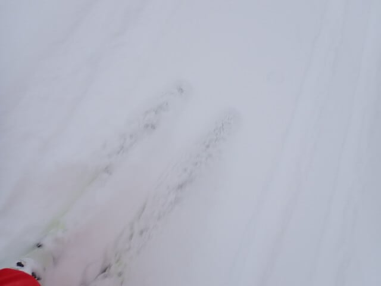

# 2025/2/11(月・祝)，飛び石4連休最終日の志賀高原焼額山スキー場速報モードレポート！…そして2月12日夜に志賀高原でも雨の危機（涙）

📅 投稿日時: 2025-02-12 03:14:54

🏷️ カテゴリ: [2025スキー滑走日記](cacd3fbf84d4a679ee61a5894c3f95e14.md)

ということで．

本日もラストまで滑り帰宅して．

帰宅後に家での一仕事をやっつけて

いると．もうこんな時間…（涙）

もう3時なんですけど．

もう，朝起きてから20時間以上

起きてるんですけど…

そして，明日も仕事なんですけど…

…それでもBlogを書く！！

偉い！！！

…ってなことで．

本日の志賀高原の速報レポート…

の前に．

明日12日の夜，ヤバいです…

かなりヤバいです．

何がヤバいかって，こいつ．

850hPaの赤い0℃線が，志賀高原より

北まで上がっちゃいますよ…！！！

うぎゃーーー！！

これは，志賀高原でも，山頂付近や

横手山方面は大丈夫だけど…

標高が低めの一ノ瀬や焼額の下部，

西舘やブナから下は，何か降れば

液体になりかねないレベル…

そして．

この日はぎりぎり微妙に，志賀高原に

降水域がかかるかかからないかレベル．

ただ，このあとに降水域が志賀高原に

広がるのは確実（泣）

うーーーーん．

このあと一気に気温が冷えて，13日朝

9時には，-6℃線が志賀高原にかかる

レベルになっているので…

冷えるのが先か，冷え始めるのが先か．

ギリギリのところ…

今のところ，降りはじめは一瞬雨で

その後雪に変わる…とみてますが．

降りはじめの雨の時間が長いと，

ガチガチアイスバーンになりかねないのが

怖い…

アイスバーンになっても，13日は一日

雪が降りそうなので，すぐに上に

雪が積もって隠れてくれそうだけど．

なるべくなら，アイスバーンは避けたい

ところ．

できれば気温が冷え始めるのが先で，

雨にならず降り始めから雪になることを

祈るばかり…

ただ．

この高温の後は…

また来ますよ，極端な寒気が！！

赤矢印の12-13にちごろの高温期間が

過ぎると．

17日あたりから，先週の豪雪をもたらした

4日から10日にかけての低温期間より

冷える予想になってます…！！

うーん．

これは，17日以降にまた積もりそうな感じ…

いや．

もう2月に積雪はいいから，3月か4月が

高温にならないよう，この冷え冷えを

貯めておきたい気分…

とりあえず，今週末の天気は明日また

予想するとして．

本題の本日の志賀高原の速報モードの

レポートです！！

まず．

本日は朝早いうちから雪が降りはじめ，

-10℃を下回る冷え冷えのほぼ終日

雪降りの天気で，朝のうちはときおり

強く降る感じでした…

圧雪後の朝に強く降ったので，

圧雪バーンも圧雪の上に10～15cmの

新雪が積もっていて，全面新雪バーン！

今日は圧雪バーンでも，細い板だと

辛い感じでした…

で．

朝のうちは新雪を楽しめたけど．

週末から離れた祭日というのに．

意外と人が多く…

今シーズン最高に近い混雑で，

第1ゴンドラは最高10分近く待ちました…（泣）

ゴンドラ待ちのピークは10時から

11時くらいの1時間ほどで，それ以外は

最大でもゲートからちょっとはみ出す

くらいで済みましたが．

週の半ばの1日だけの祝日にしては，

ゲレンデの人も多く…

午後になってもあまり人が減らない

感じでした（泣）

ただ，雪の状態は結構よくて．

朝に圧雪バーンの上に新雪が乗って

いたので，昼頃には全面ボコボコに

なるかな…

と思ったら，そこまでひどいボコボコに

ならず，意外とフラットで滑り

やすかったですよ～！

でも，午後に良くなるかも…

と思っていた天気は．

午後に上の写真のように一瞬日が射す

タイミングもあったけど．

基本的には雪降りの一日で．

昼を過ぎたらそこまで強く降ることは

無かったけど，午後になっても

雪がぱらつく一日だったのでした…

とりあえず．

週の半ばの祝日にしては混んだし，

天気も終日雪降りで，ときおり明るくなって

バーンが見やすくなる時もあったけど，

基本的にバーン状況もちょっと見にくめ

だったし．

金曜日に予想した，

運が悪ければ夕方まで曇り～雪．

という一番悪い予想が当たってしまった

感じで…ちょっと残念な天気では

あったけど．

朝のオリンピックコースでは脛パフを

楽しめたし．

雪質は終日最高だったし．

私個人的には，結構楽しめた一日

だったのでした…←同意してくれない人多数

とりあえず．

新雪たっぷり楽しめた，3泊4日の

志賀高原遠征，これにて終了です！

…4日間，短かった…（涙）

明日から仕事したくない…

## 💬 コメント一覧

### 💬 コメント by (レインボー77)
**タイトル**: Unknown
**投稿日**: 2025-02-12 13:03:26

水曜日の志賀高原情報

大雪が続いたあとの久々の晴れ間。しかもゲレンデはふっかふかのしっましま。朝陽に照らされた北アルプスが美しい。まずは白樺、唐松5点文句なし。GSも広々滑れて5点。オリンピックは早くもズクズクになりかけ、混雑もあって3点残念。パノラマも非の打ち所なしの5点。イーストもやっぱり最高5点。

奥志賀に行こうと思ったら、ゴンドラが動いてない。漏電のため運休とのことで、ヤケビを長居。最後は団体で混雑してきたので、未練なく11時終了。帰路は蓮池0℃と暖かくなり、背中には汗まで。

明日は極度の強風予報なので、根性なしスキーヤーは、、、

### 💬 コメント by (おぼう)
**タイトル**: ありがとうございました
**投稿日**: 2025-02-12 15:23:48

昨日、お声がけさせてもらいました(･∀･)

２高乗り場で「もしかして」と気付き、降り場から１ゴンまで着いていきました。

想像通りスイスイ行ってしまうので「離されてしまうかもー」と思いましたが、

斜度がゆるいおかげか、１２３ｃｍの子連れ用スキー板でも着いて行けました。

お話しできて良かったです。

ステッカーをどこに貼ろうか考え中です。

//

妻だけでなく、小5の娘も、土日の雪降り＋モサモサでもふるい落とされない根性があるようで将来が楽しみです(笑)

### 💬 コメント by (地元民)
**タイトル**: Unknown
**投稿日**: 2025-02-12 20:09:01

今朝は郷でも、車の外気温計でマイナス11℃

昼間、7℃まで上がる予想でしたが、実際は長野市で2℃までしかあがらなかったみたいです。

志賀高原、雪なのでは？

### 💬 コメント by (Skier_S)
**タイトル**: なんだか志賀は雨っぽい
**投稿日**: 2025-02-13 01:04:08

＞レインボー77さま

今日は良かったみたいですが，午後はヤケビもゴンドラ止まったみたいですね…

明日は暴風の吹雪になるので，ゆっくり休むのが吉だと思います…

＞おぼうさま

先日はありがとうございました～！

短い板で追いかけるのは大変だったかと（笑）．

娘さんは小5ですか！

また志賀にお越しの際は声をかけてください…

先日は在庫切れで2枚しかなかったですが，今度は奥さんと娘さんの分も

ステッカーお渡しします！

＞地元民さま

今朝は冷えたみたいですね…

ただ，夜中は気温上がります．深夜1時現在，蓮池付近のライブカメラだと，

雨っぽい感じです…（涙）

