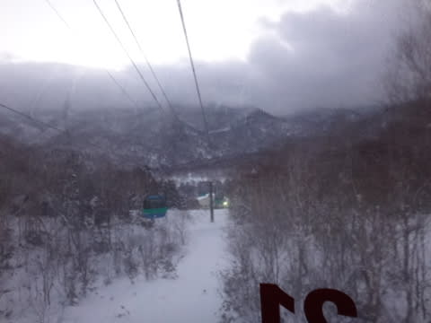

# あけましておめでとうございます！1月1日の志賀高原は…晴天なれどそろそろ雪が降ってほしい…

📅 投稿日時: 2017-01-02 01:17:29

なんということか！！

知らぬ間に，引っ越しやらなにやらドタバタした

2016年が終わり．

いつも通り志賀高原で滑っている間に，2017年が

明けてしまったようです…

ないつもの志賀高原なので．

正月という感じが全くしませんが．

年が明けたようですので．

あけましておめでとうございます

という，人並みの挨拶をしておきます…

で．

元日ですので．

はい．

そうです．

初日の出を狙う，ニューイヤーファーストトラック．

今年も参加してきました～！

時計の針を見てわかるように．

日の出前の6:45にゴンドラに乗り…

まだ薄暗い中を山頂に向かいますが．

うーむ．これ．

曇ってないかい？

…今年も初日の出は無理か…

山頂では．

初日の出を待つ間に，コーヒーやお神酒の

振る舞いがあり…

初日の出を待っての滑り出しに備えて，

200人のゲストがスタートラインで

スタンバイするという，

なんだか異常な雰囲気です…

…でも．

なんだか，とてもじゃないけど初日の出は

見えなさそうな天気…（涙）

…誰だ！今日は一日すっきり晴れって予想した

いい加減な奴は！！←自分でしょ

初日の出時刻にスタートロープが外され…

そして，スタートの合図で飛び出す200人！

スタートダッシュで頑張ったけど…

前に2人いるな！

初日の出は見えなかったけど．

元旦の太陽に照らされた空が明るくなっていく中…

元日一番のまた誰も滑ってない（前に2人いるけど…）

ぴかぴかバーンを切り裂いていく，この快感っ！！

2017年，一番初めのシュプールを刻むのだ！

…コース途中はガスってて怖かったけど（涙）

でも．

8時半の通常営業開始までの1時間半．

200人貸し切りゲレンデを滑り続けられるので…

この新春ファーストトラック．

結構コストパフォーマンスがいいんでないかい？

そして．

8時半からは通常営業開始！

そのころにはシマシマも荒らされて，

人も増えてきましたが…

うむ．

9時ごろには，，青空が顔を出してきましたよ！？？

そして，雲が切れて，晴れてきましたよ！

ふはははは！さすが，わが天気予想で

晴れといっただけのことはある！！←都合のいいことだけ，当たったことにしてないか？

…しかし．

天気が良くなると．

…なんだか，ゲレンデにこんなものが見えてきたんですが…

そうです．

コースのところどころに，浮石が…

…さらに，それだけじゃなく．

コース自体はかなり滑りやすそうに見えますが

…下地の硬いものがところどころに出てるんですが（涙）

そして．

今日は天気も良かったからか．

ゲレンデの人が多く．

やはり，昼頃にはかなりの凸凹になっていき…

コブ溝部分はしっかり固いです．

かなりしっかり気合を入れてエッジを手入れしていないと，

ツルんと行く感じ…

で．

大勢の人に削られたゲレンデは．

うむ？

うむむむむ～！？？

やはり．

まだ例年に比べ，積雪が少ないので．

ごく数か所だけですが，ちょっと雪が

薄くなっちゃってるところがちらほらと…

午後は凸凹＆アイスバーンで，ちょっと

手ごわめのコースコンディションでした(涙）

まぁ，そのおかげか．

午後2時以降は，コースの人も少なく．

ゴンドラ待ちもなかったので．

許しておいてやろう…←なんだか偉そうなんですが

ってことで．

凸凹＆アイスバーンにやられる．

ちょっと残念なコンディションの中．

日が暮れる16時半のリフト営業終了まで滑りましたが…

…そうです．

こんな日は．

圧雪かけたてのナイターがいいのだ！

昼間滑らないで，圧雪がピカピカにかけなおされた，

ガラガラのナイターに行ったほうがいいくらい

なのだ！！←あなたは昼間も絶対滑るでしょ

ということで．

ピカピカ圧雪かけたてバーンを．

いただきます～！！

今シーズン初の，焼額第3高速のナイター．

焼額クオリティのピカピカシマシマバーンを

いただきました～．

…いや．ホントに今日は．

昼間より，ナイターのほうが良かったかも？？？

うーむ．

しかし．

今日の午後の状況を見ると…

やっぱり，もう少し積雪が欲しいなぁ…

明日はつもらなさそうだけど．

3日の朝は，ちょっと積もるかも…？？

そこに期待かな～．

## 💬 コメント一覧

### 💬 コメント by (まいる)
**タイトル**: 新年
**投稿日**: 2017-01-03 08:09:34

Sさん、明けましておめでとうございます

今年もよろしくお願いします

志賀高原楽しんでいるようですね

２月の最終土日に志賀高原にいくので運が良ければ、また滑りましょう！

### 💬 コメント by (Skier_S)
**タイトル**: まいるさま
**投稿日**: 2017-01-03 22:36:37

明けましておめでとうございます！

今年もよろしくお願いします…

また，志賀高原でお会いできれば，

よろしくお願いします～

