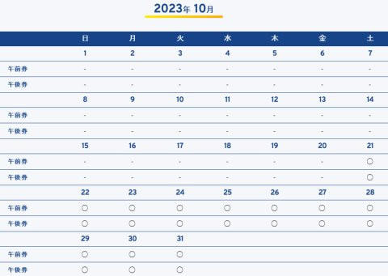

# え？今シーズンの菅平スキー場の早期営業，チケット事前購入が必要？…そして軽井沢プリンススキー場は11月1日オープンだったんだ…

📅 投稿日時: 2023-09-12 08:46:59

🏷️ カテゴリ: [日記](cc4b5682fb7b8b144980957a978653fb0.md)

ってなことで．

9月も半ばに突入し，ぼちぼち2023/24シーズンの

スキー場オープン情報がいろいろ出てきて

いるわけですが…

まず，10月21日(土)オープンと公表された菅平．

いろいろ情報が明らかになってきましたが…

（[菅平高原スノーリゾートホームページ](https://sugadaira-snowresort.com/earlyseason/)より)

下の案内の水色の線の部分，

10月21日のオープンから12月8日まで，

シーズン券が使えないのはわかってましたが…

気になるのは赤色の部分．

リフト券が9月1日から発売…！？？

早くももう発売開始してるじゃないですか！

（[菅平高原スノーリゾート早期営業案内](https://sugadaira-snowresort.com/earlyseason/)より)

どうやら事前販売をするみたいだな…

と，チケット販売のページを見に行くと．

こんな画面が出てきて…

え？

どの日のどの時間に使う券か，特定して

買うの？？

ってことで．

注意書きをよく見ると…

コース幅が狭くて危ないので，

一日券をなくして午前券(9時から12時半)と

午後券(11時半から15時)の2種類の券だけにして，

午前・午後で入れ替え制にして混雑を

緩和することは知ってましたが．

チケット販売数に上限をつけて，

その日に滑れる人を制限するみたいです…！！

（以上，[菅平高原スノーリゾート早期営業案内](https://sugadaira-snowresort.com/earlyseason/)より)

これって…

当日スキー場に行ってリフト券買おうとしても，

「もう売り切れです～」

って言われる可能性があるってことだな…

とりあえず．

菅平の早期営業に行く人は，

事前にリフト券を買っていきましょう…！！

ただ，コースが荒れてボコボコになりそうなので，

午後券は売れずに余る気もしますが…

まぁ，コースがいい午前に滑りたい人で，

週末に滑る人は事前購入必須でしょうね…

ってなことで．

菅平のオープンが10月21日で．

あとは，ウイングヒルズ白鳥もアイスクラッシュを

止めた今．

残るライバルは，イエティですが…

イエティは相変わらず，オープン予想日が

まだ出てません．

ただ…

昔はイエティのライバルだった狭山スキー場は，

むしろ夏の水遊びイベントを延長して，

狭山スキー場オープンは11月上旬と

公表していて．

すでにオープン争いの競争には関与しない

雰囲気マンマンです…

狭山も変わったもんだ…

（[狭山スキー場ホームページ](https://www.seibu-leisure.co.jp/ski_web/pdf/202309enchoeigyou_info.pdf)より）

残るアイスクラッシュゲレンデは，

軽井沢ですが…

軽井沢は，例年の11月3日より2日だけ早い，

11月1日オープンみたいです！

2023/24シーズンは50周年イベントが

いくつかあるみたいですが．

50周年がらみでいつもより早いオープン

なのかな…？

（[軽井沢プリンスホテルスキー場ホームページ](https://www.princehotels.co.jp/ski/karuizawa/winter/)より)

ってなことで．

そろそろ次のシーズンの情報が出てきたけど．

イエティが予想通り10月20日オープンなら．

もう，シーズンインまで40日を切ってます！

あと1か月とちょいで，もう次のシーズンが

始まっちゃいますよ～！！！

…でも．

シーズンが始まるのはうれしくもあるんだけど．

最近，ご無体が続いているせいか，

時間が経つのが速すぎて怖い…

まだあと2－3か月はシーズンが来ないぐらいの

気分でいたのに，やっぱり最近の地球，

時空が歪んでないか…？？

## 💬 コメント一覧

### 💬 コメント by (カンタロス)
**タイトル**: Unknown
**投稿日**: 2023-09-12 18:12:50

Sさま、こんにちは。　

菅平高原の事前予約制にはびっくりですね。

人数制限をしなければならないほど狭いのか…。

どの程度の人数を想定してるのかとても気になる所です。

私事ですが、パソコンを我慢したお金でスキーウェア（上下）をかってしまいました（笑）

かみさんが、いい加減買いなよ。と言ってくれましたし。

まぁ６年着ましたからね～。

余談ですが、神田の某ショップの店員さん情報によるとスキーウェアに関してメーカーが在庫を持たなくなってきてる。早期予約による受注生産的な感じになっていくのではないか。との事です。

いくら早期予約とはいえニューモデルは高いので旧モデルを買ってきた身としては信じたくない情報（笑）

### 💬 コメント by (Skier_S)
**タイトル**: ＞カンタロスさま
**投稿日**: 2023-09-13 01:41:44

アイスクラッシュの狭いコースは，人数制限しないと怖いです…

イエティは緩いから何とかなりますが，菅平のファミリー程度の斜度があると

かなり厳しいと思います…

そして，ウェア新調ですか！

今はウェアだけじゃなく，板もブーツも在庫を減らす方向に行っているので，

トップモデルはほぼ受注分で売り切れちゃいますよね…

旧モデルの残りを狙いにくくなってるし，残っている旧モデルも値段が落ちにくくなってきてます…

これからは，スキーヤーにとってはお財布に厳しい状況になりそうです．

でも，アメリカやカナダみたいに，一日券3万円とかになってないだけましかも…

