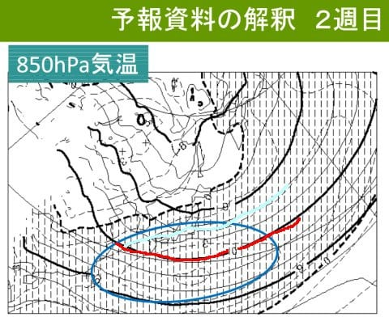

# 3月中旬までの気象庁1か月予報が出たよ！…2月はスキー場も冷え冷え，3月上旬はほぼ平年並み．そして2月13日の特派員によると志賀高原は終日吹雪で運休多数

📅 投稿日時: 2025-02-14 01:27:38

えー．

本日13日(木)の志賀高原ですが．

特派員によると，予想通り，朝から

かなりの強風の吹雪だったようで…

強風のおかげで，

焼額は第1，第2ゴンドラが運休．

でも，第2高速，第3高速，第4ロマンスは

動いたようですね…

（[焼額山スキー場Facebook](https://www.facebook.com/yakebitaiyama/posts/pfbid0vnLKWmr7A2KtN6sqeZoaYhtheA6MvrnEGLnUKqZZ5DX5wBi6D9Q4jaQQXJ5KEDyUl)より）

焼額はリフト3本動いたけど．

強風の猛吹雪のおかげで，その他の

スキー場はのきなみ壊滅状態．

奥志賀全滅．

中央エリアもほぼ全滅で，動いたのは

サンバレー・丸池・蓮池．

熊の湯は動いたのは第1，第2ペアのみ．

横手は第5，第6しか動かなかったよう

です…

動いている少ないリフトに人が集中

したので，悪天候で滑っている人が

少なくても，リフトはそこそこ混んだよう

ですね…

で．これだけ悪天候の吹雪というのに．

雪が降り始めたのは明け方だったので，

朝までの積雪はわずか10cm程度，

昼間に積もったのが20cm程度で，

思ったほど積もりませんでした…

でも，夜中に雨になってはいなかった

らしく，下地が硬くなってる気配は

なかったという報告があったので，

一安心です～！！！！

という志賀高原の状況報告の後は，

本題へ．

…そうです．

木曜日です．

定番の，気象庁の1か月予報が出る日です！！

…今回は，3月半ばとなる3/14までの一か月

間の予報になります…！

果たして，3月も引き続き冷えてくれるのか…？

気温と降雪量の予想を見ると…

おおぉ！！1週目，2週目は平年より冷える確率が

60％と，かなりの激冷えになりそうな予想…！！

そして，降雪量も多くなる可能性が50％と，

雪もしっかり降ってくれそう…！

…ただ．3月に入る3-4週目は気温が平年より

わずかに上がりそうな感じ…

詳細を見てみると…

負の北極振動！！！

これはスキーヤーにとってはうれしい

やつです！！

北極から寒気が放出され，

中緯度域に寒気が流れ込むという，

冷え込みが強くなるパターン！！

（北極振動は[この記事](e5bde56aeb97978df16133d718c475baf.md)も参考に）

実際に1週目の500hPa高度図を見ると…

赤く囲った北極付近は，普段より高度が高い

（≒気温が高い）ことを示す白抜きで，

水色で塗った中緯度地域のほぼ全域が，

普段より高度が低い（≒気温が低い）ことを

示す網掛けになっていて，北極の寒気が

中緯度に放出されて，中緯度が冷え冷えの

様子が示されてます…！！

これは冷える！！

そのおかげで．

1週目の850hPa気温も，平年より冷えることを

示す網掛け部分に日本はすっぽり覆われてるし．

海面気圧も見事な西高東低！

これは冷えるし雪が降りますよ～！！！！

さらに2週目の，２/22-2/28の850hPa気温も，

平年より低い網掛け域に日本は覆われて．

平年比-2℃の水色線が志賀に迫ってるし．

赤い0℃線は日本よりかなり南にあるし…

1週間平均で平年比-2℃ってのは，かなりの

冷え込みですよ…！！！

ただ，3-4週目，3/1-3/14の850hPa気温を

見ると…

うーん．日本は網掛け部分に入ってない（泣）

平年より気温が高い領域に入っていて，

平年比+1℃の線の中に入ってますね…

赤く塗った0℃線も志賀高原に近づき．

…これ，運が悪いと0℃線が志賀より

北に行って，液体が降る日が出てくる

かも…

とはいえ．

3-4週目はそこまで高温が続くという

予想でもないし．

さらに下のグラフを見ると，22日を

中心として，2/17-2/26くらいまでは

めちゃくちゃ冷えそうだし．

3月頭にちょっと気温が上がるけど，

そのあとはまたちゃんと平年並みに

戻ってくれそうだし．

壊滅的高温とかの予想ではなくて

一安心…

とりあえず2月中はすごい冷え冷えの

日々が続きそうです…

ただ．

昨日も書いたけど．

こんなぶっ続けに冷えて積もらなくて

いいから，

この冷え込みを3月か4月に取っておきたい…

## 💬 コメント一覧

### 💬 コメント by (jin_81-18)
**タイトル**: Unknown
**投稿日**: 2025-02-14 06:35:06

2/22-23は岐阜県ホワイトピアへ、3/1-3は焼額山へ行く予定です。

2/26辺りまでの冷え冷えは、先週のように高速道路が通行止めになったりするレベルなのでしょうか…。

### 💬 コメント by (Skier_S)
**タイトル**: ＞jin_81-18さま
**投稿日**: 2025-02-14 22:30:33

Blog見ました~！

ホントはこの飛び石4連休，志賀高原にいらっしゃる予定だったんですね…

2月17日からは，22日くらいまでは日本海側はまた通行止めになりかねない積雪量です…

22日以降は降っても通行止めになるほどまで降らないかな．

### 💬 コメント by (地元民)
**タイトル**: Unknown
**投稿日**: 2025-02-15 06:04:45

来週の寒波、下手すりゃ1週間、雪が降り続ける天気図に見えるのは自分だけ？

### 💬 コメント by (Skier_S)
**タイトル**: ＞地元民さま
**投稿日**: 2025-02-15 23:51:36

少なくとも来週22日までは降り続けそうです…

ピークは18，19，20日あたりでしょうか．

おっしゃる通り，ほぼ一週間降り続けそうですね…

今降らなくていいから，この寒波を3月か4月のために取っておきたい…

