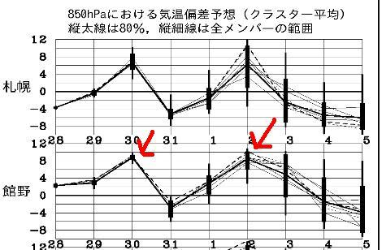
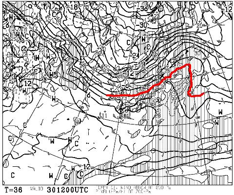
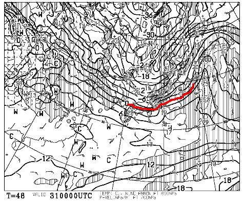
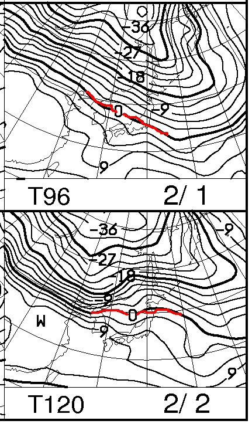

# この週末の志賀高原の天気は…かなり危険．

📅 投稿日時: 2014-01-30 01:39:27

うむむむむむむっ！

な，な，なんだ，これはっっっっ！

矢印で示した30日と2日，どちらも平年比10度くらい

気温が上がっちゃうんですがっ！！！

とりあえず，30日木曜日の850hpa気温を見てみると…

こんな感じで，0度線は志賀高原よりかなり北まで上がっちゃいます．

…それで，木曜日は，昼間に降りそうなんですよね…

こ，これは．

…考えたくないけど．

木曜は雨になりそうですね…(涙)

…でも．

31日はこんな感じで

0度線は本州より南に下がり．

志賀高原には-6度線がかかっているくらいなので．

31日はそこそこ冷えた雪がぼちぼち積もってくれそうで…

まあ，30日の雨で溶けた雪を隠してくれて．

土曜日(2月1日)の朝に，前面アイスバーン…っていう

悲劇は避けられそう．

で．

土日はこんな感じで．

2月1日はまぁきわきわ志賀高原は0度以下エリアだけど．

2日の日曜日は…

…

…あまり考えたくない感じですね(涙)

まぁ，土曜日は降らなさそうなのでいいんですが．

2日の日曜，これは降れば間違いなく雨．

…で，降るかどうかはまだ微妙なところ．

＃気温が上がるのは確実(泣)．

ということで．

現時点の土日の天気の予想は．

土曜日　朝のうち雪が残るかもしれないけど，

　　　基本的に晴れ．朝は気持ちいい圧雪．

　　　気温はこの時期としては高め．昼間は

　　　南斜面は雪が緩むかも…

　　　前日の積雪が少ない場合は，午後は下地に

　　　木曜の雨で凍ったアイスバーンが出てくるかも…

日曜日　曇り．気温は昼間はプラスにまで上がる．

　　　日がささなきゃそこそこ雪は持ってくれるけど，

　　　日がさすと危険かも…

　　　夕方遅くから，みぞれっぽい感じの何かが降るかも．

って感じで．

…まぁ，土曜は天気が良いので，ゼータクを言わなきゃ

楽しめるかも．

うーん．

日曜は，今のところ昼間は降らなさそうだけど．

降ったら致命的……

なぜ，一番寒い1月末なのに…(;＿;

また，金曜夜に最終予想をします…
