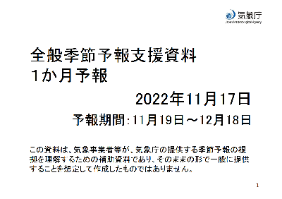
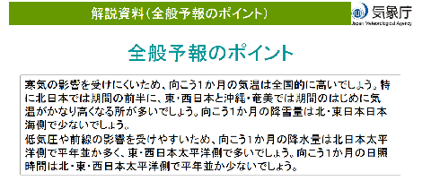
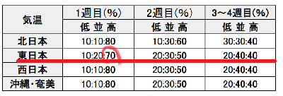
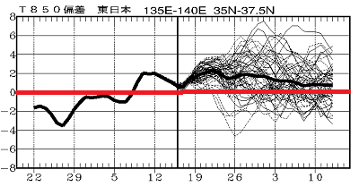

# 木曜恒例の一か月予報を見てみたら…え？？11月末から冷えるんじゃなかったの？？？

📅 投稿日時: 2022-11-18 01:39:59

ダメだ…

今日も眠い…

今日こそ早く寝たい…

ってなことで．

昨日は眠いのにもかかわらず，

長い記事を書いちゃったけど…

今日は短めの更新！！

えー．

毎週木曜と言えば．

そうですね．

このBlogの読者なら覚えてますよね．

気象庁の一か月予報の発表日ですよね．

[気象庁の数値予報ページ](https://www.jma.go.jp/bosai/numericmap/)から，

実況解析図，北半球予想図，スプレッド・高偏差確率，各種時系列…

等が見れますし．

[解説資料FCCX92](https://www.sunny-spot.net/chart/FCXX92.pdf)も発表されます！！

ってなことで．

11月19日から12月18日までの一か月間の

FCCX92を見てみると…

え…？？？

なに？？

１か月の気温は全国的に高い？？

東・西日本と沖縄・奄美では期間のはじめに気温がかなり高くなる？？

向こう１か月の降雪量は北・東日本日本海側で少ない？？？

ええええ？？

[3か月予想だと…11月末からは冷える](e81250b968d06462f1cb9577261b284e9.md)んじゃ

なかったの？？

気温予想を見ると…

1週目は，気温が高い確率が70％（屍）

2週目も，気温が高い確率が50％（泣）

3，4週目も…気温が低くなる可能性が

20％しかないんですけど…（激涙）

確か，[先週の1か月予報では，
12月に入るころの3，4週目は気温が低い](e4029324cfc2525ee2df4e86e78ec1e7f.md)

って予想だったはずなのに？？

先週の一か月予想，見事に外したって

ことか？？？

これから先の850hPa気温グラフを見ても．

志賀に雪が積もった16日に，気温が

平年並みに下がった以外．

あとはずっと平年より高い気温が

12月中旬まで続きそうな予想に

なっちゃってるんですけど…（悲）

…ラニーニャで12月は冷えるはずなのに．

どうなっちゃったんだ…！？？

でも．

一つ希望をもとう．

先週の予想だと，11月下旬から冷えるはず

だったのに．

その予想がひっくり返ったってことは…

来週の予想で，またそれがひっくり返って

冷え冷えの予想になることもあるのだ！！

私の経験で，気象庁の1か月予想．

特に3，4週目はかなりの確率で外れるのだ…！！

…今回も，3，4週目の予想が外れることを

願って…

このBlog読者なら何をするか，わかってますよね．

そうです．

これから毎晩．

来るぞ寒気！呼ぶぞ積雪！スキー場に

寒気をもたらす本気のハイパー冷え冷え踊り

を，狂ったように踊り続けるのです…
