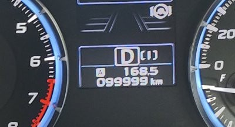
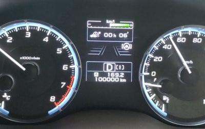

# 我がVMG LEVORG君，10万km突破！

📅 投稿日時: 2022-08-02 04:59:37

🏷️ カテゴリ: [車](cba0e8330b3f2ded7c1addfacc75d4547.md)

ってなことで．

我がVMG E型 LEVORG君．

この週末，走行距離99999kmのぞろ目を超えて…

ついに10万kmを突破しました…！

ってなことで．

2018年7月14日に納車されたこの車．

ほぼぴったり4年で10万kmを突破しましたね…

しかし…[あの日々](ecdca7ac058e50b9e3a2a3ae04e18b623.md)からはや4年か…

1年平均2.5万km．

うん．

普段なら年平均3.2万kmのところ，

コロナのおかげで走行距離が減って，

どうやらこいつとは長めに付き合えそうな予感…！！

今のところ不具合はないし．

高速道路の走行が多いからか，購入してからの

生涯燃費はリッター13kmを超えてるし．

…まぁ，燃費が良いとまでは言えないけど，

2lターボの 300馬力の4WD車と考えれば，

まぁまぁの燃費かな…

走っていて楽しい車だし．

うん．不満は無い．

2.4Lの新型LEVORGなんて，お値段が高すぎるし

うらやましくなんかないから，欲しくない．

…なんてったって，納車1年待ちらしいし．

…そして，1年後の納車なのに．

下取り車は今の下取り査定価格で買い取り保証して，

1年後に走行距離が何km伸びようが，

事故とか大きな傷とかつかない限り，

今査定した価格で1年後に買い取ってくれる

という．

年2.5万km，コロナがなきゃ3万kmくらい

走っちゃう自分としては，

ありえないくらいの好条件で下取り

してくれるみたいだけど．

うん．

でも，LEVORG2.4Lは高すぎるから買えないから，

買わないぞ～．

さすがに10万km超えたら，もう下取り価格は

かなり安くなっちゃってるから．

1年後と今で，下取り価格にそんなに差が

つかないはずだから…

大丈夫．

買わないぞ～！

新型LEVORGなんて，

うらやましくないもん！

## 💬 コメント一覧

### 💬 コメント by (naoちゃんねる)
**タイトル**: Unknown
**投稿日**: 2022-08-02 09:59:42

新型が欲しい気持ちが とめどなく溢れている記事ですねぇ(笑)😂

Sさんと同じ年月に購入した我が８は、現在80,000kmです…

結構走ってるつもりでしたが、100,000km超えとは相変わらず車も変○ですね！

プロジェクトX3を楽しみにしております❤

### 💬 コメント by (副院長)
**タイトル**: Unknown
**投稿日**: 2022-08-02 15:31:06

S様、納車が1年先ということは注文はもうすぐでしょうか？最近はそこそこの車は高価になりましたよね。タイヤもでかくて、高価だし。

前のシトロエンなんか15万キロも走ると、値段つかずでした。今は10年落ちの５Lハイブリットですが、お安く手に入り満足です。燃費は11キロぐらい（屋根に箱摘んだり、自転車キャリーのせて）走りますし、450馬力は志賀の往復に楽です。25万キロぐらいまでは大丈夫かなと、思ってます。

### 💬 コメント by (なるなる)
**タイトル**: Unknown
**投稿日**: 2022-08-02 17:39:40

新型LEVORG買っちゃうフラグですか?w

S様に触発されて半年後に買った、自分のVMGは55,000Kmで、乗っていて楽しいし

当分乗り換えの予定は無いです。というかずっと乗っていたいくらいです。

スキーブーツが限界を迎えているのですが、やっぱり、長岡某所まで行った方が

いいのでしょうか?　志賀高原よりも遠いような…

### 💬 コメント by (NONAME)
**タイトル**: Unknown
**投稿日**: 2022-08-02 23:04:27

次シーズンは5万キロくらい走るであろうから、今からたのんでおかないと必要な時に車が無い羽目に！！

って事で

ご購入決定、おめでとうございます

### 💬 コメント by (you160)
**タイトル**: Unknown
**投稿日**: 2022-08-02 23:42:16

Sさま

納車が1年後、さらに1年後の下取り保証があり、現在10万キロ。まさに替え時じゃないですか！

4年、10万キロならまだまだ値段付くかもですが、5年13万キロ、車検切れだと価値ダダ下がり、需要なくなりますよw

2.4リッターレヴォーグがSさまのこと、待ってますよ！

### 💬 コメント by (yumi)
**タイトル**: Unknown
**投稿日**: 2022-08-03 02:39:09

Sさぁ～ん🎵🚗🚙

やっぱり😅

これは 🚙次✌️買うよ🚙

って、フリだったのね🥰

🚗欲しい車🚗が 有るって、幸せ😃💕じゃぁ～ないですか🍀😌🍀

是非❣️お気張り下さいね🥰

ワタシも✌️

プロジェクトX3を💪

楽しみにしています👍

🍀🥰🍀

### 💬 コメント by (おおすぎ)
**タイトル**: Unknown
**投稿日**: 2022-08-03 12:30:21

ご成約♪　おめでとうございます　♪♪

実は、私事ながら、先月某Lメーカーにて、ハンコ押してきてしましましたが・・・

何と！納車予定日が、2025年7月以降～？？？？

当然、下取り保障なるものは御座いません・・・

（というか、一言さんのお前に売る車はねぇ～）という感じでした、トホホ・・・

### 💬 コメント by (Skier_S)
**タイトル**: コメント回答むちゃくちゃ遅れました…
**投稿日**: 2022-08-05 05:22:38

＞naoちゃんねるさま

え？もう8万km走ってるんですか…！

結構走りましたね．

まだピカピカだから，まだまだ走れそうですね！

＞副院長さま

あの車，450馬力だったんですか…

すごいですね．

最近の車は，10年落ちでも大丈夫なんでしょうか？

私の車は7年20万km走ると，ゴム部品はかなり劣化するし，ウオーターポンプやら

ラジエターやら交換しないと…と言われちゃって

かなりのお金がかかりそうな感じだったので

乗り換えましたが…

＞なるなるさま

長岡まで行くことを絶対おすすめします．

スキーブーツに関する考え方が変わりますし，

「なんでもっと早くに行かなかったんだろう…」

と思いますよ．

### 💬 コメント by (ほっぽ)
**タイトル**: レヴォーグ買取り
**投稿日**: 2022-08-13 10:54:22

＞Ｓさん

契約しても納車は１年後ですか。

ならば、手放す時期が事前にわかるので買取りする側としては時間的余裕がありますね(^^;

１年後の下取り保証だと今ならかなりの高額査定なんでしょうか。ディーラーの対応もスゴイですね。

余りに高額だと買取りできないかもですが、取り合えず私の意志は変わっていません。

人生一回くらいマルチシリンダーに乗るつもりで燃費の悪いガソリン車を買いましたが、

それもこれもレヴォーグ買取りのためのつなぎです(^^;

V6、3000ccにスーパーな過給機の付いた四駆ワゴン、

サブコンで390psにパワーアップした車は刺激的ですが、お財布には厳しいです(^^;

### 💬 コメント by (Skier_S)
**タイトル**: ＞ほっぽさま
**投稿日**: 2022-08-14 17:44:59

V6 3000ccのワゴン？？SUVじゃなくて？？

日本車じゃないですよね…なんだろう？

とりあえず，私ももうしばらくはVMGに乗るつもりです．

もし乗り換えを検討する時はまた連絡します～！！

