# 3連休中日，1月10日の志賀高原は…晴天なれど，混雑，積雪もなかったので…（涙）

📅 投稿日時: 2016-01-10 23:24:15

ということで．

3連休の中日なわけですが．

さすが，ちょいと混みましたね…

そして，雪がまた残念なことになってきています…

とりあえず，本日朝は…

予想通り，ぴかぴかの晴天でスタートです！

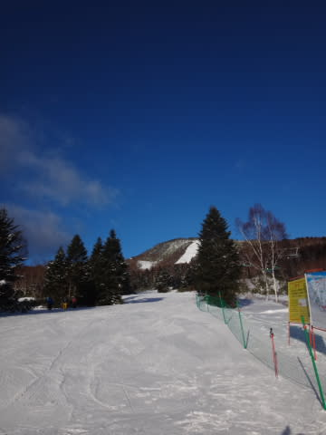

…と．

普段なら喜ぶところだけど．

…もう，晴れなくていいから雪を…（涙）

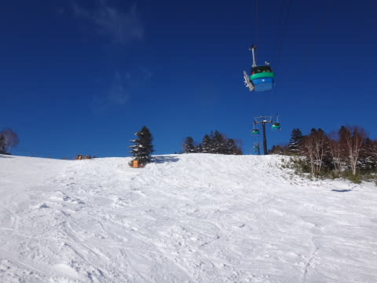

とはいえ．

山頂の気温は-9度と，そこそこ冷え込んでいるので…

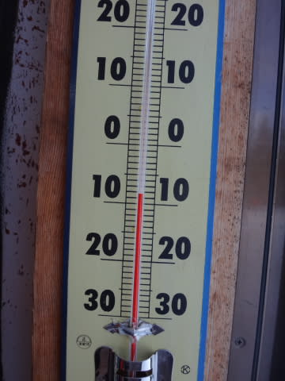

朝イチの雪質は最高っ！！

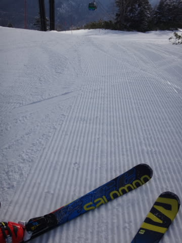

最高のシマシマ，ぴかぴかバーン！！

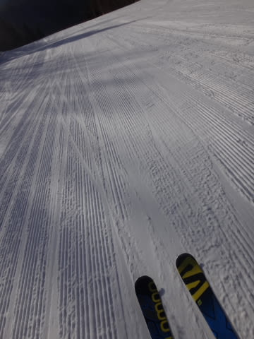

この朝イチの最高バーンは，私が予想した通りっ！←100回くらい強調しておきたいところ

と，しばし最高の朝イチシマシマを堪能していたら…

うむ？？

ちょっとゲレンデに氷のコロコロが…

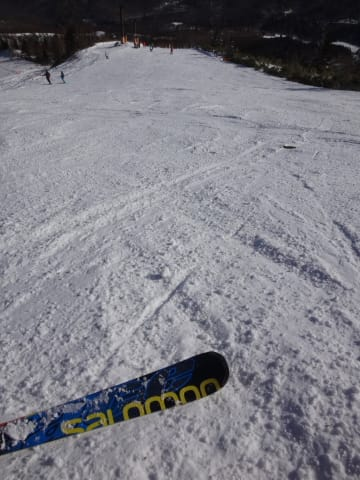

滑りにくくなってきたなぁ…

と，思っていたら．

さらに…

ありり？

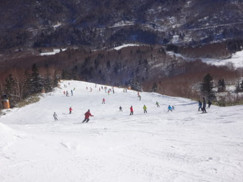

す，すごい人口密度になってきたんですが…（涙）

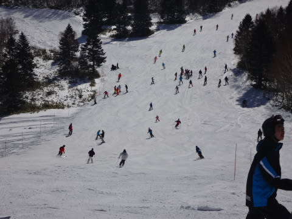

そして…

朝10時には．焼額第1ゴンドラは10分待ちに…（泣）

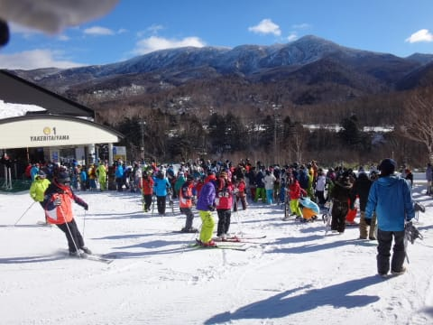

こんなに混むとは…さすが，3連休の中日…（涙）

第2ゴンドラは，30分待ちまで行ったようです（恐怖）．

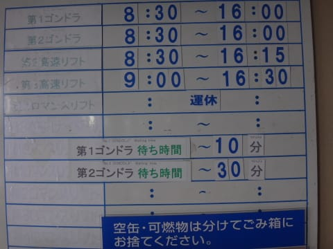

でもでも．

焼額の常．

ゴンドラ待ちがあったのは，午前11時までの1時間．

11時過ぎには，もうこんな感じで，待ち時間はほとんどなくなります．

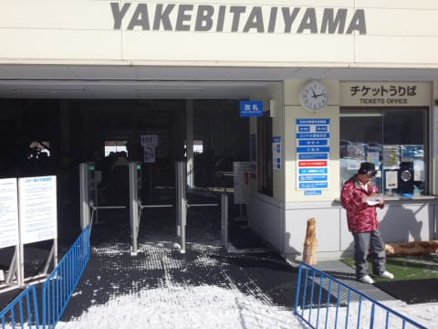

（時計は11時15分…さっきの列の写真から1時間経ってないです）

ってことで．

相変わらずコースの人口密度は高いけど，

まぁ，ゴンドラ待ちがないだけましかな！

って感じで．

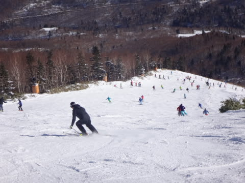

今朝までロープで区切ってあった，第1ゴンドラ下側の

新雪エリアがオープンになったのを堪能したりしつつ…

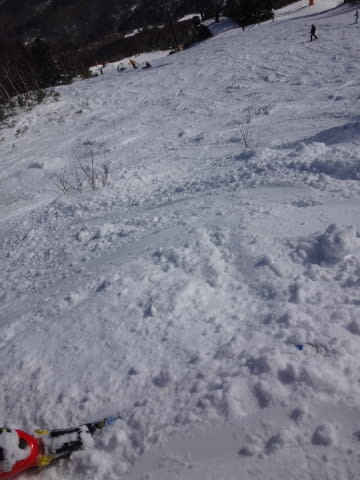

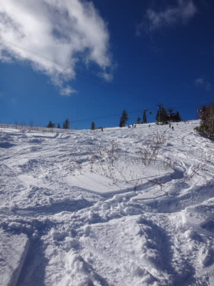

（あっという間に食い散らされましたが）

今日の昼は，ちょっとだけ奥志賀へ移動してみました．

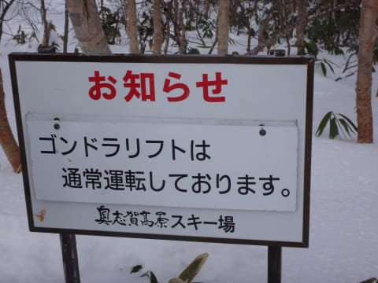

奥志賀ゴンドラ側のダウンヒルコース．

一見，まともそうに見えますが…

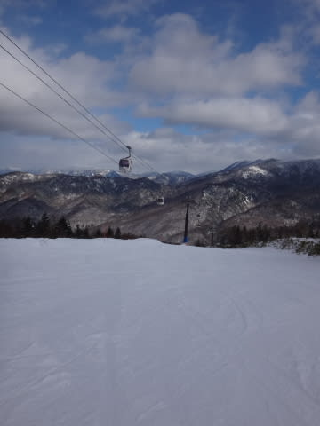

あれ？？氷？？

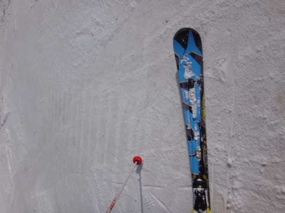

そして，コース上の急斜面．

かなり石が散らばっていて，結構危険…（涙）．

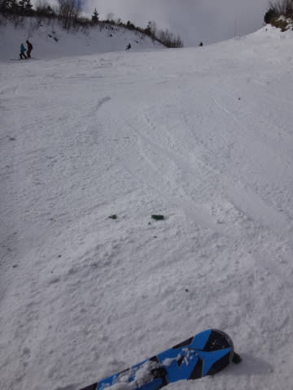

だのに…

奥志賀ゴンドラは3分待ち．

焼額の1ゴンは，この時間待ちなしだったのに…

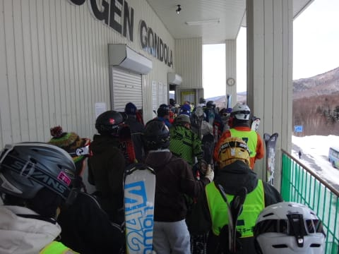

奥志賀のリフト側，エキスパートコースは…

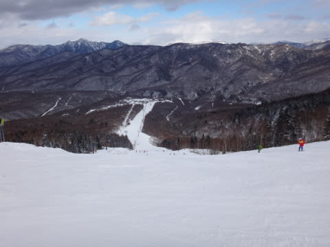

午後1時には，もうコブコブになっており．

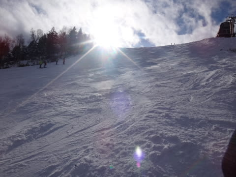

そして，焼額よりましだけど，意外と人も多く．

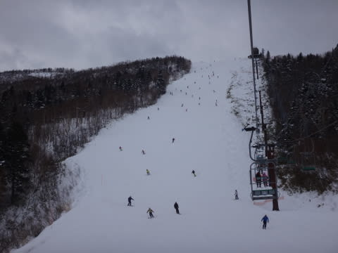

で．

あれ？？

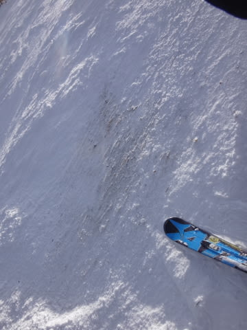

あらららら～．

ダメか．

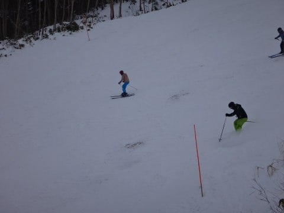

年末年始，他のコースがだめでもいい雪を

キープした北斜面のエキスパートコース．

ここもついに，地面さんが「こんにちは～」と

出てきちゃってます（泣）．

だもんで．

焼額に戻ると．

第2ゴンドラ側は…

ふーむ．

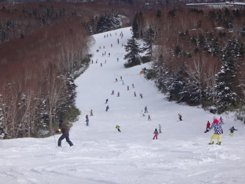

うーーーむ．

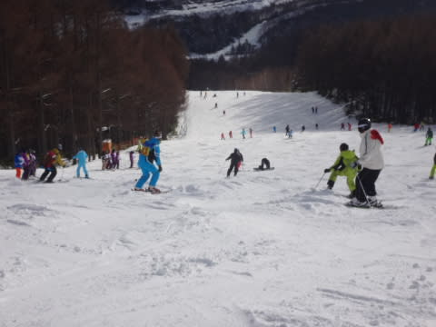

混んでてコブコブで，昨日積もった雪は

混雑した人で完全に削り取られ，人工雪の硬い下地が出てきた

アイスバーンに（涙）

そして，第1ゴンドラ側のGSコースも…

ああ．

今週必死につけた人工雪，

多くの人が滑ったので，はがされちゃって…

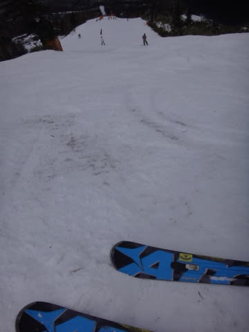

また，結構な石ころが出てきたよ…（激泣）．

そして．第3高速のイーストコースも…

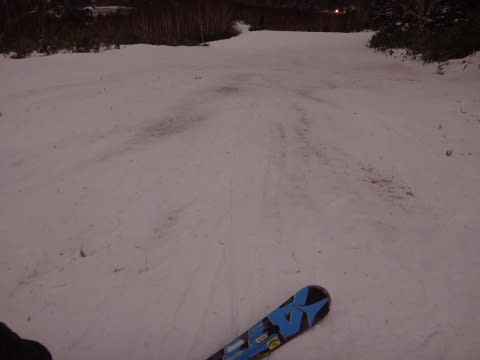

ダメだ．

ダメだよ．

昨日は積雪が10cmとはいえあっただけよかったけど．

今日は積雪もなく，人も多かったので．

また，ゲレンデの雪がはがされて，かなり土が…（止まらない涙）

＃1月3日の最悪状態よりはまだマシだけど

ああ…

…

そうだ！

こんな時はナイターだ！

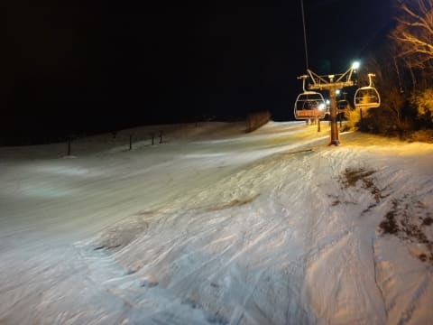

うはははは．

ナイターのシマシマバーンに癒されるのだっ！

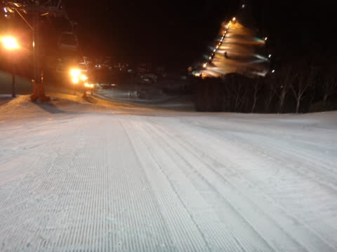

うひょう！

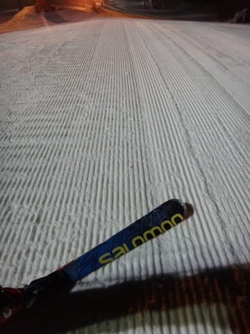

やったー！これは最高だ～！

…と，思ったところ．

え？？？

なんだか，一気に修学旅行生の団体さんが…

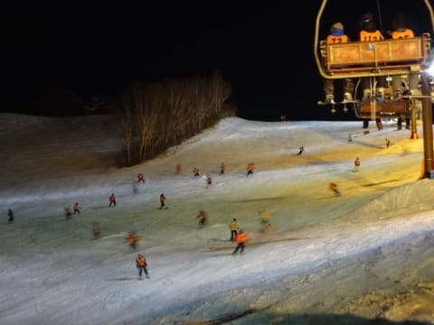

ってことで．

ナイター時間のほとんど，修学旅行の生徒さんがいっぱいで．

…気持ちよく飛ばすことができない，というオチでした（涙）

あああー．

なんだか，ちょっと不完全燃焼の一日だったなぁ…

もっと，

もっと雪をっ！！

…ちなみに．

今，雪がちらちら降ってます．

…たぶん，明日の朝までに，積もったとしても10cmかなぁ…

明日までに，3mほど積もってほしいなぁ…←一晩でそんなに積もったら，リフトもゴンドラも動かないから

## 💬 コメント一覧

### 💬 コメント by (ぴよ＠太田市)
**タイトル**: いよいよ深刻
**投稿日**: 2016-01-11 07:14:23

今シーズンいよいよ深刻！

東北もほぼ全滅、関東甲信越も同じで、今週はかぐらに非難してました。

苗場山一つ超えただけなのに、なぜにかぐらは雪があるのか？

下山コースもオープンしており雪は十分です

（苗場は悲惨．．）

ただかぐらにはぐるぐるゴンドラが無いので悲しいです．．．．

### 💬 コメント by (べべ)
**タイトル**: 降りませんね…
**投稿日**: 2016-01-11 09:33:05

今日も降ってませんね…

おかげで志賀高原の前売り券が減りません(泣)

将軍来ないかなー。

(昨日妙高杉ノ原に行ってきましたが、妙高もブッシュがかなり出てる状況です。)

### 💬 コメント by (まいる)
**タイトル**: 寒気が
**投稿日**: 2016-01-11 21:52:01

お疲れ様です。連休のスキーから帰ってきました。なんとかこれからの寒気で積雪して欲しいものですね。　ところで、盗難ホテル事件はいったい・・・(-_-;)

### 💬 コメント by (Skier_S)
**タイトル**: 雪よ降れ！！
**投稿日**: 2016-01-11 23:58:34

＞ぴよ＠太田市さま

かぐらは雪がいっぱいあるようですね～．

人もいっぱいみたいですが（笑）．

下山コースも滑れるんですね！

うーむ．雪を一部志賀に分けてほしいところ…

かぐらはぐるぐるゴンドラはありませんが，

かぐら第1高速をグルグルできれば私は

満足度高いんですけどね～．

＞べべさま

降ってません…（涙）．

妙高も悲惨ですか…

日本海側だから，今日あたり

降ってるんじゃないかと思っていたんですが…

今週末に期待！

＞まいるさま

ホントに，もっと積もってくれないと…（涙）．

しかし，盗難事件．ニュースであれだけ

「志賀高原で盗難」って連呼されると，

志賀高原の人気が落ちそうですね…（残念）

