# 年末年始の志賀高原スキー場の天気は？積雪があるのか？雪不足は解消するのか？…27日～28日朝，31日～2日にかけて，雪が降りそう…！

📅 投稿日時: 2019-12-27 02:23:19

🏷️ カテゴリ: [スキー天気予想](c6554f5c3c106093b511a8daae23757e8.md)

ということで．

26日（木）は，雨になるかも…

と，[24日の記事](e9d7d03e1b4e445016d2806f83bec00b5.md)で予告していましたが．

その時に，

　南風で志賀は降らないパターン

　が，予想天気図に出ているのか…！！

と書いていて．

また，[昨日の記事](ecd8c187c29e0924cf2f4b35bd4463aba.md)で．

　おそらく26日，夜まで志賀ではほとんど降らないと

　信じています．

と，書いた通りの天気になったようで．

今日は昼間はほとんど降なかったようです！！

（わずかに雪がぱらついたようですが…）

ふはははは．

すごいぞ，私の天気予想っ！！

…しかし．

　…そして，夜中の降り始め，麓近辺は

　確かに雨になっちゃうかもしれないけど．

と，書いた予想も，残念ながら当たってしまい．

26日夜中から，降り始めたようです…

それも，雨が（涙）

あぁ…こういう予想は当たらなくていいのに…（泣）

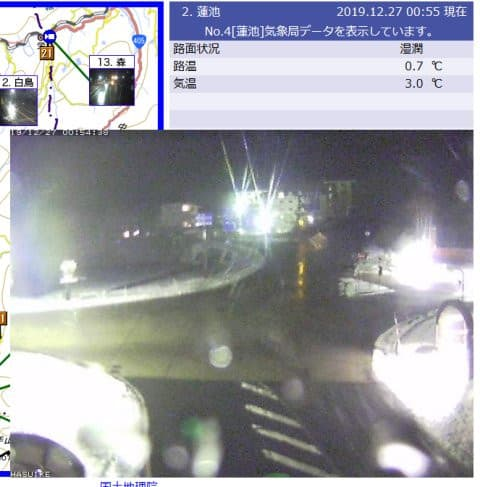

（[北信建設事務所ホームページ](http://hokushin-camera.org/)より）

でも，この時点の渋峠は気温-1.7℃で雪だったので．

蓮池は雨でも，スキー場の山頂近くは雪だったと

信じたい…（懇願）

そして．

午後2時半現在ですが，硯川や3号トンネル付近は

雪に見えます！！

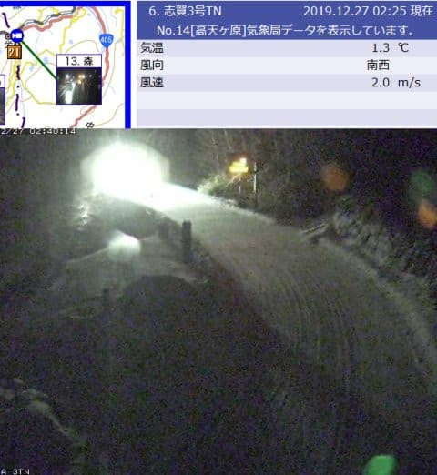

蓮池近辺はまだ雨のようですが．

明日27日の朝までには雪に変わります！

とりあえず，これから雪になる！

27日はどさどさ積もるはず…！！

と，27日の850hpa気温を見ると…

うほほほほ！！

赤い0℃線は日本のはるか南．

志賀高原には水色の-9℃線が近づいてます！

冷えます！

激冷えです！

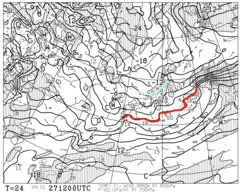

そして，27日の地上天気図を見ると．

うはははは．

やはり，日本海側に雪雲がかかっているので．

降ります．

積もります！！

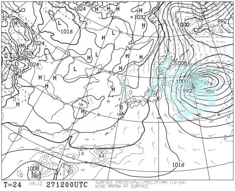

27日朝までに10cm程度，

27日の昼間でも，20cmほど積もって

くれるのでは…？？

とりあえず，恵みの雪になってくれそう…！！

…ですが．

27日は終日強風＆吹雪なので．

この日滑ろうと思う人は，覚悟してください．

奥志賀ゴンドラは動かないかも…

で．

多くの会社員が年末年始休みの初日となる，

28日(土)の850hpa予想図を見ると…

うむ．

この日も，水色の-6℃線が志賀高原に近づいて

来ているし．

朝は-10℃クラス，昼間も-5℃以上には上がらない

冷え冷えデー！

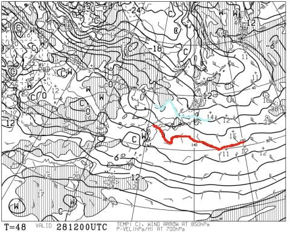

そして，この日の地上天気図を見ると．

…うむ．

一見，高気圧に覆われて晴れそうですが．

風向きとしては北～北西．

これだけ冷えて，北風だと…

麓は晴れても，山の上には

雪雲がかかるので．

おそらく夕方までは曇り空かな…

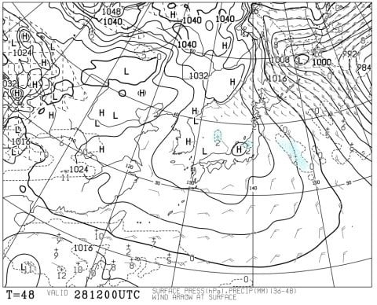

続いて29日(日)の850hpa予想図を見ると…

うううーむ．

赤い0℃線が志賀高原に近づいてきているので．

気温が上がりそう…

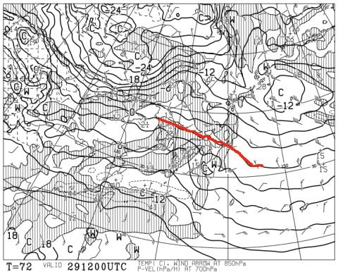

そして，29日の地上天気図は．

…降水域が志賀にはかかってないので，

まぁ晴れそうな感じですかね．

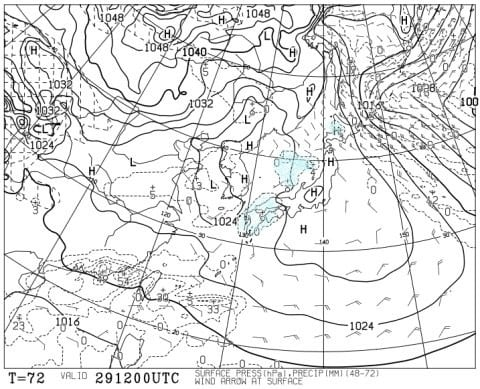

で．

続く年末年始休み3日目，30日の850hpa予想は…

…

…やっぱり，昨日段階での予想と変わらず．

この日，気温が上がりそうで．

水色の+6℃線が志賀高原にかかってます…！

これは，標高の高い志賀高原でも，

降れば液体確実の気温（泣）

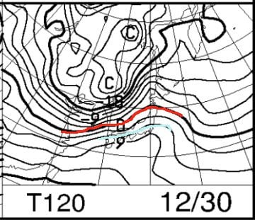

そして，30日の地上天気図は…

うーん．

きわどい．

きわどいところ，志賀高原にも

降水域の網掛けが…(泣）

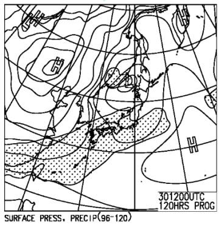

まぁ，降ってもリフト営業終了後の，

夜遅く．

それも，降水域ギリギリだから，

降ってもそんなひどい降りに

ならないんじゃないかな…

で．その後の31，1，2日の850hpa予想図を見ると．

うむ！素晴らしい！

この3日とも，赤い0℃線は日本の

太平洋岸より南にまで下がり．

31，2日に至っては，水色の-9℃線が

志賀に近づいているので．

冷えます．

激冷えです．

この3日間は，いい感じで冷えそうです…っ！！

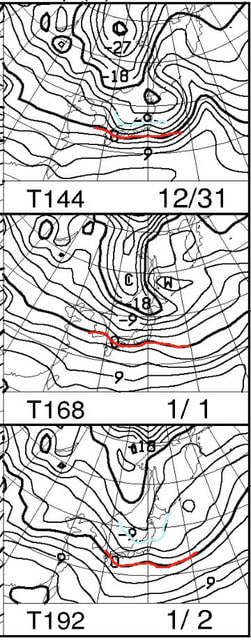

そして，31，1，2日の地上天気図を見ると…

この3日間とも，日本の東海上に低気圧があり，

日本付近の等圧線が縦縞になる，

典型的な冬型パターン！！

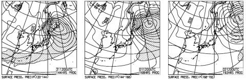

31日と1日の図では降水域の網掛けが

志賀高原にかかっているので．

おそらく，31～1日夜にかけては雪が降りそう…！！

2日は，降水量のある部分を示す網掛けが，

本州にはかかってないけど．

でも，2日も志賀高原では雪が降り続けると思います…

ってなことで．

まとめると．

27日(金）：夜中は雨だったけど…じき雪に変わり，

　雪がシンシンと降り続く朝．

　朝は気温が高め．-2度程度？

　朝は10cmほどの重めの積雪．

　昼間は気温がぐんぐん下がり，

　ひたすら雪が降り続ける．

　風が強く，吹雪なので，奥志賀

　ゴンドラは動かないかも？？

　朝からリフト営業終了までに，

　さらに20cmほど積もってくれるか…

　夕方になったらかなり気温が落ちて，

　-10℃くらいまで冷えるか…

28日(土)：この日も朝まで雪が降り続ける！

　朝も5cmほどの積雪．

　朝は激冷え，-10℃以下．

　朝のうちは雪がのこるが，

　そのあとは曇り空．

　午後に向けては雲も減っていき，

　夕方は日も射すかも．

　雪は朝イチは昨日からの冷え冷え

　新雪が圧雪された，天然雪のシマシマ！

　久々の天然雪！

　朝イチ最高！！

　ただ，人が多いので，午後に向かって　

　荒れ荒れボコボココブ斜面になりそう…

　終日寒いよ！

29日（日）：朝は-8℃程度に冷える，

　曇り～晴れで，朝イチは冷え冷えシマシマ

　バーンを満喫できそう！

　昼間はちょっと気温が上がり，

　午後は0℃近くまで気温が上がる．

　晴れた太陽の下，いい感じの雪で

　滑れるかな．

　人工雪が無いエリアはまだ

　雪が薄いので，ブッシュが出てくる

　心配が…

　

30日(月)：朝は-3℃程度かな？

　あさイチは締まったシマシマ！

　朝は日が射しているかもしれないけど，

　基本的に終日曇り．

　昼間は気温が上がり，プラス気温にまで

　上がり，雪のコンディションは悪化していく．

　夜になって，雨が降り始める可能性も…

31日(火）前日の夜に降り始めた雨は，

　夜中に雪に変わる．

　この日は激冷え，昼間も-10℃程度．

　終日雪が降り続ける吹雪の一日．

　ゴンドラは減速，ヘタすると営業できず．

　でも，29，30と積雪が無く，心もとなかった

　天然雪の積み増しが！

　昼間も雪が積もるので，ゲレンデは

　モサモサになっていく．

　夜までひたすら降り続ける．

1日（水）：この日も朝まで降り続ける．

　気温は朝は-10℃クラス．昼間も-5℃程度．

　朝はブーツパフくらい積もってるかも？？

　昼間はドサドサ積もるほどではないが，

　終日雪がぱらつく．

2日（木）：この日も冷え冷え！

　朝にかけて，雪はうっすら

　積もってくれるか…

　終日曇り～雪がぱらつく天気．

　気温は朝は-10℃以下，昼間も-5℃以下．

…ってな感じでしょうか．

27日の雪で，28日は最高！！

29，30と積雪の積み増しが無く．

30日は，夜から雨になる可能性があり，

ちょいとヤバそうですが．

それ以外は気温が低く，

31日～1日は，そこそこ積もってくれそう…

とりあえず．

今の天気図のままなら，年始にはそこそこ

滑れるようになってくれそうな気配…！

## 💬 コメント一覧

### 💬 コメント by (かず)
**タイトル**: Unknown
**投稿日**: 2019-12-27 15:29:07

明日1ゴン動きますけと…明日はやめておきます  奥志賀とGS側の状況で日曜から7泊予定です  ビール太りでウェア変わってますので声かけさせてもらいます笑

### 💬 コメント by (Skier_S)
**タイトル**: ＞かずさま
**投稿日**: 2019-12-27 23:24:22

明後日は晴天ですが，雪のコンディションは土曜28の方がいいかもです…

30日は避けた方がよさげな天気．

31日にドサドサ降りそうなので，パウダー狙いなら31日からでしょう…

また志賀高原でお会いしましょう！

