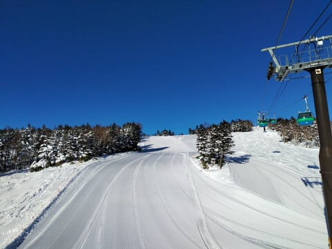
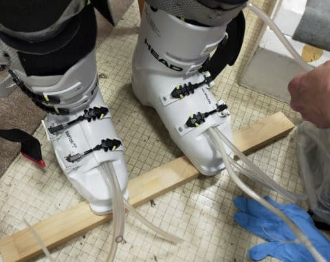

# HEAD Raptor WCR3のHEAD純正フォーミングインナーを作ってみた，その3…インナーブーツのフォーミング！

📅 投稿日時: 2024-01-10 03:37:18

🏷️ カテゴリ: [スキー雑談](c1f9d2cb7478308da16419928ea3945e9.md)

えー．

今日もとんでもない時間にBlogを

後進しています（涙）

ダメだ…仕事が進まない…（泣）

で．

本日…というか，もう昨日になる9日の

志賀高原の特派員写真を見ると…

うぎゃーーー！！

雪も天気も最高っぽい！！

先日積もった雪が圧雪された，冷え冷え

雪の快楽シマシマバーンじゃないですかっ！！

滑りたい～っ！！

こんなコンディションで滑りたいっ！！

仕事してるどころじゃないよ…

明日…というか，日付が変わった本日，

10日も志賀高原は晴れそうだから，

今日もコンディションいいだろうなぁ…

あ，9日から本日10日水曜日にかけて，

北陸地方では積もりそう，とニュース

などでは言ってますが…

残念ながら，見事な西風です．

志賀高原には積もりません…（涙）

なんだか，能登地方とかの被災地に降る

パターンなんですよね…

被災地に降らないで，志賀高原に

降ってほしい…（懇願）

ってな感じで，10，11日は志賀高原では

雪はほとんど積もらなさそうだけど．

でも，12日から13日にかけて，20cmほど

積もってくれそう…！

うーん．

この週末にかけて，もう少し積もって

欲しい気もするけど…

ゲレンデ状況は改善することはあれ，

悪化はしないでしょう．

とはいえ，13日の土曜の朝は，

運が良ければ脛パフくらい積もる

可能性もあるので，

（運が悪ければ10cm）

志賀高原にいっぱい積もってくれるよう期待

しましょう…！

で．

期待できるのは15，16日です！！

この2日はかなり冷え込んで，さらに北風に

なりそうなので，結構積もりそう！！

来週末は，志賀のゲレンデ状況は結構

改善しそうな予感…っ！！

とりあえず，また明日週末の天気予想

します～！！

ってなことで，本題へ．

[昨日の，フォーミングインナー作成の記事](ed44d0009d0d97ce999eab2644f2c8466.md)の

続きです！

前回の記事で，

インソール作成・シェル成型・カント調整が

終わったので…

今度は最後の大物にして本命，

フォーミングインナーの成形に入ります！

当たり出しを終えたシェルに…

フォーミング材を流し込むホースが

適切な位置になるようインナー

ブーツをセットして…

そして，かかとの位置が適切な場所に

なるように，慎重にブーツを履きます．

足の位置が適切なことを確認し，

バックルの締め具合も緩く

締まるくらいに調整して…

まずはつま先側に注入口があるタング

の方から，フォーミング材の注入開始！

私は足首が細く，通常のブーツでは

タングに厚めのカーペット材を貼って，

厚さ増しをしているくらいなので…

このタングのフォーミングだけでも，

かなりホールドが変わるはず…！

左右のタングのフォーミングが終わったら，

今度は台の上に乗って，インナー本体の

フォーミング材注入にかかります．

このように，つま先側がちょっと高く

なっている感じの台の上に乗って…

2液混合型のフォーミング材を

混ぜたら…

かかと側のホースにフォーミング材ボトルを

繋いで，インナーへフォーミング材を

流し込みます！

インナーブーツにフォーミング材が

流れ込んで，余分なフォーミング材が

つま先側から流れ出しますが…

足裏の左右からかかと，さらには

タングを覆う足首から脛に近い

部分まで，しっかり発泡剤が入って，

足形ぴったりに包み込むインナーが

出来上がってきます…

片側のフォーミングが仕上がるのに，

わずか2-3分．

その後，反対側も同じ手順で

フォーミングしますが…

こちらのフォーミングも3分程度で終わり．

タングのフォーミングを合わせても，

両足のフォーミングで30分ほどで

あっけなく終わります…

これで，あとはフォーミング材を

流し込むホースを引っこ抜いたら，

フォーミングインナーの完成です！！

このフォーミングインナーですが．

タングも成形されてぴったりな上．

赤線で囲った足の甲の部分から，

足首の部分にもしっかりフォーミング

剤が入るので…

足首が細くて，足首のホールド感に

いつも悩まされている私の足でも，

足首が前後に動くことなく，

しっかり足首が固定される，

理想のブーツに仕上がりました！！

（[続く](e74dad7701b0a7b21808dfcb63d844553.md)）

## 💬 コメント一覧

### 💬 コメント by (m&t m)
**タイトル**: Unknown
**投稿日**: 2024-01-10 15:00:09

ヘッドの日本未入荷フォーミングブーツ良さそうですね

神田ブーツ研究のフォーミングインナーはレクザムのフォーミングインナーですが、ブー研オリジナルで市販品より脛と甲の部分が特注でより多くフォーム材が入る仕様になっています

市販品よりもフィット感が抜群ですが、人によっては痛いブーツになってしまう場合があるみたいです

施工者の腕が問われます

自分は現在フィッシャーバキュームフィットブーツですが、足型に合わせてインナーではなくシェル自体を成型するため、フォーミングブーツの様な圧迫感がなく足にフィットしています

また、フォーミングブーツが再成型できない一発勝負なのに対し、バキュームフィットは再成型可能なところもメリットです

自分もインナーがへたってきたところで再成型しました

両方とも履いた経験から、よりタイトなものを求る方はフォーミングブーツを、一日中履いても快適なものを求める方はバキュームフィットがお勧めです

### 💬 コメント by (レインボー76)
**タイトル**: Unknown
**投稿日**: 2024-01-10 15:35:12

水曜日の志賀高原情報

朝の上林-1℃　蓮池-4℃。前日よりかなり暖かい。

今日も奥ゴンスタート。小雪降るなか、ダウンヒルはふかふか快楽だけど、ニ壁(上の壁)上部に地肌。

エキスパもふかふかまっ平らで感激もの。林道は上部で一ヶ所地肌。

三高はやっぱり志賀一の雪質。基礎練習には欠かせない。今日は仲間４人がフィッシャーRC4でお揃い。とっても楽しいけれど、ガスが濃くなってきたので11時終了。これではレインボーどころかイレブンAM隊です！

### 💬 コメント by (副院長)
**タイトル**: Unknown
**投稿日**: 2024-01-10 22:25:42

新雪入荷あざ～す。14日から2泊3日で私の今シーズン始まります。骨折後なので、アクシデントはご法度です。おとなしくゆっくり開始したいと思います。フォーミングブーツブーツうらやましいです。靴がよくなると、新しい板が欲しくなるし、財政的には悪循環ですよねぇ。

今シーズンはゴンドラ制限なしでしょうか？お会いできたらよろしくお願いします。

### 💬 コメント by (愛読者)
**タイトル**: Unknown
**投稿日**: 2024-01-11 07:06:47

写真は、Ｓさんがとれない角度からのも多数。相棒が撮られたのですか❔そうなら相棒のフォーミングパート2もあっありませんか。おかわりします。

### 💬 コメント by (レインボー76)
**タイトル**: Unknown
**投稿日**: 2024-01-11 20:10:57

木曜日の志賀高原情報

朝の上林-5℃、蓮池-7℃。冷えてる。

ヴォクシーでこんなにスリップサインが出るのは初めてです。でも、上に行くとカミカミでした。

今日は奥志賀からサンバレー往復です。

まずは三高からエキスパートへ。な、なんとシーズン1のカミカミ、完璧圧雪。予定がなければずっと滑っていたい気分。

ダウンヒルはやっぱり壁での地肌が気になってだめ。

漕いで漕いでやけびへ。GSは、まだ閉鎖のオリンピック分岐辺りで地肌があるものの、まずまずかな。

白樺もいいけどエキスパには及ばない。

ダイヤは圧雪が悪いうえに見にくくて最悪。

タンネは雪はいいけど団体さんで居場所がない。

高天もまずまずだけど、橋が閉鎖なので担いで歩いてヘロヘロ。

西館は快適でした。でも下部では過密でジャイアントへ助走が効かない。

よっこいしょ、よっこいしょ、よっこいしょういち！

6人がようやくたどり着いたジャイアントリフト。面白いことに年齢順に遅い。後ろから76 73 70。

ところが悲劇というものは起きるものなんですね。韓国ドラマみたいな展開。なんと、私らが乗る番になって故障。回復の目処なしだって！

時に10時30分。ゴンドラで寺子屋へ。少し石が出てるけど良好でした。

ファミリーも快適まっ平ら。

チウホテル11時30分着。久々のチウシチュー。

### 💬 コメント by (不敗の剣士)
**タイトル**: Unknown
**投稿日**: 2024-01-11 20:14:34

木曜日の志賀高原情報

昼過ぎのタンネは学生団体が休憩中で狙い目。学生さん削ってないので最高でした。

あとは一目散にやけびニ高から奥志賀へ。これもしたの道が閉鎖なので、またまたよっこいしょ。完全に力尽きました。13時10分終了。サンバレーへの道は漕ぐ事が多すぎるのでもうしたくない。無理です。

今日良かったのは、エキスパ、西舘、タンネ(時間帯に注意)、ファミリー、寺子屋

明日は西舘メインにしようかなあ！

### 💬 コメント by (Skier_S)
**タイトル**: コメント回答遅れました
**投稿日**: 2024-01-12 00:30:43

＞m&t mさま

私も最初FISCHERのバキュームを履いてみたかったのですが，私のような

局所的な出っ張りがある足ではバキュームの成形では間に合わないらしく

（緩い凸凹には追随できるけど，極端な出っ張りなどは吸収しきれない)，

私の足だとバキュームで回避するのは無理だと言われました（涙）

おそらく，普通の足形の方ならバキュームはすごくいいみたいですが…

再成型ができるのも魅力です．

＞レインボー76さま＆不敗の剣士さま

志賀高原レポートありがとうございます！

結局サンバレーまでは行けなかったんですね…

絶妙に運が悪いタイミングでしたね．寺小屋やGSコース，まだ石が出てるんですか…

もう一降り欲しい！

＞副院長さま

14日からシーズンインですか！

15，16日とかなり積もりそうなので，ゲレンデコンディション回復＆パフパフを滑れると

思います…

14日，志賀高原でお会いしましょう！

＞愛読者さま

いや…これ，手を伸ばして撮った自撮りです．

全部自分で撮ってるんですよ…

残念ながらお替り無しです（笑）．

