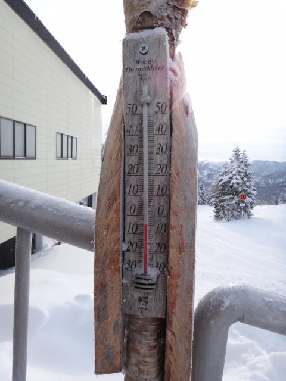

# 1月22日　日曜日の志賀高原は…

📅 投稿日時: 2012-01-23 01:18:29

とうことで．

この週末2日目，日曜ですが．

昼ごろから晴れるかな～…と予想してましたが，

予想より早く低気圧が通過して行ったので，

天気は，朝イチは曇っていたものの．

朝9時を過ぎたころから，時々日が射す状態．

で．

気温は．

予想通り上がりましたね…

先週までの寒さがうそのよう．

この時期としては，暖かかったですね～．

朝の気温は山頂でもマイナス5度と，先週より10度以上暖かかったという…

んで，昼間の気温はぎりぎりプラスまで上がっちゃいましたね～

でも，志賀高原では終日雪はそんなに緩まなかったのでラッキー．

握ってダマに固まるような雪にはならず．

朝から比較的しっかりとした圧雪で，

重い新雪に悩まされることも無く．

夕方まで比較的良い雪をキープして，雪自体は悪く無かったです．

道路の雪は1月の志賀高原にして珍しく，解けていましたけどね．

あー．

一の瀬ファミリーのメインバーンの上部は

ぼこぼこしてところどころ固くて，ちょっと厳しかったですけどね．

さらに．

焼額のゲレンデは．

昨日と同じように．

「経営大丈夫か？？」

と心配になるくらいがらがら．

…人がいないんですが．

当然，ゴンドラ待ちも全く発生せず．

一の瀬のゲレンデは，修学旅行生もいて

そこそこ人はいたんですけど．

それでもリフト待ちは全くなし．

とりあえず．

この日は．

空いているバーンを気持ちよく滑れて，

それほど寒くも無く，時折日も射し．

当初予想と比べると，状況としてはかなり

いい一日でした．

