# コドモとコモド！子連れダイブクルーズ26　コモドはサンゴもきれいです

📅 投稿日時: 2011-07-30 00:31:56

さて．最終日のスペシャルダイブは．

貸切で，ガイド一人に私一人というゼイタクなダイビングです

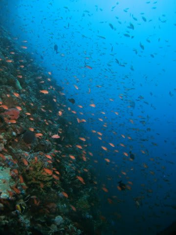

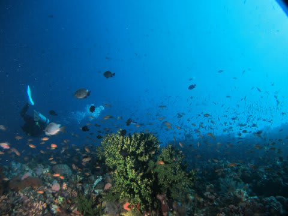

ドロップオフに沿って，ゆるゆると行ったり来たり．

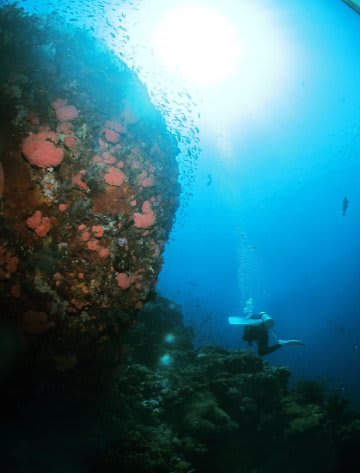

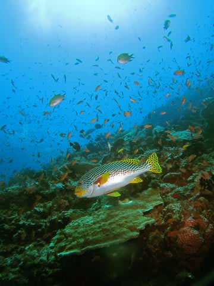

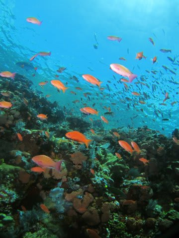

流れの下流側の，一番端っこまで来ると…

水面付近，すごい渦巻いているのが見えます．

ものすごい流れているのが見えます．

ぐるぐるです．

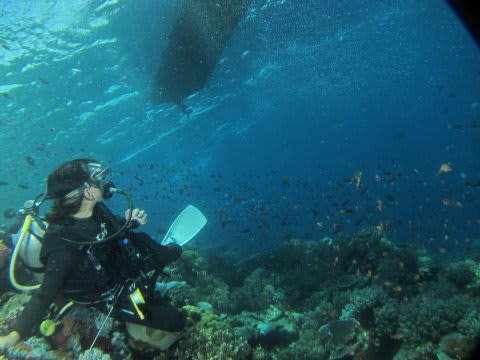

写真だとちょっとわかりにくいですが…

ボートの右側あたりに，グルグルの流れが見えます．

ぐるぐるエリアにちょっと近づいてみると…

体が思いっきり揺さぶられる！

うおおお！

…これ以上進むためには，ちょっと命のスペアを

あと1～2個準備しておかないといけないなぁ…

さすが，激流の海，コモド…

でも，危険エリアからちょっと離れると，全く

流れがなくなるんですよね～．

基本的にこのポイントは，流れが無いマッタリポイントです

で．

その後はまたゆっくりと，流れの無い，

キンギョハナダイの群れるドロップオフを流して…

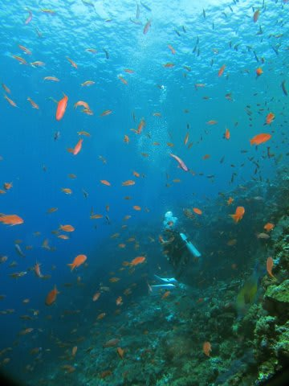

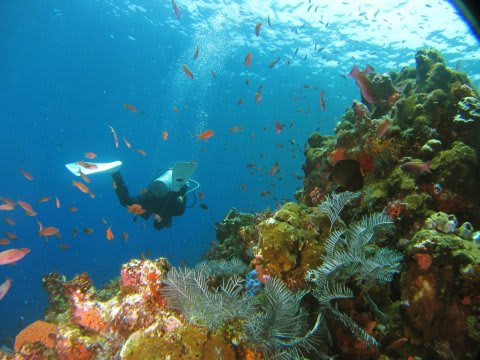

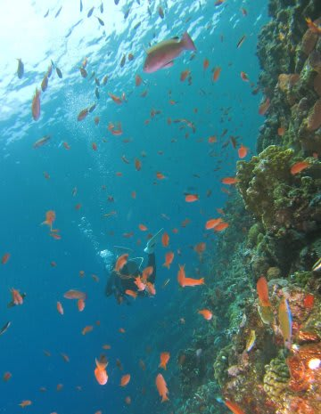

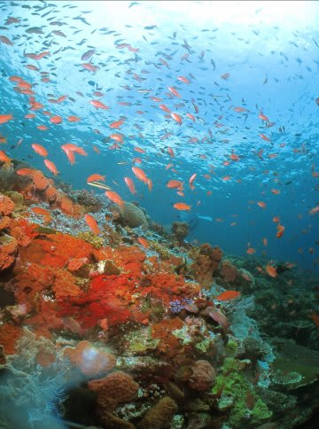

最後のほうは，浅瀬にあがってきます．

この浅瀬の，珊瑚がきれいなこと！！

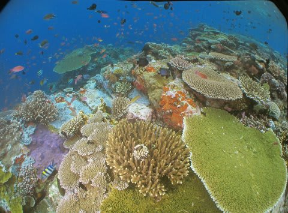

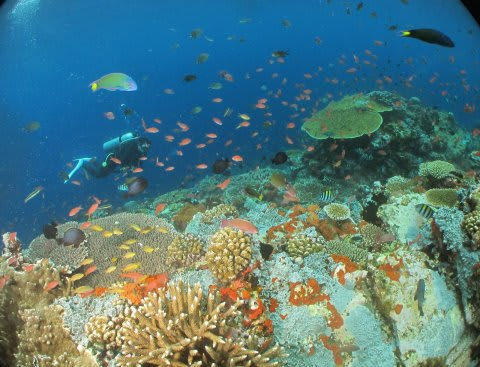

深度3m．

普通のダイビングだったら，こんな浅いところに

長いこと滞在させてくれないと思いますが．

そこはほかのゲストがいない貸切ダイビング．

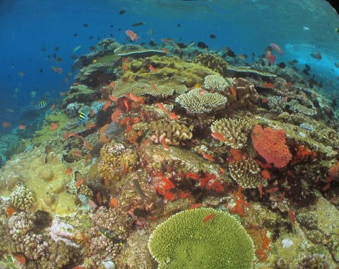

私の趣味をよくわかっているK村さんガイドですから．

この珊瑚がきれいな浅瀬で15分以上とどまっていてくれます．

もう，好きな場所に移動して好きなだけ遊んでてください，

って．

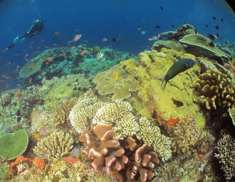

あああ．

幸せダイビングだぁ！

幸せの55分（相変わらず長いダイブタイムだなぁ…）

をすごしてエグジット．

なんと…

マンツーマンダイビングとは，なんと贅沢なことか．

妻は，昨日一日，それもあの北エリアを，この貸切

ダイビングで3本も潜っているのか！

うらやますぃーーーーっ！

本船に戻ると…

直ちに船はコモドドラゴンを見に行くために移動開始．

うーん．

私一人のダイビングのために，本船の移動まで待たせて

しまっていたのね…

なんか，超贅沢させてもらってるなぁ…

リビングへ上がると，すでに皆さんは昼食中．

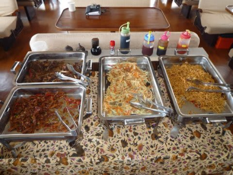

ゆっくりご飯を食べながら，コモドドラゴン見学ツアーの

時間まで，さっきのダイビングの満足感を噛みしめつつ，

のんびりすごしたのでした…
