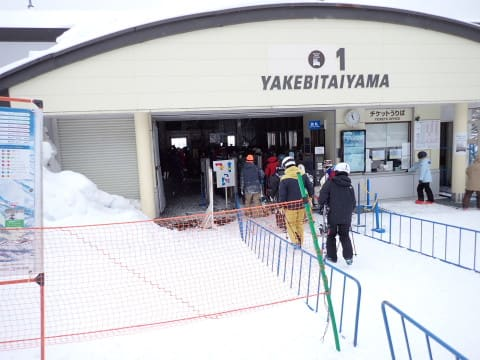

# 2024/2/12(月・祝)，3連休最終日の志賀高原焼額山スキー場速報レポート！…雪のち曇りのち晴れ，コースによって人は多めだったけど午後のゴンドラはガラガラ，雪は良かったよ！

📅 投稿日時: 2024-02-13 02:44:25

ってなわけで．

3連休の後半2日間，志賀高原で

滑ってきたわけですが．

本日深夜0時近くに帰宅しました…

いろいろ片付けたりなんだりしていると

もうかなりいい時間なので，

帰宅日恒例の速報モードにて，

本日の志賀高原レポートです！

えー．

まず．

昨晩から5cm程度の積雪があったらしく．

うっすら積雪路を登ってスキー場へ

向かいますが…

焼額山に到着すると．

「雪がぱらついてるかも」と予想

したけど，その予想をはるかに上回る

ガン降り．

でも，気温は-10℃程度なので，結構

冷えたいい雪が降ってる感じ．

朝の圧雪後に雪が降ったので，

締まった圧雪の上に2-3cmの新雪が

乗った，トップシーズンらしい

いい雪質の極楽バーン！！

3連休ということもあり，午前中の

サウスとGSコースは人口密度が

高めだったけど…

白樺コースやイーストコースなど，

場所を選べばガラガラのコースも

あり．

3連休としては混雑を避けて滑れたし．

ゴンドラも午前で一番混んだタイミング

でもゲートの外にちょっと並ぶ程度．

午後になると搬器数台待ち程度で乗れたし．

リフトもそんなに混まず．

3連休とはいえ最終日はそこまで

混まなくてよかったですね～！

そして，強い雪が降ったのは朝の30分

くらいだけで．午前中は曇り時々小雪の天気．

さらに昼頃になると，日が差す

タイミングも出始め…

午後2時を過ぎると，完全な晴れに

なってきましたよ…！！

そして．

午後3時を過ぎると，

ゲレンデに人がいなくなり…

そして，空は雲一つない快晴に！！

…でも，どうせ晴れるなら朝から晴れて

欲しかった…

さすがに夕方のバーンはちょいと

荒れたけど．

荒れたのはこの下の写真のGSコースと

サウスコースくらいかな～…

白樺や唐松コースは多少凸凹したけど，

雪が良かったので十分大回りできる

レベルでした！

ってなことで．

本日は特別に第4ロマンスリフトのみ

4:45まで営業延長だったので．

ゲレンデが薄暗くなり，ナイター照明が

点き始めるいつもより30分遅いラストまで，

今日も昼休みも取らずひたすらぐるぐる

滑り続けたのでした…

いやーーー．

この3連休は冷えて雪質が良かった！

志賀のトップシーズンらしいいい雪を

楽しめました…

…が．

これから先の予報を見ると…

ニュースとかでもやってる通り，

13日から15日は，平年比+8℃～＋12℃

という，4月並みの激烈高温に

なりそうです（泣）

そして15日の夜は空から液体が降るかも…

16日の朝にかけて雪に変わってくれそう

なので．

うーん．

17日の週末は，16日に積もった雪で

何とかなるといいなぁ…

皆さんの日ごろの行いが悪ければ，

17日の週末は，

15日にかなり雨が降り，16日の雪が

それほど積もらずアイスバーン

行いが良ければ，

15日はそこまで雨が降らず，

16日の雪でいい感じのバーン

になります．

さて．どっちになるか！？？

で．

15日夜の雨の危機を乗り越えても…

その後，20日ごろまでまだ高温期間が

続きます（泣）

17，18，19日の850hPa気温を見ても．

赤い0℃線が志賀高原の北まで行き．

18，19日に至っては，北海道まで

北上しちゃってます（涙）

とても2月と思えない激烈高温…

このままだと，

次の週末が終わったあと，

来週の20～21日あたりにまた雨が降りそう…

でも．また来週22日ごろは冷えて雪に

なりそうなので．

次の3連休も，運が良ければぎりぎり

全面アイスバーンにならずに済むかも…

うーん．

きわどい．

この2月，平日に雨で週末直前に

雪が降るというパターンが，

2連続で続きそう…

雨がひどくならず，週末前の雪でバーン

コンディションが回復するといいんだけど…

とりあえず．

いつも通り．

スキーヤーの皆様におかれましては，

週末までにゲレンデ状況が回復するよう．

日ごろの行いをめちゃくちゃ良くして

くださいますように，よろしくお願い

申し上げます…

## 💬 コメント一覧

### 💬 コメント by (レインボー76)
**タイトル**: Unknown
**投稿日**: 2024-02-13 14:37:38

火曜日の志賀高原情報

朝の上林-3℃　蓮池-1℃、逆転現象！

爽やかに晴れ渡って雲ひとつない。今日から春用ウエアにしたのは正解でした。

ゲレンデも最高雪質で、オリンピックもエキスパートもファミリー正面も、多分シーズンベストかと。寺子屋からの眺望もベスト。

この日にサボリーマンした人には、後悔は微塵もなかったことでしょう。

帰路の高天+5℃　蓮池+10℃でした。

### 💬 コメント by (Skier_S)
**タイトル**: ＞レインボー76さま
**投稿日**: 2024-02-14 04:52:38

昼間は蓮池10℃ですか！！！

午後には雪が日差し＆気温で緩んでいるので，明日の雪は

かなり硬いと思います．

気を付けて滑ってください…！

