# 2024/5/26(日)の月山スキー場，詳細レポート！…終日晴れ，あさイチ沢コース最高！大斜面はちょっと混んだけどリフト待ちは少なめ

📅 投稿日時: 2024-05-29 04:09:44

🏷️ カテゴリ: [2024スキー滑走日記](c453f687e8a0f05679e95831d0a02cd0c.md)

ってなことで．

土日に月山に行ってきた後遺症か…

睡眠時間が全く足りておらず，

昨日は仕事が終わってないのに，

また深夜2時半ごろに床で寝てしまい，

Blogが更新できませんでした…

…って言っても，今日もまた夜遅く．

あんまり長く記事を書いているパワーが

ない…

でも．

2日連続記事を書かないというわけには

行かず…

明日朝，ちゃんと仕事に行けるのか？？

と心配しながら．

日曜の月山スキー場の詳細レポートです！！

えー．

まず．

あさイチの駐車場は，かなりの混雑．

満車ではならなかったけど，満車に

近い状態で．

昨日より混みそう…

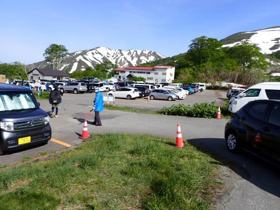

ってなことで．

駐車場からトコトコ歩くこと10分ほど．

リフト下駅にやってきます…

リフト下駅までの道は，ほぼ雪がない

道を歩いて行けます．

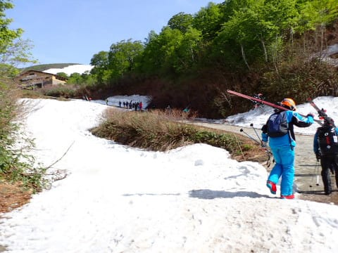

で．

あさイチは，リフト券売り場こそ5分以上

並んだものの．

リフト券売り場の流れが悪いからか…

朝8時過ぎのリフトは待ち無しで乗れました！

今日もリフトは板を履いて乗り降り

できますし．

朝はリフト乗り場の雪も真っ白で幅広．

かなり大量に圧雪車で乗り場に

雪を運んでるようです…

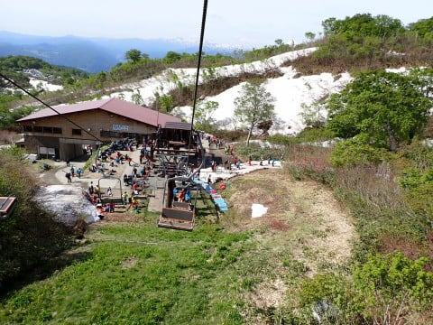

そして当然のごとく，リフト降り場も

雪がついていて，板を履いたまま

リフトを降りたら…

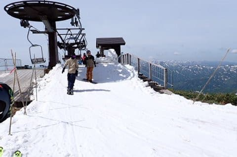

そのまま，ゲレンデに出られる道が

繋がっています！

かなり上の方から大量に雪を

運んで，結構な幅の道がつけて

あります．

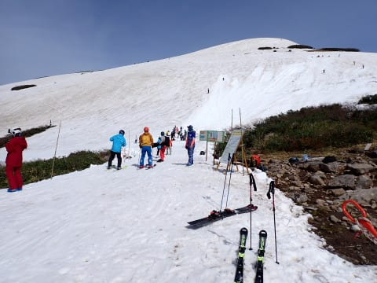

ゲレンデに出てからリフト乗り場を

振り返ると．

降り場も結構しっかり雪がつけてあるのが

分かります！

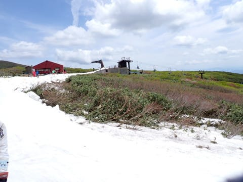

まずは沢コースから滑りますが．

圧雪が入って，昨日のラストの荒れ荒れが

リセットされていて，

朝はすごい滑りやすい！！

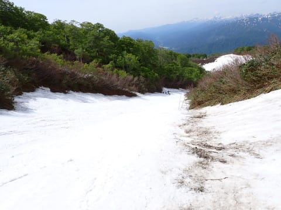

朝は気温が低めだったからか，

雪もザブザブではなく，板の滑りがいい

比較的しっかりした雪！

…これ，かぐらのあさイチよりいいかも…！！

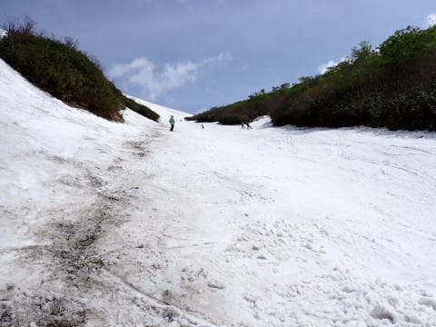

沢コースの一番下の部分も，圧雪車で

かなり雪を運んできているのか．

昨日ちょっと木の枝とか出かけていた

ところが埋められてます！

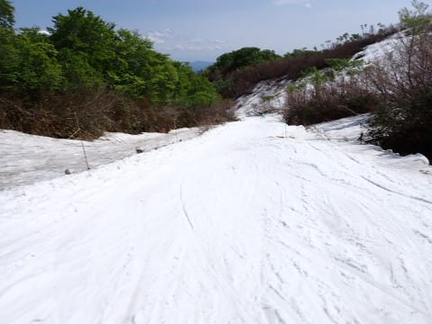

幅は狭いけど…

この日一日，大きな岩や木の根っこが

出てくるとなく，沢コースは

最後までもちました…

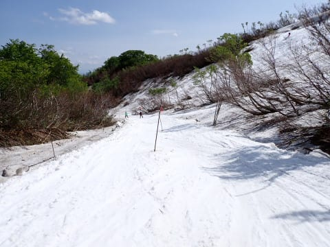

そして，リフト乗り場もかなり

雪が運び込まれています！

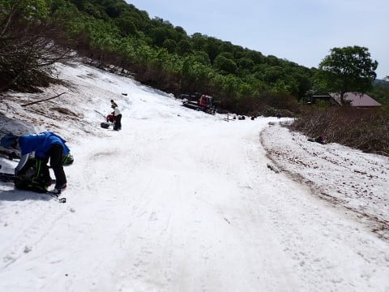

ただ．

朝9時ごろまでは結構ガラガラだったけど．

10時近くになると人も増えてきて…

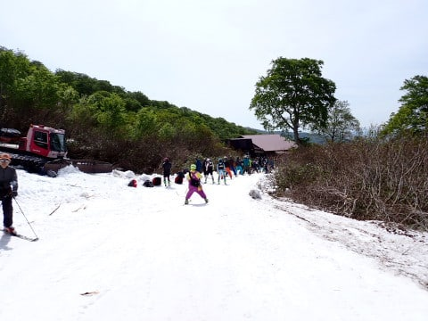

最大ここまで待ちました…(泣)

昨日より混んでますが，ここまで並んだのは

1回だけ．

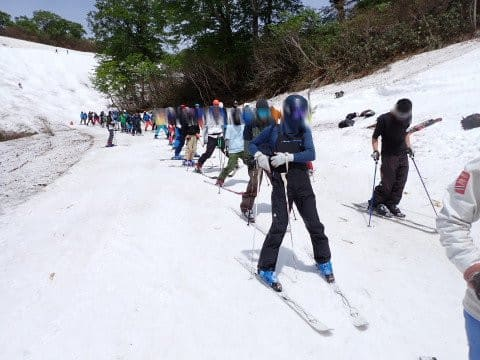

これでも，板を履かないでの乗車となった

時よりはリフトのスピードが速いので，

リフトは5分待ち程度．

午前中でもタイミングによっては3-4人

待ちの時があったり，2-3分待ちだったり．

レッスンの団体さんとかち合うかどうかで

待ち時間が全然違いました…

あ，午後1時以降はほぼ待ち0でした．

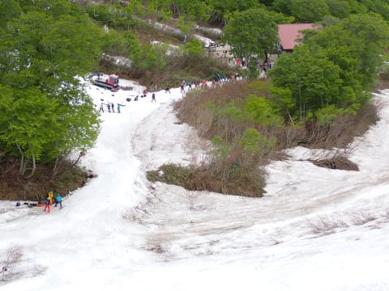

沢コースがあまりにも気持ちよく．

朝のうちはひたすら沢コースグルグルでしたが…

やっぱり月山に来たからには，大斜面へ．

昨日も書きましたが，リフト降り場から

まっすぐゲレンデに下りるところの

大斜面へのトラバースルート．藪が

立ち始めてきてん

もうそろそろ終わりそうな感じ…(泣)

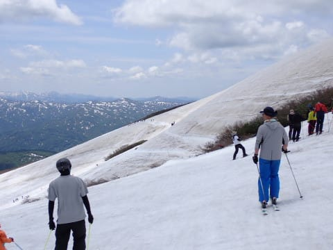

トラバースルート近辺は，

まだまだ雪がいっぱいあります！

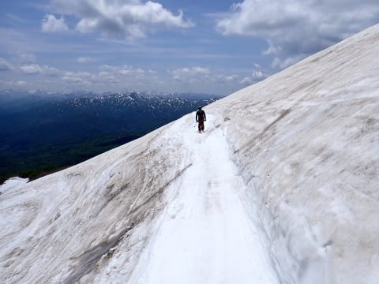

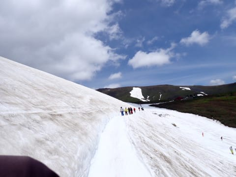

で．

大斜面へ出ますが…

上の方はかなり幅広く．

そして，コブラインが何本も

掘られています．

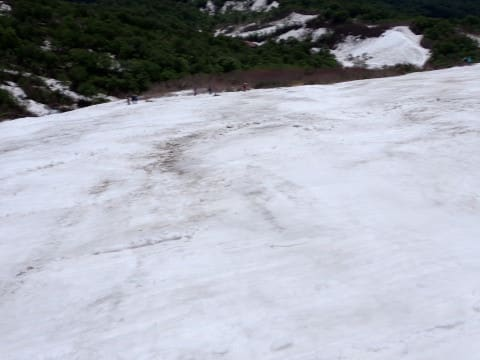

大斜面下側は，週末で人数が多かった

からか．

昨日よりさらに掘削が進み，コブが

深くなった感じ…

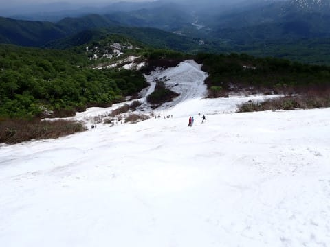

この日の大斜面は，午前はレッスンが

非常に多く，混んでいた感じですが．

午後はそんなに混みませんでしたね…

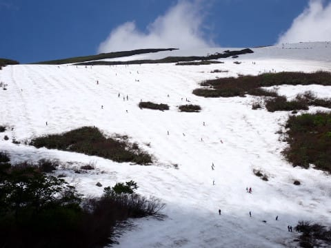

ってな感じで．

午後の，そこまで混んでない大斜面やら…

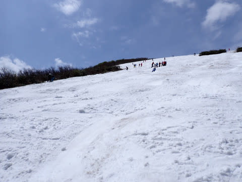

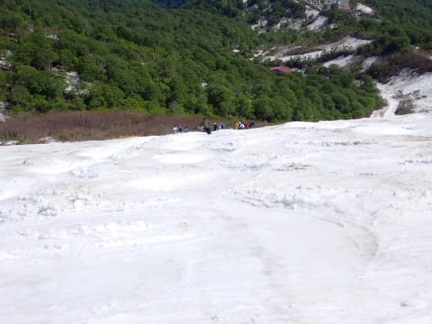

時折，沢コースを混ぜて滑ったりと，

2種類のバリエーションを楽しみながら

滑りました．

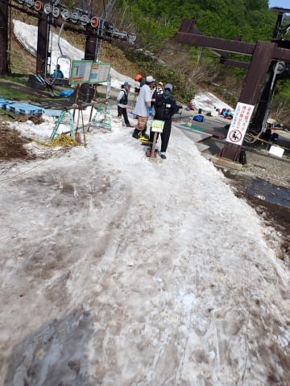

午後の大斜面は，かなりコブは深かったし．

沢コースも午後は結構荒れたけど．

でも，かぐらが終わったこの時期に，

これだけ滑れるのなら．

まぁ，片道500㎞走ってくる

価値はあるかな…！

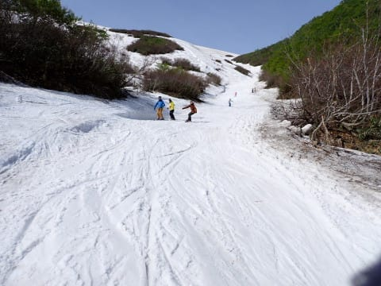

ってなことで．

今シーズン，あと1回くらい月山へ

行っておきたいな…
