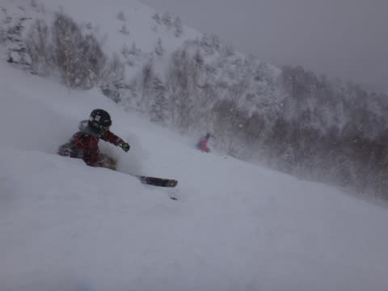

# 新雪パフパフは，ファットスキーがいいなぁ…

📅 投稿日時: 2015-02-04 01:03:38

🏷️ カテゴリ: [スキー雑談](c1f9d2cb7478308da16419928ea3945e9.md)

ってことで．

この日曜は，パフパフパウダー大放出祭りだったわけですが．

パフパフと言えば，最近はやりのファットスキー．

最近，焼額でも，ファットスキーを履いている人が多いん

ですよね～．

いや，昔，

すごい新雪で一回履いたことがあるんですよ．

かなり幅の広い，パウダー用のスキーを．

…そのころは，まだこんな太い板を履いている人は

珍しい時代で．

その時は，

「新雪では無敵だけど…まぁ，圧雪で手こずるし，

　普段使いには苦しいこんな板，流行らないだろうな…」

…と，思ったわけですが．

でも．

でも，ですね．

最近では，ファットスキーを履いた人がすごく増えてきて．

日曜のパフパフパウダーのエキスパートコース．

急斜面の深い新雪を，ファットスキーを履いた人が，すんごい勢いで，

ほぼ直滑降に近いラインで滑り降りていくのを見て．

いやー．

気持ちよさそうだなぁ…！！

こんな腰パフくらいに深い，パフパフ雪の斜面は．

やっぱり，普通のスキーよりも，ファットスキーが

気持ちいいだろうなぁ…！！

と．

ごく一瞬，

わずかに一瞬．

頭に思い浮かんだわけですが．

…いや．

いやいや．

やっぱり．

そんな，ファットスキーを履きたくなるほどの

すごいパウダーなんて．

シーズンに数回ある程度．

そんなわずかな機会のために，新しい板を買うなんて，

ありえない…

そんな板買っちゃったら，大回り用，小回り用，新雪用って，

3セットも板を持ち歩かなきゃならなくなるじゃないか！

板を3セット持ってスキー場に行くなんて，

そんなおかしな人になってはいけない！！

…買わないぞ～．

ファットスキーなんて，買わないぞ～（棒読みで）．

## 💬 コメント一覧

### 💬 コメント by (いか)
**タイトル**: Unknown
**投稿日**: 2015-02-04 06:27:01

あなたは気付くはずです…車に積んでさえおけばよいことを…。

晴れの日にファットは使いません…大雪の日に大回り板は使いません…。

あらふしぎ、2セットだけですね(笑)

開放値は普通の板よりすこし強めがいいですー

### 💬 コメント by (べべ)
**タイトル**: ファット
**投稿日**: 2015-02-04 08:04:10

ファットスキー最高ですよ！

あの浮遊感は癖になります。

志賀高原のパフパフパウダーなんかもう…

想像だけでヨダレもんです(笑)

### 💬 コメント by (れお)
**タイトル**: 激しく同意!!
**投稿日**: 2015-02-04 11:42:16

わかります～。

私も、先週末のヤケビで、腰パフのゲレンデをファットのスキーヤーが滑っていくのを見て、良いんだろうなぁ～、楽しそうだなぁ～、と思いながら見てましたから!!

でも、基礎板しか乗ったこと無いから、知識も無いし、買うところまでは行かないんですよね…。

Ｓさんが買ったら、私も買おうかな～ 笑

Ｓさんのレビューとか、非常に参考になると思いますので、とりあえず神田にでも行って、調べてきてもらえませんか？

もちろん、買わなくて良いんですよ!! 見るだけでオッケーですから!!!

### 💬 コメント by (Goku)
**タイトル**: Unknown
**投稿日**: 2015-02-04 19:57:55

えー買いましたよね。

多分。

### 💬 コメント by (Skier_S)
**タイトル**: まだ，買ってませんよ～
**投稿日**: 2015-02-04 23:58:35

＞いかさま

う…

すごい説得力があるコメント…

でも．

ゲレンデにもっていかなくても．

一人なのに，車に板が3セット積んであるだけで，

十分おかしい人の仲間入りのような気も…（笑）．

＞べべさま

いやいやいや．

やっぱり，ファットスキー．

新雪では無敵だと思うんですよ．

でも，先立つものが…（涙）．

買っても，シーズン何回履くのかなぁ…

と考えると，購入に二の足を踏んでしまいます…

＞れおさま

いやー．

楽しそうですよね～．

でも．

私もどんなモデルがあるか全く知らないし．

まだ買う判断がついてないんですよね～．

試乗会でも，新雪で試乗できる機会って

なかなかなくて．

ファットは試しようがないので．

どーゆー性能か試せないんですよね～．

＞Gokuさま

買ってませんよっ！！

### 💬 コメント by (ゆうこ)
**タイトル**: 買いに行くんですね
**投稿日**: 2015-02-05 10:07:51

私もGokuさんも同じく、この記事を見たときは買ったのかなと思いましたが、まだ買ってないということは、近いうちに仕事で神田近辺に行く用事があるから、その時の第3回(?)物欲選手権開催の前振りかなと思いました！

まぁ、きっと買ってしまうんでしょうね。

お金では、買えない価値がある。買えるものはマスターカードで！

### 💬 コメント by (れお)
**タイトル**: SnowCan
**投稿日**: 2015-02-05 15:12:20

志賀にあるレンタルショップ（Snow Can）で、ファットスキー貸してるみたいですね。半日レンタルも有るみたいなので、今度、ぜひ利用してみようかなと…。

Ｓさんも御存じかと思いますが、参考のため

### 💬 コメント by (mae)
**タイトル**: セミファットスキー
**投稿日**: 2015-02-05 22:16:47

でも良いのでは?

K2 WAYBACKとか。今シーズンは新雪の当たり年ですね。シーズン10日位乗れれば十分なつもりで、自分は買いましたが、ぱふぱふも今シーズンは終わりじゃないですかね。来シーズンですかね。

### 💬 コメント by (Skier_S)
**タイトル**: 何か期待されている気が…
**投稿日**: 2015-02-05 23:52:56

＞ゆうこさま

お久しぶりです～．

いやいや，まだ買ってませんよ～！

買うかどうかも微妙で，

3（買う）：７（買わない）くらいの気分です…

はっきり言って，どんな板があるのかも

分からないし，パウダーで試乗もできないので，

なかなか踏ん切りがつきません…

＞れおさま

う…

試乗ができなくても，レンタルがあるんですね…

うーーーむ．

パウダーが降った日，朝にレンタル借りると，

朝イチに出遅れそう（笑）．

＞maeさま

いや，私がかうならセミファットくらいかな～，

センター90mm超えはつらいかな～，

とか思っているんですが…

でも，今シーズンはファットの出番多いですよね．

maeさんの板はセンター幅どのくらいの板なんですか？

…でも．今シーズンもまだパフパフが続くと期待してます！（個人的に）

