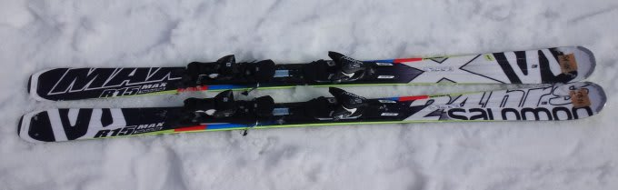
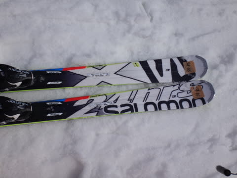

# 2015シーズンモデルのスキー試乗レポート第2回…SALOMON編2

📅 投稿日時: 2014-03-14 23:09:14

えー．

やはり，この土日は．

基本的に，晴れてくれそうですね～．

土曜は気温も低めで，朝は10cmくらいの，ブーツパフ程度の新雪も

楽しめるかな～．

今のところ，昨日の天気予想通りの週末になりそう！

…ってところで．

2014/2015シーズンのスキー板，試乗レポート第2弾です．

…あと4時間後に出発なので，今日も1機種のみのレポートで…

今回はサロモン編その２です．

---

○SALOMON 24hours MAX 170cm

基礎オールラウンド．

うーん．

試乗板は，ちょっとエッジが過剰に立ててあったのか．

アイスバーンでエッジが引っかかりすぎて，今回のような

アイスバーン＆もさもさ雪のマダラ状態では，いきなり

エッジが引っかかったりして，ちょいと操作性が…

だもんで．ちょっと評価が適当じゃないかも．

で．

履いた感じは軽め．

板のセンターのエッジが効き，あまりトップとテールが

効かないかな？…って感じを受けます．

トップのロッカーがちょいと強めに入っているのかも…．

んで．

板を傾けていくと，あるところからエッジがカツンと効き始め，

板のサイドカーブなりに曲がって行きます…

というより，曲げられていってしまう感じ．

たわみ量や傾きで回転半径がコントロールするより，板によって

決められた半径で曲がっていきます．

エッジが立ちすぎていたこともあり，ずらしで半径をコントロール

しにくく，板が行きたい方向にスキーヤーがついていく感じ．

スピード耐性も，フレックスはそこそこ強めではあるんですが．

トップスピードを出していくと，板なりに中回りの旋回半径で

回ってしまい，

また，硬いアイスバーンとモサ雪のまだら状態だったってのもあって，

板が叩かれてしまい．

トップスピードでの安定感がちょっと物足りない感じ…

ちょっと今回の板は，エッジの仕上げがいまいちだったので，

評価が辛めになっちゃってるかも．

もう少しエッジをダリングすると，評価が変わる可能性も

あります…

しかし．

SALOMONを10本以上乗りつぎ，ブーツもSALOMONを履いている

SALOMON好きとしては，ちょっと残念な感じ．

どうした，SALOMON！…と言いたいところ．

## 💬 コメント一覧

### 💬 コメント by (KC)
**タイトル**: チューンナップについて
**投稿日**: 2014-04-22 16:58:46

はじめまして。

サロモン営業マンのKCと申します。

ブログの感想ご意見、参考にさせていただきました！！

今回、試乗スキーを気合い入れてチューンをしすぎた結果引っかかってしまうセッティングになってしまったようです。

楽しみにしてたスキー試乗を「おやっと」思わせてしまし申し訳ありませんでした。

今後もサロモンをよろしくお願いします。

### 💬 コメント by (Skier_S)
**タイトル**: KCさま
**投稿日**: 2014-04-23 03:19:13

初めまして！

SALOMONの関係者の方から直コメントをいただけるとは…

わざわざコメントありがとうございます．

残念ながらこの日の板は，

アイスバーンのコンディションにしてはちょっと

エッジが立ちすぎかな～，って感じでしたが．

やっぱり気合いを入れてチューンしすぎたんですね（＾＾）

ちょっと辛口のコメントでしたが，本文にあるように

私はSALOMON好きですので，

基本的にSALOMONの板に期待が大きいのかと…

また，いい板を期待してます！

### 💬 コメント by (kei)
**タイトル**: Unknown
**投稿日**: 2016-02-13 21:53:19

初めてコメントします。

いつも楽しく拝見させていただいてます。

24 LM、170cmを2016年現在使用しています。

最高で手放せません、笑

2014のX-race165cmも所持しており、小回り用に使用していますが、LMの小回り、高速安定感、と大回りの弧でも調整出来るが気に入っています。強いていてば、コブに入っていくときに、気合が必要ですが、、

自分史上最高のオールラウンドモデルです。

だいぶ使用して年数が経ちますので、

今年、去年くらいで、24LM 170cmに似たような板があれば、アドバイスいただけると助かります。

よろしくお願いします。

### 💬 コメント by (Skier_S)
**タイトル**: keiさま
**投稿日**: 2016-02-13 22:52:24

ご愛読ありがとうございます～．

このBlogを古くからを読んでいたらご存じ

と思いますが，私もかつてはLM乗りでした…

私も結構SALOMON好きなので，

今も'15X-RACE165cm愛用してます．

で．

LM170cmの代わりになる板って言ったら…

X-RACEと対極になりますが，

X-MAXがいいかと思います．

http://blog.goo.ne.jp/tsakamot2001/e/4e8afd90f108425ab46c6fff0f3db977

すごく軽いのにグリップと高速安定感があって，

軽いのでコブも気楽に入れます．

LMと乗り味はかなり変わりますが，

LM170cmの代わりに行けます．

SALOMON好きで，X-RACEも持っていらっしゃるなら，

気楽に履ける板としてX-MAXおススメです！

### 💬 コメント by (kei)
**タイトル**: お礼
**投稿日**: 2016-02-14 00:15:18

こんなに早くお返事いただけて嬉しいです。

もちろん、昔からの読者です！

Skier_Sさんと、板のフィーリングが合うようで、インプレは参考にさせて頂いてます。

SALOMONの板は、安定性と、バランス良いグリップもありますよね。

自分は、ATOMICも好きですが、イヤーによって、とてもシャープだったり、少し優しかったり。とても滑りやすい板と思いますが、サロモンよりも、その板に合わせてスキーヤーが慣れていく必要があると思います。でもATOMICも好きです。

試乗会でもSALOMONとATOMICしか試しません、笑

この２つのメーカーを乗り続けていれば、買い替え時に店員さんとも話せるかと。

### 💬 コメント by (Skier_S)
**タイトル**: keiさま
**投稿日**: 2016-02-15 00:19:42

たったいま，志賀高原から戻ってきました…

ということで，遅くなりましたがお返事をば…

昔からの読者ということで，ありがとうございます！

こんなどシロートのインプレが役に立つなら幸いです（笑）．

X-MAXは，グリップと高速性はかなり強めですよ！

板の軽さからは想像できない高速安定性です．

私もS5は何回か履いたことありますが，

少なくともS5レベルの高速安定性があり，

かなり張りも強いです．

それなのに，軽くて動かしやすくて，

小回りもコブもOK…という，何でもありの

オールラウンド板かと思います．

自分がいま，

「オールラウンド板を選べ」

と言われたら，

SALOMONのX-MAX170cmを選びます．

板が軽いので，コブの中でどうやっても振り回せるし，

飛ばされても簡単にリカバーできるので楽です．

谷回りで，好きなところに板を動かせます．

軽いのに張りがある，不思議な板です．

X-RACEの170cmだと…

Xビンディングだとちょっと重くて強すぎて，

私には小回りをする技術はありません（笑）．

Zビンディングだと何とかなるのかな…？？

ちなみに，keiさんが履いていX-RACEは

ビンディングはXですか？Zですか？

### 💬 コメント by (kei)
**タイトル**: Unknown
**投稿日**: 2016-02-17 00:08:09

お返事ありがとうございます。

リンク先にX-MAXの乗り味が書いてありましたね、よく読まずに、書いてしまったようです。

丁寧に、お答えいただきありがとうございます。

Skier_Sさんの、試乗レビューは、かなり参考になります。私は、必ず試乗して、購入を決めていましたが、ここ数年、試乗会には行けず、このような情報をいただけたことを嬉しく思います。

＞自分がいま，

＞「オールラウンド板を選べ」

＞と言われたら，

＞SALOMONのX-MAX170cmを選びます．

ここまで言い切ってくれてありがとうございます。

もう少しで決心つきそうです、笑

出来れば、X-RACE 170 と比べてみたかったですね。今回、硬派でない板を選ぶところが、悩んでいる自分がいますが（笑）

しかし、小回りは、X-MAX 170の方が回旋性が良さそうなので、素直にメリットになると思いました。

コスメが、ずっと使いたいような感じではないですが、、来年、白で、このページの24のようなデザインだったらいいな。

来月の試乗会始まって、すぐ買うかな、笑

＊＊

X-RACE 165は、X12ビンディングです。

### 💬 コメント by (Skier_S)
**タイトル**: keiさま
**投稿日**: 2016-02-17 02:22:14

え？

X-RACEの165cm，Xビンディングを小回り専用機として

履いてるんですか…

かなりの体力ですね（＾＾；

私も1年違いのX-RACE165cm，Xビンディングですが，

むしろ最初は大回り用として買いました（笑）．

雪が荒れてきたり，人が多かったりするところでは

この板は履けません（笑）．

この板，スピードを出すとぐいぐい曲がって超絶に楽しいんですが，

中速やずらしで扱いやすい板ではないので（汗）．

LMの後継機種に何を求めるかだと思いますが，

X-RACEと違って，雪が悪いときやコブコブに荒れた

斜面などでも気楽に履けるオールラウンド板…

って求めるならX-MAXだと思いますよ（笑）．

X-RACEの165と170の2セットだと，性格が近すぎるので，いっそ165を小回りベースオールラウンドとして

使うことにして，175cmを大回り専用機として買う

手もあるかも？？

ちなみに，最高速の安定性はX-MAX170より

X-RACE165の方が上です…

でも，LM170と比べても，X-RACE165のほうが

圧倒的にトップスピード耐性が強いので…

LMの後継機と考えるならX-MAXでも

十分かと．

…でも，悩みは尽きませんね（＾＾

### 💬 コメント by (kei)
**タイトル**: Skier_Sさま
**投稿日**: 2016-02-18 23:43:23

＞175cmを大回り専用機として買う

＞手もあるかも？？

色々なアドバイスと選択肢をありがとうございます。

所有しているX-RACE 165はターンは、確かにある程度スピードががあると楽しいです。中速だと丁寧にまわしてあげる必要があります。自分の板はエッジが立ってないのかな、低速でもずらせる気がします。へたりかな？笑

次回、意識して、ずらしてみます。

Skier_Sさんは、試乗レポを書いて（分析して）、また、複数板を所有しいるので、その板の一番の特性を引き出して乗ることが出来るんだな、と思いました。

水色のSX165を乗っていたSkier_Sにはかないません、笑。

試乗会で私は、あの鋭さ、跳ね返り、乗りこなせず笑ってしまいました。あのシーズン、どうしてあの板が売れたのか、不思議でした。みんな上手いんだなと。

今でも覚えていますが、店員に聞いたら、

「そう感じるのであれば、お客様は乗りこなせないレベルですね」と言われました、笑

あと、お決まりのSXは技術選に出るような方が選ぶトップモデルですので、と笑

これからも、色々ブログ楽しみにしています！

本当にお世話になりました。

どの店員さんに聞いても、これほど的確にお答えしてくれる方はいないと思います。

これからも、所有するメインはATOMICとSALOMONでお願いします、笑

＞LMの後継機と考えるならX-MAXでも

＞十分かと．

＞

＞…でも，悩みは尽きませんね（＾＾

そう、実は

玄関にX-MAX170 立てかけてあります！

### 💬 コメント by (Skier_S)
**タイトル**: keiさま
**投稿日**: 2016-02-19 00:22:53

をを！

X-MAX購入されましたか！

おめでとうございます．

最初はX-RACEと違いすぎて戸惑うかもしれませんが，

しばらく履いて慣れてくると，あまりもの履きやすさに

X-RACEの出番がなくなるかもしれません（笑）．

しかし，SXを難しいと感じましたか…

あの板はフレックス自体はX-RACEより優しいので，

結構たわむのですが，

バネ性が強いためにたわんで溜まった圧が

一気に解放されるので，動きのタイミングを

合わせないと確かに反動をもらっちゃいます．

テールの強さを使って，圧をテールに抜いてやるように

滑ると，返りの早さで板が加速していくような，

超快楽の脳内麻薬小回りができるのですが…

私にとっては，SXは麻薬です（笑）．

今後も，SALOMONとATOMICを履いていくつもりですので，

またよろしくお願いします（＾＾）/~

