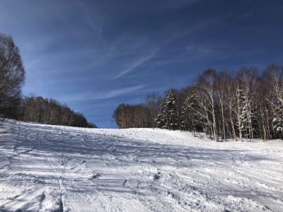

# 2月5日（金），6日（土）の志賀高原スキー場，特派員情報…晴天シマシマの最高の2日間だったようですね

📅 投稿日時: 2021-02-07 04:48:45

えー．

仕事がご無体なのにスキーに行けず，

いろいろ終わりかけてるSkier_Sです…

金曜の夜中に在宅勤務を終えてから，

夜ごはんを食べるパワーもなく倒れるように

寝た後．

どうせスキーにも行かないんだし…と

睡眠不足解消がてら，夜まで20時間以上

布団の中で転がっていました…

気づいたら，30時間以上食事をとって

ませんでした…

ということで．

昨日は更新できませんでしたが．

金曜も土曜も，特派員から写真を

いただいているので，この金曜，

土曜の志賀高原のレポートを…！

まず，5日の金曜ですね．

朝の気温は-11度！

そして，朝イチは…

うぎゃーーーー！シマシマ！

冷え冷えでこんな晴天でこんなシマシマ

なんて…

うらやましい～っ！！！！

この雲一つない晴天で，人もいなくて

冷え冷えフラットで…

これは…シーズン最高のコンディション

では！？？

午前中，一瞬ゴンドラが混んだらしいけど．

でも，ゲレンデはガラガラ！！！

人が少ないので，午後になっても荒れず…

ラストまで最高コンディションを

キープしたようです！

あぁ…いいなぁ…

そして，6日の土曜日は．

この日も晴天！

朝の積雪は0で…

（積雪0でも，最近は朝イチ写真におこみん人形が写されている…）

気温は結構上がるかと思ったけど，

山頂で-6℃！

放射冷却でそこそこ冷えてますね…

だもんで．

あさイチもピカピカシマシマバーン

だったようです！！

一の瀬正面バーンも朝イチはシマシマで…

あぁ…うらやましい…

こんなピカピカシマシマ滑りたい…

そして，今日も終日天気がよく．

景色もすっきり見渡せて．

あぁ…

なんて絶好のスキー日和なんでしょう…

雪質は下地の硬いのが大体隠れてくれた

ようで，ガリガリではなくいい感じの

雪質だったとのことで．

昼間もそれほど気温が上がらず．

ゲレンデも休日にしては空いていて．

夕方になってもそんなに荒れず，

いいコンディションだったようです…！！

ということで．

特派員の皆様，写真ありがとうございました～！

明日は朝のうちは晴れてそうですが．

昼ごろから雲が増えて，

午後は雪になりそうです…

うーん．私のスキー断ちも一か月を

超えて．

禁断症状が出てきました…

滑りに行きたいなぁ…

## 💬 コメント一覧

### 💬 コメント by (ikkun)
**タイトル**: Unknown
**投稿日**: 2021-02-07 06:58:19

おはようございます❗一昨日と昨日は青空でしたよ❤️しかもステキな雪質で朝はまさにしましま 富士山も見えて感動の小学生男子三年生でした  ちなみにゲレンデでカワイイ女の子を見つけて笑顔って変ですね(笑)しかもリフトチケット安いのでお正月以上にコミコミのゲレンデは凄かった昨日です❗まこうでなくてはヤバいですが…ちゃんとマスクに体温測定に密を極力って奴を実践しているリフトレストランスキー学校ではあります❗ 今日も笑顔に会えます様に(笑)

### 💬 コメント by (レインボー73)
**タイトル**: Unknown
**投稿日**: 2021-02-07 15:07:03

日曜日の志賀高原情報

朝の上林０℃　蓮池ー４℃　ニゴン雪温ー８℃。晴れて穏やかな朝。明日の積雪を予想して、今日はフィッシャーＲＣ４ＲＣ 180cm Ｒ19。

パノラマ、カラマツはやや硬めの快楽バーン。１ゴンは休日早朝があるので避け、ＧＳからすぐに奥志賀エキスパートへ。今日はここが楽園。

10時過ぎ、曇ってきたので、より安全なヤケビヘ。混雑の可能性が高い１ゴンを避け、三高、シラカバ、カラマツで、出っ尻を治すため、へそをつき出す基礎練習。師匠の後を付くと結構うまくできる。また課題ができて幸せです。

昼を過ぎると、風が強まり冷え込んで雪も。

昼食抜きでレインボー少し手前まで、よく働きました。

湯田中のラーメン屋に着いた頃には雨が。

明日はパウダーを楽しませてくださいませ。

### 💬 コメント by (アリス)
**タイトル**: S様の復帰お祈りしています
**投稿日**: 2021-02-07 17:12:55

Skier_S様

お世話になっております。

S様、職場や社会的な立場上での自粛を止む無くされる事をお察し致します。

政府や知事の宣言の解除が早期に発表され、S様の志賀高原復帰をお祈りしております。

2/4～6まで志賀高原に滞在しておりました。コンディションは特派員様の情報通りです。

万年初心者の自己流スキーヤーですが、あのコンディションばかりは自分が上達したかに感じます・・

S様　少しここをお借りします。

はなげ親分様、奥様

2/5(金）は突然の2回目のご挨拶失礼しました。

お二人の、ヘルメットに20000m倶楽部のステッカーを発見、皆さまの脚力に頭が下がります。

### 💬 コメント by (Skier_S)
**タイトル**: 寝て仕事したら終わった土日
**投稿日**: 2021-02-08 02:38:32

＞ikkunさま

金・土は最高だったようで，良かったですね！

でも，そこまで混むってすごいですね…

とりあえず，スキー場がつぶれるのは困るので，

密にならない程度にお客さんが入ってほしいところ…

＞レインボー73さま

今日は大回り板が本領を発揮したと思います…！

エキスパ，良かったみたいですね．

朝から想像がつかないほど午後は天気が荒れだしたので，

今日はレインボー前上がりが正解ですよね（笑）．

＞アリスさま

早く復活したいところです…（涙）

しかし，4日から6日までの滞在！

新雪あり，晴天ありの一番いい時期に滞在でしたね．

大当たりの天気だったのではないでしょうか．

