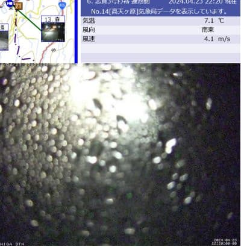
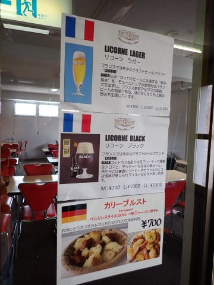

# 2024/4/21(日)の志賀高原焼額山スキー場の詳細レポート…曇り空だけど朝はいい感じの硬めバーン！でも，日が射さなかったけど午後は緩んで楽しくないバーン状況に（泣）

📅 投稿日時: 2024-04-24 01:30:05

🏷️ カテゴリ: [2024スキー滑走日記](c453f687e8a0f05679e95831d0a02cd0c.md)

えー．

どうやらシーズンの疲れが溜まって

来ているのか…

昨日は職場の飲み会があったせいもあり．

帰宅して何とか頑張ってBlogを書いている

途中で，こらえきれずに倒れたように寝て

しまってました…（泣）

平日の睡眠不足のうえ，土曜は睡眠2時間で

滑りに行き，それなのに日曜も早朝から

滑りに行くこの時期はヤバいですね←いや，普段からいろいろヤバいから

そろそろゆっくり寝ないとやばい気が

するけど．

今日もまだ仕事が終わってないのに，

昨日更新していないから必死にBlogを

書いているという…←Blog書いてないで仕事しろよ

ということで，いまさらの感がありますが…

昨日途中まで書きかけて寝てしまった

記事があるので．

日曜の焼額山の詳細レポートです！

…の前に．

どうやら日曜にすでに土が出かかっていた

GSコース．

火曜の今日はさらに雪解けが進んだようで…

特派員の写真を見ると，土が出かかって

茶色くなっているところが…（涙）

そして，土が出そうなところにバッテンが

付けられているようですが…

いくつもヤバそうなところがあるみたい

ですね（泣）

これはヤバい…

GSコース，GW前半もヤバいか？？

と思っていたら．

さすが焼額山．

火曜の営業終了後と，水曜定休日の

2日間で，GSコース横の非圧雪側の

雪を圧雪側に寄せて，コースの延命

作業を図るようです…！！

（[焼額山スキー場Facebook](https://www.facebook.com/yakebitaiyama/videos/405458689002817)より）

この写真の右側のコブコースから，

左側の圧雪側に雪を出すようですが…

これで50～80㎝の厚みを稼げるなら，

コースコンディションは良くなりそう…！

…ただ．

志賀高原は24日(水)の0:30現在，

雨が降ってるようです…(泣)

（[北信建設事務所道路気象状況カメラ](http://hokushin.pref-nagano-roadcamera.jp/)より）

さらに．

4月25日から29日にかけての5日間，

ずっと平年比+5℃以上の高温が

続きそう（涙）

うーん．

こんな状況でも，GWラストまで

雪がもってくれるかな…？？？

またGW前半の詳細天気予想は

明日やるとして，

とりあえず今日の本題の，日曜の

焼額山の詳細レポートです！

まず．

あさイチは朝6時からの早朝から

滑ってきたわけですが…

意外と朝6時前から待っている人は多い

ですね…！

営業直前には，この倍以上の列の長さに

なってました…

1ゴン，2ゴンの2本のゴンドラが動くので，

もっと多くの人が早朝から滑っている

ことになりますが．

とりあえず山頂へ向かうと…

朝6時というのに，すでに気温は+4℃．

暖かい…暖かすぎるよ（涙）

でも，夜に結構冷え込んでくれたのか．

雪はしっかり硬めのバーンで，

日差しが弱い曇り空なので，しばらくの間

雪はそこまで緩まずに済みそうな感じ…！

ってなことで．

誰も滑ってない早朝の1本目を滑り出しますが…

板が滑る，しっかり硬めのシマシマ！！

やっぱりこの時期は早朝だね！！！

…と，気持ちよく滑りますが…

昨日の昼間に雪が緩みすぎて荒れた

バーンが均しきれてないのか，

圧雪にところどころ穴ぼこや段差が

あったのが惜しい…

でも．

板は走るし，ゴンドラ2本でコースも

GSコース・パノラマ＆サウスコース，

パノラマインが早朝から滑れるので．

人が分散してゴンドラもコースも

全く混まず．

コースはほぼ人と重なることなく

滑れます！！

早朝営業の間は，気温が高かったけど

日が射さなかったこともあり．

締まり気味のバーンながらも，表面が

適度に緩んだ滑りやすいバーンに

なっていき．

通常営業の8時過ぎごろまでは，

しっかり硬めの下地のバーンを

滑ることができました…！

…が．

朝10時ごろになると．

気温も+7℃を越えて，さらにぐんぐん

上がっていったので…

日差しがないにもかかわらず，雪は

一気に緩み始め．滑りがあまりよくない，

ザブザブ雪になってしまいました（泣）

雪が悪くなったのと，

早朝6時から滑り始めた人の

4時間券の期限が切れる10時過ぎには，

怖いくらい人がいなくなり…

第1ゴンドラも．

第2ゴンドラも，毎回飛び乗り．

ゴンドラ待ちは全く0．

前に待っている人がいたら，

「人がいる！！」と思っちゃうレベルで

ガラガラでした．

昼頃になると，かなりヤバい感じで

雪が重くなり．

バーンが荒れていく上に，板が雪に

潜っちゃうザブザブバーンになり．

重い雪で板が埋もれていくので，

まっすぐ滑るしかないような

状況になっていきます…（泣）

そして，GSコースでは．

一部雪が薄いところが出てきました…

うーん．

オリンピックコースの雪をはがして

GSコースにかなりの雪を入れた

みたいだけど．

それでももうこんなになっちゃう

とは…（泣）

で．

GSコースはヤバい感じで，雪も荒れて

厳しかったけど…

サウスコースはGSコースよりは

荒れておらず．

板も比較的滑るし…

まだ何とかぎりぎり楽しく滑ることが

できたかな？？

…と，思っていたら．

12時半ごろ，追い打ちをかけるような

非情の雨（涙）

でも，そこまでひどい雨じゃなく，

ゴンドラの窓にせいぜいこの程度の

水滴がつくくらいの雨で．

ウェアがそこまで濡れるほどじゃない

雨で．30分も経たずに止んでくれたので

まだ救われました…

でも．

この雨で追い打ちをかけられたのか，

さらに雪の状態は悪化してしまい…

GSコースの雪が薄いところは

さらに薄くなっちゃった感じで．

うーん．

これはちょっとヤバい…

ただ，コース幅いっぱいにまだ雪があるので．

雪を寄せればもう少しもつんじゃないかな～…

と思っていたら．

さっき書いたみたいに，ちょうど火曜・水曜で

このコブ斜面側から雪を出すことになった

みたいですね．

ってな感じで．

雪が薄くなってる部分はごく一部

とはいえ．

コース全面，雪はもうザブザブ荒れ荒れだし．

人が滑らないので，雪の上に汚れが

浮いてきて，さらに滑らなくなるし．

（GSコース上部にバンクドスラローム

コースが作ってあったけど，そのコース外は

見事茶色くなってた…（泣））

とりあえず．

こんなつらい状況なのに．

なんで滑り続けてるんだろう…？？

と，疑問に思いながらも．

結局この日も，ゲレンデに全く人が

いなくなる15時過ぎまで，ひたすら

滑り続けていたのでした…

…しかし．

ホントに今日の写真は，ゲレンデに

他の人が写ってない…

いや．すごい悲しいくらいにガラガラ

でしたよ…！！

あ．

ちなみに，一旦営業終了した，第1ゴンドラ

下の「リトルスターマックス」ですが．

土曜は営業してましたが，日曜はクローズ．

でも，GWは営業再開するようです…

ただ，フランスビールを出す店で，

食べ物もおつまみ的なものだけなのかな？

席数も少ないので，GWの休日に焼額山に

滑りに来る人は，お昼はもってくる

ことをおススメします…

ってなことで．

朝のうちは良かったものの．

昼前からかなり厳しい条件になった

日曜日だったわけで．

やはりこの時期は，早朝がいいなぁ…

GWに来る方は，焼額山限定1日券・2日券や

4時間券なら早朝から滑れるので．

早朝から滑って，昼前に切り上げることを

おすすめします…←自分は最後まで滑ってるのに！？？
