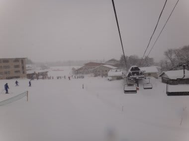

# 1月27，28日の菅平は…

📅 投稿日時: 2012-01-30 00:01:28

🏷️ カテゴリ: [2012スキー滑走日記](cca3a0e9524e0203150f790b1fc3c71ad.md)

ということで．

この週末は久々に志賀高原を離れ．

菅平で滑ってきましたけど…

なんだか，菅平らしからぬ天気でしたねー．

…いや，-10度を切る寒さは菅平っぽかったんですけどね．

終日激しい雪が舞う2日間．

で．まず．

27日の土曜日ですけど．

朝から天気は悪く，雪が降り続けてました…

あー．だいたいコース脇はひざ下パフくらい．

圧雪コースも，コース上に10cmくらい雪が積もってましたかねー．

おかげで昼ごろには結構コースが荒れちゃいましたが．

結局，この日は終日雪が降ってましたねー．

ガスが出て視界が全く効かなくなる，ってことが無かったのが

救いだけど．

夕方はすげー寒い．

風が出て寒い．

寒すぎたからか，ゲレンデの人は少なかったなぁ．

おかげでリフト待ちはほとんどなく，ファミリーが最大1-2分

待ったかなぁ，ってくらい．

んで．

日曜も…

朝から雪．

土曜夜から降り続いた雪で，

コース外はブーツから脛程度の積雪かな～

ゲレンデもコースによって5-10cmの積雪．

一瞬雲が薄くなり，雪が止むこともあったけど…

午後からまたすごい雪に．

吹雪ってほどではなかったけど，

風も結構あって，この日も寒かったよ～．

やっぱり午後は結構コースが荒れましたね…

どーでもいいですが，ゲレンデに人がいない…

あまりの寒さと，荒れているゲレンデ状況で，

日曜はみんな早々に退散しちゃったのかな？

準指検定を控えているらしい，プルークを練習して

いる人を時々見かけましたが…

モサモサの雪がゲレンデの上に積もった状況では，

ピタピタの整地を求めていた人たちにはつらかったかも…

とりあえず．

菅平らしからぬ柔らかい雪がコースを覆った週末でした．
