# え？わがVMG LEVORG君，フロントサス交換…？？　そして2月20日(日)の志賀高原スキー場特派員レポート

📅 投稿日時: 2021-02-21 00:29:16

さすがに土曜日の本日は，

かなりの数の特派員から写真が送られて

きました…

だもんで，まずは本日も志賀高原特派員レポートから！

えー．

今日はファーストトラックに参加した

特派員もいたようですが．

ファーストトラック開始の7:30から

すでに晴天！

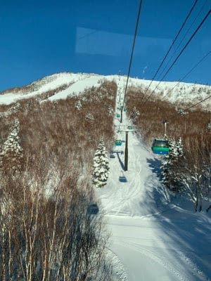

…そして．

シマシマ！！

うーむ．

通常営業前にここを貸し切りで滑れる

なんて…ファーストトラックに参加している

人がうらやましい！！

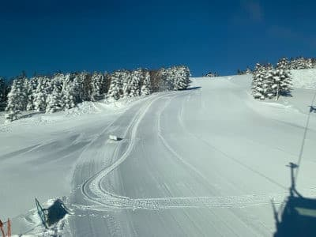

そして．

通常営業開始まえの第一ゴンドラは，これだけの

人が待っていたようで．

そろそろスキー場にお客さんが戻り始めてきてるの

かな…

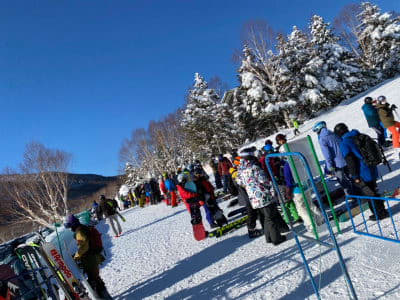

あさイチの山頂気温は-4℃と，

この時期にしては高め．

…でも，予想は-3℃だったので，

ほぼ予想通りかな…

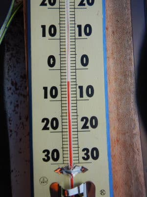

そして山頂は…

シマシマ！

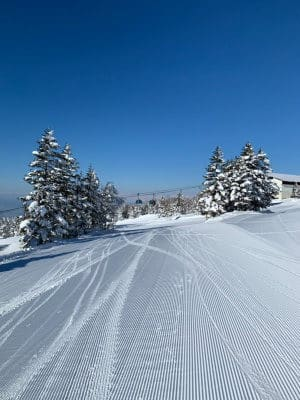

シマシマ…

滑りたい…

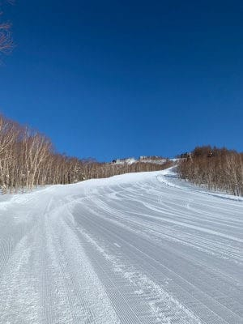

奥志賀も，朝イチシマシマ！

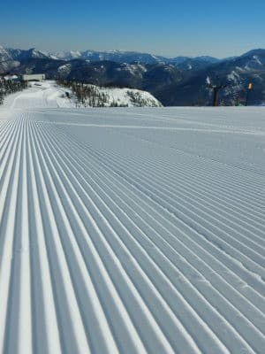

奥志賀は，ピステンが故障して昨日までは

第2高速ペア沿いのエキスパートコースが

非圧雪でしたが．

今日は圧雪されていたようです…

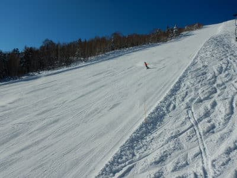

高天も天気がよく，朝イチは

良かったようです！

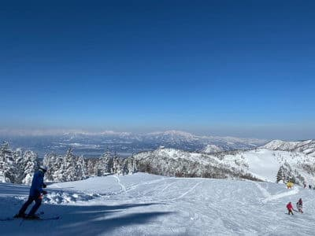

ただ．

焼額のイ１ゴンも…

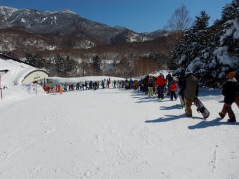

2ゴンもすごい列で．

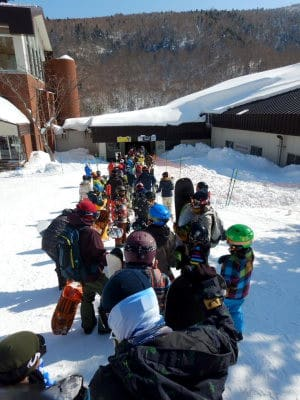

ゴンドラは原則相乗り禁止で．

一人ずつ乗っていく人も多かったらしく．

今日は一日，ゴンドラ待ちが解消しなかった

ようです…

逆に，一人乗りとかでゴンドラの輸送力が落ちている分，

ゲレンデはガラガラだったみたいですが…

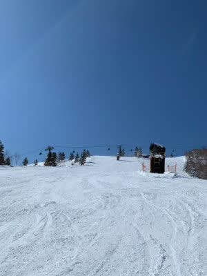

昼間の気温は，予想通りのプラス気温で．

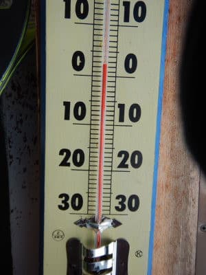

一部，ゲレンデが緩んじゃったところも

あったみたいですが．

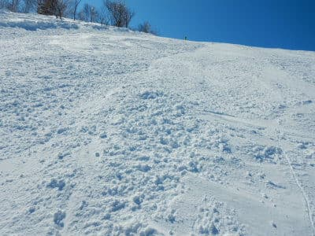

焼額や一の瀬方面は，日が当たるところ以外は，

夕方までいい雪質をキープしてくれたようです…

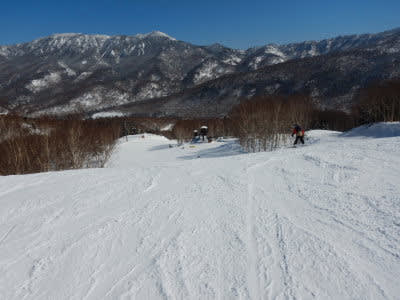

一の瀬も，正面バーンは午後は荒れたものの．

パーフェクターが最高だった…

という報告が流れてきていました．

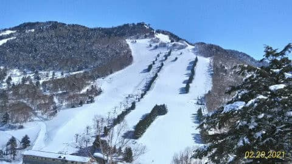

ただ，標高の低い西館方面は，

昼間に結構雪が緩んだようで．

夕方はかなりカチカチになっていた

ようですね…

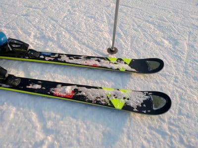

ってなことで．

本日は，晴天で気温が上がったわりに，

意外と雪が緩まず．

ゴンドラがかなり混んだ以外は，良い日

だったようですね…

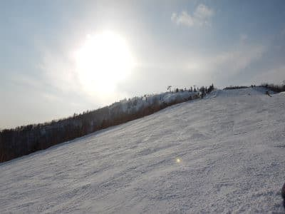

明日も今日と同じ晴天で．

気温が今日よりもっと上がるので．

残念ながら明日はかなり雪が緩むと

思います…

…いや．

槍やミサイルが降るんだったかな？？

ってなことで．

本題へ．

(特派員写真が多すぎたので，前フリが異常に長かったんですけど…）

先週日曜に，スバルディーラーへ車の不具合を

見てもらいに行った…

という話を書きましたが．

一体何があったのかというと．

我がVMG LEVORG君．

数か月前から，

右フロントのあたりから異音がするように

なったんです…（涙）

駆動系か，ブレーキか．

20㎞くらいの低速で走っているときに，

「パキ，パキ」というか，「ポコポコ」というか…

感覚的には，イニシャルが強いLSDが

バキバキいう音を，ちょっと弱くした感じ 

（通じる人がいるのか？）

いや，ずっと音がするようになったわけではなく．

時折思い出したように鳴り始め，

なり始めるとしばらく続く…

という感じで．

特に，長距離を走った後は音が出る確率が

かなり高まる気が…

ってなことで．

数か月前から音が出るようになったけど．

再現性がなく，出たりでなくなったり…

という感じだったのが．

最近では出る頻度が高くなって来たので，

ディーラーにもっていったわけですが…

うーむ．

ディーラーで現象がちゃんと出てくれるかな？

現象が出なくて，

「わからないので，しばらく様子見で」

とならないかな…

と，心配しながらディーラーに車を

預けること，半日．

その結果はというと…

Dラーさん「こちらでも現象，再現しました…」

私（良かった…それだけが心配だった）

Dラーさん「これは，ビルシュタインダンパーのこのモデルの

　車では，他のお客さんにも出ている例がある現象でして…」

私「え？既知の不具合だったんですか…！」

　（それだったら，もっと早くに来ればよかったかも）

Dラーさん「この不具合では，ビルシュタインダンバーを

　フロントストラットごと無償で交換させて

　いただきます…！」

私「え！ストラット丸ごと交換！！？？

　…でも，右側のダンバーだけ新品になるんですか？

　左右バランス大丈夫ですかね…？」

　(まぁ，購入後3年＆10万km以内の保証期間内だから無償は当然として，

　タダで換えてくれるのが片方だけってことはないよね？？）

Dラーさん「現象が出ているのは右のダンパーですが，

　左右とも交換させていただきます…」

（0円と書かれた見積書を出しながら）

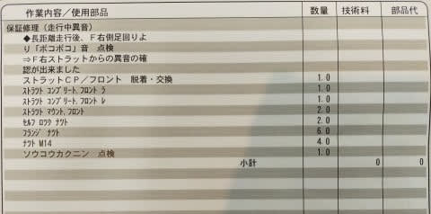

私（まぁ，6.6万㎞走ったダンパーが，ストラットごと

　新品になるならラッキーかな…）

Dラーさん「この症状は，走行の安全性に影響はないので，

　後日交換とさせてください．

　一日入庫してもらえれば交換できますので」

…ということで．

どうやら，ダンパーのオイルが変質するとか

固化するとかなんとかいう話らしいのですが．

（ディーラーさんも原因の詳細知らず）

わがVMG LEVORG君．

フロントサス左右，ストラット丸ごと交換

となりました…

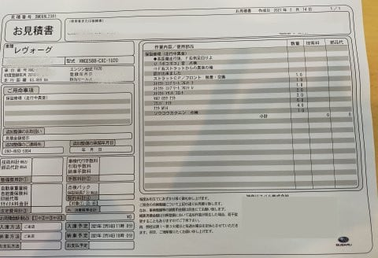

ディーラーの工場の空きが3月以降ということで．

交換時期はかなり後になりそうですが．

2年半，6.6万㎞走ったビルシュタインダンパーが

ただで対策品の新品になるなら，まぁラッキーと

いえるのかな…

でも．

どうせなら

リアもついでに無償で換えてくれないかな…？？

と思った，Skier_Sだったのでした…

## 💬 コメント一覧

### 💬 コメント by (しんちゃん)
**タイトル**: 得した感じ
**投稿日**: 2021-02-21 01:47:24

6.6万㎞も走って、フロントサスがストラットごと新品になるなんて、得した感じですね(^^ゞ

これで新車気分になって、ますます走行距離が伸びたりして（笑）

### 💬 コメント by (かず)
**タイトル**: Unknown
**投稿日**: 2021-02-21 09:36:17

お休み中すいません！最新の火曜の雪はどうでさょうか？雪次第で今日帰ります

### 💬 コメント by (レインボー73)
**タイトル**: Unknown
**投稿日**: 2021-02-21 12:21:07

日曜日の志賀高原情報

今日は暖かくなるというお告げにより薄着したけど、やっぱり暑い！　カラマツ一本のあとは、年長組の子とデート。

ありがたいことに、この第３日曜日は未就学児は全山無料。

おかげで昼食は、メガ唐揚げの銀嶺に。

ダイヤもファミリー下部も天狗も、すべて最高雪質。天狗の番号抜けが残念だけど、まずは最高の午前中。

あの西館様は、ひたすら西館フーディー回しだったとか。それほどよかったらしい。でも、今日は奥志賀もどこもかも良かったみたいですね。

私は横滑りとプルークばかりだったので、、、

### 💬 コメント by (ノムノム)
**タイトル**: 私も経験しています
**投稿日**: 2021-02-21 13:45:33

ご無沙汰しています。私の前車S4(A型)も同様の症状が出て、フロントダンパー交換になりましたよ。

特に長距離走行したあとに出やすかったですね。ドイツからの輸入品ですので、半年近く待たされた

記憶があります。

結局、リアもオイルが滲んできていたので、ヤフオクで仕入れてきた純正品と間を置かずして交換、

前後ともシャッキリしました。(5万km位だったかな)

幸い、現車のF型ではまだ出ていませんが、どうなることやら…。

ちなみに今年の志賀はいいですね。4回ほど行ってしまいましたが、その辺のスーパーやモールよりも

人口密度が低く、安心して楽しめました。新設ゴンドラは拍子抜けしましたが…(苦笑)

### 💬 コメント by (レインボー73)
**タイトル**: Unknown
**投稿日**: 2021-02-21 14:56:18

日曜日の志賀高原情報２

銀嶺も珍しく満員になってきたので、悪いので早めの退散。西館滑走組は『全部緩んでた。下部では足掴み多発』。西館短いリフト組の私達は、緩んでたけど足つかみはなし。

狙いのタンネは午後も快適安全バーンでした。

ファミリー下部も緩いけど安全バーン。

サウスはボコボコで終了。またもレインボーに大幅遅刻。

最大の収穫は、３歳の女の子が、５回目で怖いものなしのスイスイプルーク。転んでも自分で起きる、板は自分で持つすごさ！あんなふうに急速に上手くなりたい！

### 💬 コメント by (AK)
**タイトル**: Unknown
**投稿日**: 2021-02-21 17:34:05

イニシャルの強いLSDのバキバキ音わかる人ここにいます(笑)

フロントからあの音したら気になりますね。

無償でフロント丸々交換なんて保証期間内でよかったですね。

### 💬 コメント by (Skier_S)
**タイトル**: Unknown
**投稿日**: 2021-02-21 19:57:08

＞急ぎかずさまへ

23日朝は15cmくらい、朝の営業開始から雪が強くなり、昼間に20cm以上つもるかも…

営業開始前より開始後のほうが降りそう。

気温は冷え冷え、マイナス15℃クラスの雪降りの1日です

### 💬 コメント by (かず)
**タイトル**: Unknown
**投稿日**: 2021-02-21 22:02:15

ありがとうございます！ やっぱりSのお告げもそうですよね  夜積もるならかなり仕事の調整が大変ですけど休みました  昼間なので結局帰りました！若さんの情報楽しみにしてます

### 💬 コメント by (Noname)
**タイトル**: Unknown
**投稿日**: 2021-02-21 22:29:50

「前側のダンバーだけ新品になるんですか？

　前後バランス大丈夫ですかね…？」

これだなwww

（ちなLSDのバキバキ音わかります）

### 💬 コメント by (西舘)
**タイトル**: 気が利かないけど中央エリアもそれなりに頑張っているのだ。
**投稿日**: 2021-02-21 22:33:23

焼額はちょー満員！の情報をいただき、焼額への出勤は急遽取りやめて、雪が緩むまで我が聖地、西舘を周回。良い感じに緩んで最高コンディション、しかも３シーズン前までの速度に戻ってるし搬器の数も間引きされていない、以前の状態に戻ってる！そして1月下旬から16時で終了だったけど今日は16:30まで延長。

西舘もたまにはやるねぇ。

晴天時にはがら空きの西舘なのに、今日はゲートから溢れて並びましたよ。いやぁ皆様、西舘の魅力に気が付いちゃいましたか。

銀嶺にレインボーさんを探しに行き邂逅。我が家はレインボーさんのストーカーだから。

可愛いお嬢ちゃんたち凄いですよ。年長のお嬢ちゃん、高天原の不整地を自力で渡ってしまいました。

タンネ良かったですね、柔らかい雪で転倒も怖くないから、こそ練にもってこいでした。

雪質最高の寺小屋経由で一の瀬パーフェクターに挑戦！降りました、なんとか降りましたよ気持ち良く。

やっぱり今日も楽しかったのでした。

### 💬 コメント by (レインボー73)
**タイトル**: Unknown
**投稿日**: 2021-02-22 14:17:32

月曜日の志賀高原情報

今日はスピード好き隊員が社会生活に戻る日なので、ひと滑りのみの日。朝一のカラマツは硬い。１ゴンが過密との情報を得たので、ニゴンからファミリーへ瞬間移動。

ファミリーはカチカチ山の金太郎だけど、凹凸がないので怖くはない。ファミリー下部はひどいコロコロ。

48連荘最終日の隊員が『最後は天狗をの～んびり』との希望で、まったりと天狗ロングラン。

10時終了。布団干し、大掃除ができて満足の日でした。

エス様、明日はパウダーにしてくださいな。

### 💬 コメント by (ダウンヒル)
**タイトル**: Unknown
**投稿日**: 2021-02-22 16:28:44

皆さま、日々の志賀出勤お疲れ様です。

気温が上がり、行く先々で妖怪板掴みの洗礼を浴びながらも、無事クリア。

退勤間際は奥志賀ゴンドラ山頂向かいの高速ペア（第3？ペア）をかじって気分良く生還出来ました。あー、良かった良かった。

報告遅れましたが···S様、喜んで下さい!

S様のブログファンがわたくしの常宿に潜伏しておりました！

１億数千万のブログファンの発掘ができ、嬉しい限りです!

### 💬 コメント by (m&t)
**タイトル**: Unknown
**投稿日**: 2021-02-22 17:57:20

Sさん！今年から無くなったと思っていたアルペン試乗会。ありました。緊急事態宣言終わっていたら、試乗レポートよろしくお願いします!

### 💬 コメント by (アリス)
**タイトル**: スキー場浮気しています
**投稿日**: 2021-02-22 19:03:24

Skier_S様

日々の情報提供ありがとうございます。

ここのところ志賀高原を浮気ばかりして滑っています。

不思議なのですが、家に帰って都度思うことは

『ヤケビ滑りたいー』なんです。

やはり、志賀高原は特別な存在だと改めて思っています。

あっ　　それと私のスキー仲間にSさんとGokuさんファン多いです。お二人は既に志賀高原のスーパースター的存在ですね♪♪

レインボーさんの情報も的確で神がかりです♪

スキー場のHPより詳しいので、感謝しております♪

### 💬 コメント by (ダウンヒル)
**タイトル**: Unknown
**投稿日**: 2021-02-22 19:34:36

追伸

今日奥志賀ゴンドラ横にて、RX78ガンダム、シャア専用ザク、ドム、ジム、の４機が現れ、戦闘しておりました。

近々、ミサイルが降る以外にもレーザー兵器でのモビルスーツ戰が勃発するかも。

君は、生き延びることができるか？(爆)

### 💬 コメント by (オオスギ)
**タイトル**: Unknown
**投稿日**: 2021-02-22 20:04:46

すみません、わたしの時代は、もうバキバキ音のしない、カーボンLSD

(ATS)が、主流になっておりまして…

古い車は、バキバキ鳴らしてサーキット走ってましたね‼️

### 💬 コメント by (Skier_S)
**タイトル**: 昨日は死んでました
**投稿日**: 2021-02-23 03:42:04

＞しんちゃんさま

ダンパー新品は儲けものですが．

リヤも換えてくれればいいんですけどね～．

次はエンジンが不調になって交換になれば，20万kmは乗れるかも？？

＞レインボー73さま

毎度のレポートありがとうございます．

やっぱりファンが増えてきてるみたいですね（笑）．

明日はパウダーですが…

ちょっと重いし，ブーツパフ，せいぜい脛パフでそれほど深くないと思います（残念）

でも，硬いのは隠れてくれそうな感じです．

＞ノムノムさま

あ，WRXでも同事象出たんですね！！

でも，半年待ちですか…

私のE型でも出てるので，F型も出るかも？

＞AKさま

分かる人がこんなにいるとは！！

今ではこんなボキボキ音を出しながら走っている車は

絶滅したと思ってましたが（笑）．

＞かずさま

今回は諦めて正解だと思います．

私の読みではそれほど量は降らなさそうです．

雪質も志賀としては重そうです…

重くてもいいなら，志賀じゃなくARAIや妙高方面なら量は積もってるかもしれませんが．

＞Nonameさま

「前側のダンバーだけ新品になるんですか？

　前後バランス大丈夫ですかね…？」

は，私も考えたのですが（笑）．

「さすがにリアは交換にならないんですか？」

と聞いたら，「リアはそのままで…」と言われちゃいました．

しかし，LSDのバキバキ音，意外と知っている人多いですね…（笑）

＞西舘さま

西舘フーディー，フルスピード営業ですか！

一の瀬ファミリーとヤケビもフルスピード営業してほしい…

志賀高原人脈が増えて楽しんでいるようで良かったです！

＞ダウンヒルさま

妖怪板掴みの大量発生の中のスキー，お疲れ様でした（笑）．

しかし，ダウンヒルさんの宿にもこのBlogの読者さんがいらっしゃいましたか．

私とお会いしたことがある方でしょうか…？

焼額に遊びに来るよう勧めてみてください（笑）．

あと，ガンダム隊が志賀に来ていると情報は効いていたのですが…

奥志賀に来てたのですね！

＞m&tさま

え！

試乗会，やるんですね！！

緊急事態宣言が解除されていて，仕事の状況が許せば行きます…！

＞アリスさま

私も一時期はホームゲレンデを決めず，毎週毎週違うゲレンデに

行っていましたが…

やっぱり志賀がいい，と志賀の住人になりました．

ヤケビはやっぱりいいですよ！！

またスキー仲間の方もヤケビに誘ってお越しください！

＞オオスギさま

そうですね…

LSDのバキバキ音が分かるのはもう年齢がばれますよね…（笑）

でも，今でもスバル車はステアリングを大きく切ってスタートすると，

トランスファー付近から差動吸収のゴゴゴって音する車がありますけど（笑）．

### 💬 コメント by (ほっぽ)
**タイトル**: ビルシュタイン
**投稿日**: 2021-02-24 07:06:04

Ｓさん

そうですか、フロントのみ新品交換ですか。

リアの方が容量小さいので出来れば前後新品にしたいところですが、

不具合が出ていないのでダメなのでしょうね。

我が家のアルハイも社外ビルシュタインですが、フロント倒立からハンドル切ると音が出てしまいましたが、ある潤滑剤の塗布で治りました。

倒立ダンパーのアウターとストラットケースとのシール不良だったかな。

社外品なので潤滑剤でごまかしてしまいましたが、その後数年経過しましたが不具合無しです。

アルペン試乗会、既に募集が始まっていますね。

何時ものASAMA2000の他、志賀は4月第一土日に熊の湯で開催です。

私は3/13の白樺2in1と3/22のASAMAにエントリーしました。

