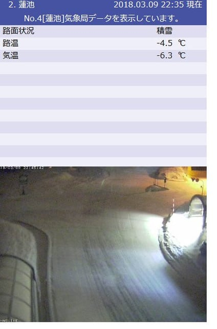
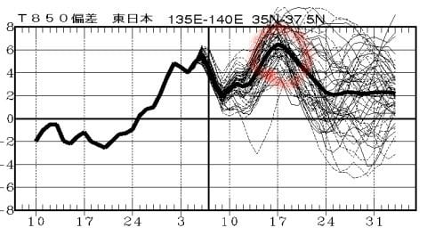

# なぜか明日はスキーに行けず…（涙）．でも，日曜は志賀高原へ復活予定！

📅 投稿日時: 2018-03-09 22:58:25

🏷️ カテゴリ: [日記](cc4b5682fb7b8b144980957a978653fb0.md)

ということで．

予想通り，本日金曜の朝まで．

志賀高原でも夜通し雨が降り続いていたようですが．

金曜の朝から雪に変わったようですね…

でも．予想通りあまり積もってないようですが…（涙）．

とはいえ．

まだうっすらと雪は降り続けているようなので．

明日の朝は，固いバーンの上にうっすら雪が

乗って．

朝イチはまだまともなコンディションで滑れそうかな…

…すぐ，固いバーンが出てきそうですけど（涙）

そして，土曜日朝は雲が残りそうなものの．

土曜日の午前中から日が射し始め．

日曜まですっきり晴れが続きそうなので．

…天気はいいけど，積雪は望めそうにありません（残念）．

土日とも，朝イチはいいものの．

すぐに硬い斜面が出てくる週末になりそう…（泣）

それどころか．

これから一週間，また高温の日々が続きそうで…

この，赤丸で囲った17日前後なんて．

先週の「GWか！！」と思うほどの異常高温と

同じくらいの気温に上がりそうなんですけど（泣）．

また，17，18の週末．

貼りつく春の雪になっちゃうのか…（激涙）

あぁ…

ヤバいかも．

今シーズン，ヤバいかも…

で．

明日から週末ですが．

なぜか，明日は用事があって．

スキーに行けないんですね…（涙）

ということで．

土曜日にイチゴンの前で待っていても，

私は現れませんことを予告しておきます．

あー．

日曜は復活します．

日曜は朝からイチゴン滑ってますので～！！

## 💬 コメント一覧

### 💬 コメント by (Goku)
**タイトル**: 同じく・・・
**投稿日**: 2018-03-10 00:27:51

会長！わたしも明日欠勤です。

いや、日曜日もだった(T_T)/~~~

### 💬 コメント by (しんちゃん)
**タイトル**: 日曜復活
**投稿日**: 2018-03-10 02:07:52

私も日曜復活予定です。

よろしくお願いします。

### 💬 コメント by (michi)
**タイトル**: Unknown
**投稿日**: 2018-03-10 08:27:27

今朝は朝礼無しですか（笑）

私も明日参戦予定です！

宜しくお願いします。

### 💬 コメント by (さち)
**タイトル**: Unknown
**投稿日**: 2018-03-10 11:36:23

今ブログ確認しました！(笑)

明日お待ちしております(^^)d

### 💬 コメント by (ホンダです。)
**タイトル**: 早朝スタート
**投稿日**: 2018-03-10 16:39:04

本日から早朝スタートしました。S様をさがしましたが見つからす。欠席と今知りました。明日お待ちしてますよ。👋😃

### 💬 コメント by (yama)
**タイトル**: ３月１０日は
**投稿日**: 2018-03-10 18:46:40

ヤケビ早朝始まりました。原夫妻がファーストトラックをゲットしたようです。天気は予報通りでした。ガスに覆われていたのが晴れて、午後は雲海の上でスキーになりました。立ち止まり写真を撮る人が多かったです。朝は１０から２０cmの新雪もありましたが、すぐに下のアイスバーンが出てきました。２週間前よりかなり雪が減りました。(>_<)

ps本日　原さん20000mチャレンジしました。早朝からラスリフまでで19700m、ナイターも行くようなので達成は確実と思います。旦那さんの方だけです。女性の２番目はSさんの娘さんですかね。

ps2 娘さんからバレンタインデーのチョコをもらっているのでホワイトデーのお返しがあります。こちらは朝食食べて一の瀬スタートなので早朝参加のSさんに会えるかどうかわかりません。いつものホテルに帰りに寄って下さい。

いつもいるブログガーが２人もいないので長文になりました。

### 💬 コメント by (かず)
**タイトル**: Unknown
**投稿日**: 2018-03-10 19:18:17

早朝から　結構寒かったです　景色はトップシーズン並でした　所々氷がありましたが圧雪コースは隠れてます　奇跡的に想像以上に良かったので泊りにしてます

### 💬 コメント by (Skier_S)
**タイトル**: なぜか今日はコメントが多いですね…
**投稿日**: 2018-03-10 20:40:03

＞Gokuさま

土日連続欠席，ちと寂しいですね…

焼額が静かになります（笑）．

無事用事は済みそうでしょうか？

また来週お会いしましょう~！

＞しんちゃんさま

日曜日帰りですか？

では，また朝礼にて！

＃私はフライングスタートで滑ってると思いますが

＞michiさま

日曜参加ですね！

私はフライングスタート（？）なので，

朝イチゴンドラには並んでいない可能性大です（笑）．

でも，いつも通りイチゴンぐるぐる滑ってますので，

またお会いしましょう！

＞さちさま

こちらにお返事いただくとは…（笑）

いつもと違う日曜に伺いますが，

よろしくお願いします～！

＞ホンダさま

そうなんです…

今日は欠席だったんです．

もう少しで2日連続欠席になりそうなところ，

ギリギリ土曜のみ欠席ですみました．

明日は朝早くからバリバリ滑る予定ですので，

よろしくお願いします！

＞yamaさま

やはり，10cmほど積もったんですね…

朝イチは最高だったのではないでしょうか…

雪が減ったのは残念です（涙）．

