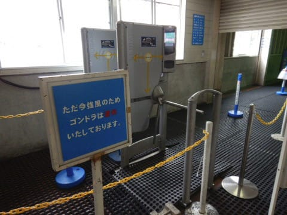
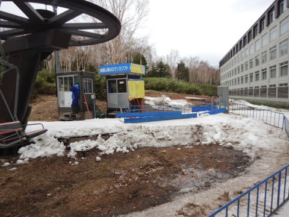
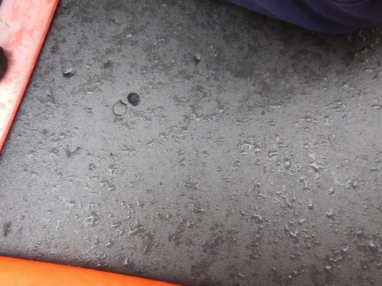
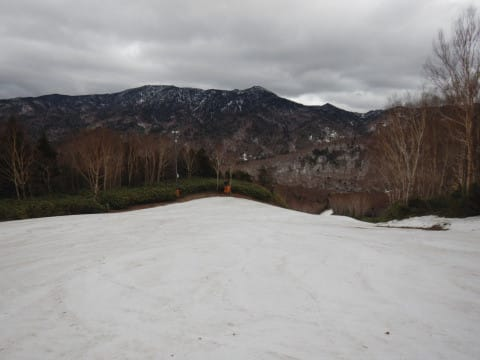
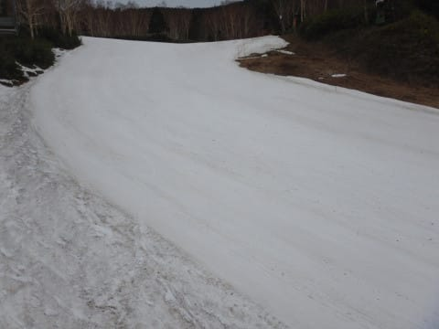
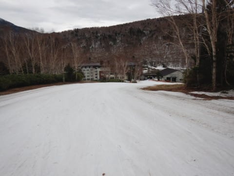
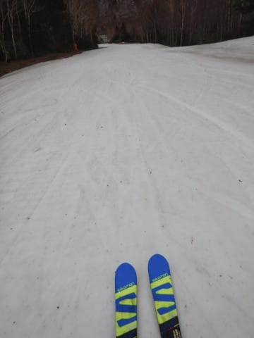

# 2021/5/5(水)志賀高原焼額山スキー場ファイナルデー，速報モード！…朝は雨が降ったけど，午後は降らず！でも強風でゴンドラ終日運休(涙）

📅 投稿日時: 2021-05-06 01:41:45

🏷️ カテゴリ: [2021スキー滑走日記](c2b0fc073d6357d3b786f6ca655147f7d.md)

というわけで．

ついに本日．

わがホームゲレンデ，焼額山スキー場の

営業最終日となってしまいました…(涙)

だもんで．6泊7日の長きにわたった

私のGWの志賀高原滞在も終了です．

で．

いつも通り，今日の帰宅は夜遅く．

いろいろ洗車やら片づけやらをやっていると

もう深夜…(涙)

明日はいつも通り仕事なので，今日は

速報モードにて！

ってなことで．

焼額ファイナルデーの本日．

なんと．

強風でゴンドラ運休！

奥志賀も全山運休，横手も第2トリプルは

早朝のみで営業休止という状況（泣）

一の瀬，寺小屋，高天ヶ原は通常営業

だったのですが．

焼額は本日，6:30の早朝から，

第4ロマンスでの営業となりました(残念)

まぁ，滑れただけマシかな…

私は通常営業の8時からの参加でしたが，

天気は9時半ごろからポツポツ雨が

降り始め．

その後，午前11時過ぎごろまで，

時折パラパラと雨が降る感じでしたが．

午後は曇り空で，雨は降りませんでした！！

…ただ，やはり終日ゴンドラは動かず(泣）

でも．

4月29日の時点での，

「これはGW最終日まで雪がもつか…？」

という心配とはうらはらに．

雪はしっかり最終日までもってくれ

ましたよ！

そして．

雨でペアリフトしか動いていない

悪条件の本日は，当然のごとく

ゲレンデはガラガラ…

午前も10人ちょい，午後はひとケタの

人数が滑っていた程度．

雨が降っていた午前中は，雪の滑りが良く，

結構楽しめたけど．

雨が止んだ午後は，曇り空だったので

晴れの日ほどひどくはなかったものの，

ちょいと滑りが悪くなっていったのが

残念…

でも．

GWの営業最後までしっかり雪が残って

くれたことに感謝しつつ．

今シーズンの焼額ファイナルデー．

ホームゲレンデとの別れを惜しみつつ，

今シーズンの営業終了のラスト1本まで

ひたすら滑り続けたのでした…

いやー．

でも．

ひたすら週末に雨が続いた3月から

高温の4月が続いた時は．

GW前に焼額は終わるんじゃないか…

と心配していたけど．

スタッフのコース整備の尽力と，

5月2，3日の奇跡の降雪により，

美時営業最終日まで滑ることが

出来ました～！！

これにて，私の今シーズンの焼額通い，終了です…

## 💬 コメント一覧

### 💬 コメント by (西舘)
**タイトル**: 感無量でございます
**投稿日**: 2021-05-06 02:01:10

皆さん一緒だと思いますが、今シーズンは辛い日々も有って、思い切りとは言い難いけれど、

振り返ればそれなりに楽しいことがいっぱいあって、良い思い出がいっぱいです。

それもこれも、ゲレンデでお声がけ頂いた皆様、ご一緒して下さった皆様のおかげです。

Ｓさんが消えていたゲレンデは、何となく熱量が下がっていて、幻でもいいから会えないかなぁと念じていたのでした。

かなり後になってしまいましたが、お戻り頂いた時は、本当に嬉しかったなぁ。

楽しかったなぁ。本当にありがとございました。

昨シーズン頑張って良かった、このブログに出会って良かった。

それでは皆様、リアルでは暫くご機嫌よう。

### 💬 コメント by (Skier_S)
**タイトル**: ＞西舘さま
**投稿日**: 2021-05-06 02:05:27

コメント早っ！！！

…今シーズン．

辛いこともあったけど，全体的にはいいシーズンだったと

思っています．

来シーズンは，今シーズンよりいいシーズンになることを祈って…

そして，またみんなでゲレンデ以外でも会えるといいですね！

### 💬 コメント by (ほっぽ)
**タイトル**: ヤケビシーズン終了
**投稿日**: 2021-05-06 07:11:13

Ｓさん

ヤケビシーズン終了、お疲れ様でした。

最後の最後に雨で４ロマとは、これまたなかなかの修行ですが、

通常営業開始から終了まで４ロマワンメイクで滑り倒すとは流石です。

私はケガで一足早くシーズン終了しましたが、Ｓさんはかぐら、月山とまだまだスキーシーズンが続きますね。

ケガには気をつけてシーズンラストまで楽しんで下さい。

http://hoppo.officialblog.jp/

### 💬 コメント by (うえいと)
**タイトル**: Unknown
**投稿日**: 2021-05-06 08:59:36

早朝から雨まで滑ってましたがほとんど人が来ませんでしたね。早朝だけで上がった人が多かったです

### 💬 コメント by (yumi)
**タイトル**: Unknown
**投稿日**: 2021-05-06 14:07:53

Ｓさぁ～ん☔🌪️💦

えっ👀⁉️

９時半頃から ポツポツ❓️

11時過ぎ迄ってェ～～～🤔

じゃぁ～🙄・・・ワタシ😁

丁度💥雨☔️の降っている時だけ👀滑ってた⛷️💨って コト⁉️

かしら😅

### 💬 コメント by (ikkun)
**タイトル**: Unknown
**投稿日**: 2021-05-06 15:43:02

お疲れ様でしたm(__)m  毎週末あちらから焼額山って嘘っぱち？みたいな(笑)しかし真実ですね❤️もはや顔パスでいけますね🎵ピッ❗がなければ(笑) あの３月の雨の嵐を恨むしかありませんね  にしても お疲れ様でした❗来シーズンはもっとまともなseasonになること祈りながら❗ 顔合わせ頂けたら幸せですm(__)m

### 💬 コメント by (Northfox)
**タイトル**: お疲れさまでした
**投稿日**: 2021-05-06 19:49:40

私はGWのスキーはさっさと諦めて、S様がヤケビで頑張って滑っているときにスタッドレスタイヤをノーマルタイヤに交換していました．．．

今シーズンは雪が降るときと降らないときが極端すぎました。大雪やガスで視界不良も多かった印象です。

来シーズンは良いコンディションで滑れるようにと祈念しつつ道具の手入れ等来冬に向けて準備しようと思います。

追伸：来シーズンこそは何も買わない！が目標です

### 💬 コメント by (michi)
**タイトル**: Unknown
**投稿日**: 2021-05-07 09:04:23

ヤケビ最終日ラストまでお疲れ様でした✋

ゴンドラ運休で4ロマのみ、雨の中でしたが、ガラガラで板も走るので良かったです✨

カッパーズの気持ちが少しだけわかりました😅

GW7日間、全てヤケビで過ごすという何とも素晴らしい記録を作りましたね（笑）

しかし雨で始まり雨で終わり。途中、奇跡の積雪有りと、これだけ天候やコンディションが変わったGWも珍しいのではないでしょうか。

### 💬 コメント by (スシネコ)
**タイトル**: Unknown
**投稿日**: 2021-05-07 10:55:33

Sさん　お疲れ様でした。

私は４月以降のヤケビや志賀をまだ経験したことがないので、レポート読んで楽しくイメージしておりました。来年こそは（仕事をやっつけて）参戦したいと思っております。

P.S.あちらこちらの皆さんのコメント読んで「GS板」に興味が湧いてきました（笑）

### 💬 コメント by (Skier_S)
**タイトル**: コメント回答遅れました…
**投稿日**: 2021-05-08 03:53:38

＞ほっぽさま

朝8:00から15:30まで，4ロマ37本すべりました…

雨で意外と雪が滑って悪くなかったですよ←いろいろ終わった人

怪我はしっかり治して，また来シーズンお会いしましょう！

＞うえいとさま

朝，ちらっとお見かけしたけど，雨が降って退散されてたのですね．

午後の雨予想だったのが，午前降って午後止んだのが皮肉な感じでした…

＞yumiさま

まるで嫌がらせのように，午前中降り続けました．

午後は全く降らなかったんですよ…

ちょうどタイミングが悪い時に滑っていたようですね(笑)．

＞ikkunさま

3月の雨より，1，2月のコロナの方が苦しかったですね…(涙)

来シーズンはいいシーズンになってほしいです．

ぜひ来シーズンは焼額へ！！

＞Northfoxさま

今シーズン，雪が極端に降ったらしい１，２月は行けなかったので，

私にとっては雨ばっかりの今シーズンでした(涙)

来シーズンこそはいいシーズンになることを祈りつつ，

物欲選手権大敗仲間も増えるシーズンであることを願ってます(笑)．

＞michiさま

最終日，お疲れ様でした！

意外と雨の日も楽しいでしょ？

ぜひ今後もカッパーズにご参加を(笑)．

しかしこのGWは，雨⇒雪⇒雨と続いて，晴天が少なかったけど，

それだけ貼りつき雪が少なく楽しめたGWでした！！

＞スシネコさま

ぜひ，来年のGWは志賀高原参戦を！！

その時はGS板を忘れずに…(笑)

物欲選手権で一緒に負けましょう！！

