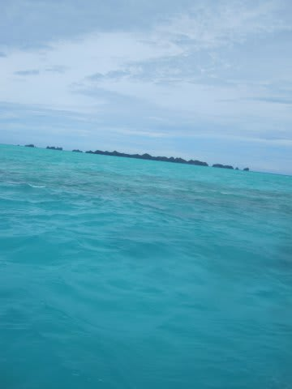
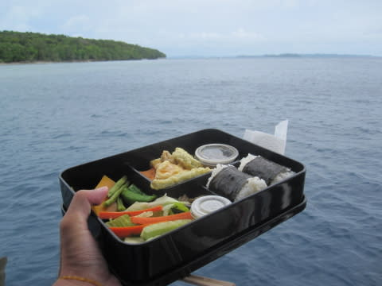
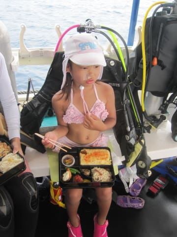
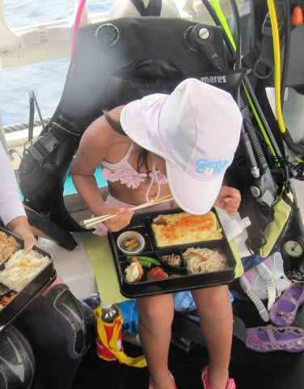
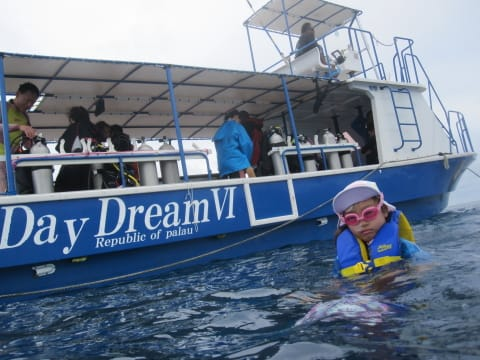
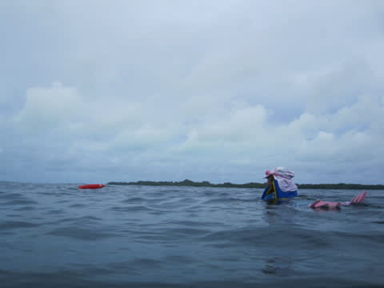
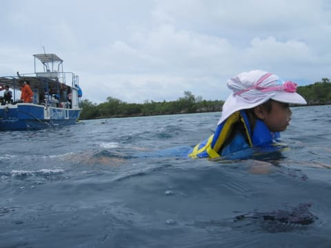
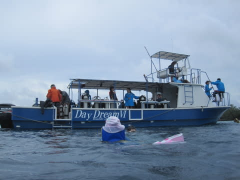
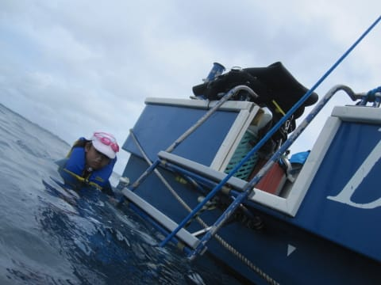

# 2014年10月，小学生の子連れでパラオへダイビングに行ってみた，その23…お昼休みは，やっぱり…

📅 投稿日時: 2015-09-05 00:54:27

2本目のお留守番タイムが終了したので．

次はお昼ご飯タイムだな…

…ってことで，お昼休みのために．

船は移動して，インリーフ側の穏やかな海へ戻ってきました…

そして，恒例．

船の上でのお弁当タイム！

…ちょいとどんよりとした感じの空なのが

残念ではあるけど．

きょうの私のお弁当は，てんぷら＆おにぎりをチョイス．

そして娘は…

オムライス弁当ですね～．

…

…でも．

娘．

やはり，昨日と同じく．

なんだか，必死に急いで食べてるんですけど…

…

…これは．

…

これは，やっぱり…

「泳ぐ」

…そうですか．

やっぱり，そうですか．

お泳ぎになられますか．

…今日も午前中，2本とも泳げないポイントだったし．

泳ぎたくて仕方がなかったんだよね…

仕方がない．

私もかなり急いでお弁当を掻き込み…

まだ，他のみんながお弁当を食べ終わってないうちから，

娘と一緒に海へ飛び込み！

そして…

ひたすら泳ぐ，泳ぐ，泳ぐ娘．

…まさに．

水を得た魚，ならぬ．

水を得た娘…

午前中，全く泳げなかったうっぷんを晴らすかのごとく

泳ぎまくってます．

ただ…

今日は，3本目はまた外洋側に移動するので．

20分ほども泳いだとところで

「船，もう出します～！！」

と，言われ．

しぶしぶ船に戻る娘…

ちょっと船に上がるのが不満そう．

ちょっと不満そうな娘を乗せて．

船は3本目のポイントへ向かいます…

…今日はあんまり泳がせられなくて，

すまん．娘．

3本目，泳げるポイントだといいんだけどねぇ…
