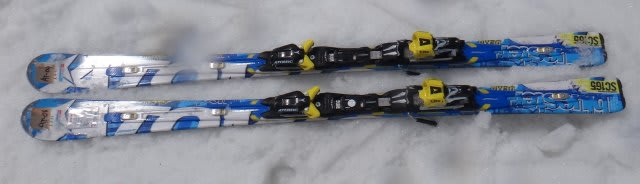
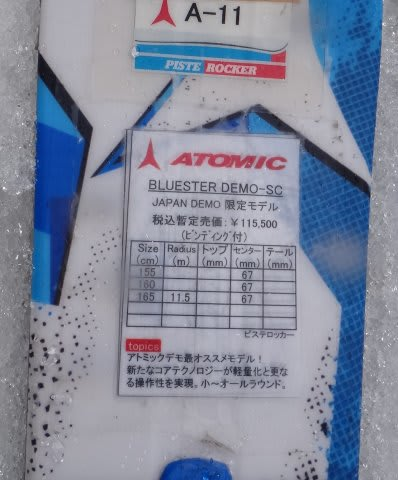
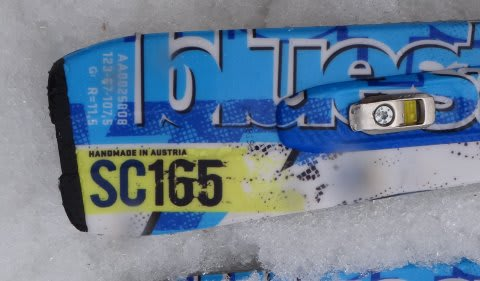

# 2014シーズンモデルのスキー試乗レポートその16…ATOMIC編

📅 投稿日時: 2013-05-30 00:12:43

🏷️ カテゴリ: [スキー板試乗](c0bd8048615710cee890e403a36cc9a2b.md)

えーと．

4月上旬に試乗した板のレポートがですねぇ．

…まだ続いてるんですねぇ…

ということで．

今回は，アトミック．

前回，[BLUESTER DEMO SX,AX](e726cab54be3de58a921195324593fe55.md)や，[BLUESTER S TIとS FW](ed7b0e4de1f43bee191804ee0c1fd5f0d.md)のレポートを書いてますが．

今回は，SXのひとつ下のグレード，SCです．

では，どうぞ～

----

ATOMIC 

BLUESTER DEMO SC 165cm

小回り基礎用．

SXよりフレックスを弱めたモデルになります．

…今年は，「SX」と「S」というモデル展開.

SXとSの両者，板は全く同じだけれども，

SXは強いXビンディング，Sは普通のNEOXビンディング…

という，ビンディングだけの違いでした．

しかし，来年の「SX」と「SC」．

板のサイドカーブは両者で同じですが，

この2モデル，ビンディングだけでなく板のフレックスも変えたみたいで，

全体的にSXと比べマイルドな仕上がりになっているようです…

滑ってみたところ．

あー．SXと全然違いますね．SXとは全く違う性格の板です．

フレックスが弱めです．

でも，トーションはそこそこ強いので，板のグリップ感は十分あります．

板のグリップが強いのに，フレックスがマイルドなので，かなり

簡単にたわみます．

それも，トップとテールがたわむというより，センターにたわみが

集中している感じ．

SXのようにトップやテールが利いて，トップから食い込んで行くとか，

たまった圧を板のテールに抜いていって，板の返りを次の谷回りにつなげる…

という官能性は薄いです．

どこに乗っても，センター部分のエッジが集中的に効く感じ．

ポジションの自由度がすごく広いともいえるので，ある意味楽かも．

持った感じ重い板ですが，履くと軽く動かせるし，

グリップが強めと言っても，グリップしたらどうしようもなくずらせない

昔のアトミックみたいなことも無く，SXよりは楽にずらしにいけるので，

SXより楽に履ける板です．

体力の無い人には手ごわいかもしれない，SXの張りの強さ・返りの早さがなく，

扱いやすくなりましたが．

そのかわり，SXのような，「おおお！」って感動はあんまり無いです．

…SX使いからしてみると，なんだか，刺激の無い普通の板になっちゃってる感じが…

＃すいません．普段SXに乗りなれているので，試乗評価がSX基準に

＃なっちゃってます…
