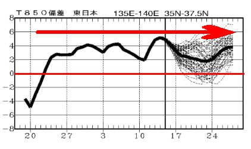

# 2025シーズンモデルのスキー板の試乗レポート速報…ATOMIC編　S9i PRO，S9i

📅 投稿日時: 2024-04-17 01:41:06

🏷️ カテゴリ: [スキー板試乗](c0bd8048615710cee890e403a36cc9a2b.md)

えー．

本日の志賀高原も晴れの高温の一日で．

かなり雪が解けたっぽいですね…（涙）

一ノ瀬ファミリーのパーフェクター

コースも，本日でクローズになった

ようです（泣）

うーん．

一見まだ滑れるように見えるんですけどね～…

で．

晴れなくてよい昼間は晴れて，

日差しで雪がやられたというのに．

17日の1:00現在，志賀高原は雨が降っている

みたいです（涙）

さらに雪が解けていく…（泣）

ただ，雨は明日のリフト運転開始のころには

止むと思いますが…

残念ながら，これからまだまだ高温が続き．

時折雨が降る，雪にとっては厳しい

天気が続きそうです…（泣）

なんてたって．

3月23日ごろに平年気温を上回って以来，

本日までひたすら平年比より高い気温が

続き．

さらに今後も2週間は平年比プラス気温が

続きそうなので…

1か月以上，1日残らず平年より高い気温が

続く

という，すごい悲しい状況になりそう…

とりあえず．

高温が続くのは仕方がないとすれば．

高温でもせめて雪を一気に融かす強風や

雨にならず，

なるべく雪にダメージが少ない，

風が弱い曇り空の天気が続くことを

祈るばかり…

ってなことで本題へ．

引き続き，スキー板試乗の速報レポート．

本日はアトミック編です！！

〇ATOMIC REDSTER S9i Revoshock S 165cm 

履いた感じ，かなり軽い！

ビンディングもプレートも軽く，

かなり軽快な履き心地．

それでいて，良くたわんで良く回って

来ます．

良く回るうえに軽いので，板を動かし

やすくていろんな小技が使える感じ．

今シーズンモデルからキャリーオーバー

らしく，構造は変わってないとのこと

ですが…去年よりグリップが強くなった

ように感じるのは気のせい？

でも，グリップが強すぎることもなく，

ずらしもキレもできて，軽さで板を

動かしやすいので荒れた斜面や不整地でも

滑りやすく．

そんなに気合を入れなくても履ける，

荒れた斜面でも整地でもOKの，小回り

ベースのゲレンデ普段履きとして良さそう．

〇ATOMIC REDSTER S9i Pro 165cm 

こちらは昨年からモデルチェンジした

らしいけど…

SALOMONのSL PROと同じく，こいつも

ICONビンディングになってますね…！

履いた感じ，かなり重くてしっかりしていて，

硬い板でした…

春のザク雪で履いたので，雪が柔らか

過ぎて板をたわませることができず，

板がしっかり重めなので，重い雪の中

ずらすには強い筋力が求められ，

春の雪ではサイドカーブなりに落ちてくる

ことしかできませんでした（泣）．

ちょっと私には手ごわい板．

硬いフラット斜面で滑ってみたかった…

硬い斜面だと評価は一変するかも．
