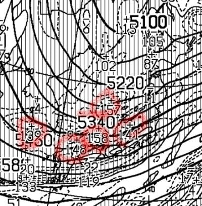

# これから23，24日の週末までに雪が積もるのか？？マニアックに天気図を読み込んでみた

📅 投稿日時: 2023-12-20 01:33:38

🏷️ カテゴリ: [スキー天気予想](c6554f5c3c106093b511a8daae23757e8.md)

えー．

本日の志賀高原も，天然雪はほぼなくて，

せいぜい1㎝程度の積雪だったようですが…

冷え冷え期間は続いているので，

人工降雪機はフル稼働できて．

昨日の予告通り，明日水曜から，

焼額の第2高速リフトが再稼働です～！

（[焼額山スキー場ホームページ](https://www.princehotels.co.jp/ski/shiga/winter/)より）

うーん．

でも，コース幅はまだ15~20mと狭いのね…

でも，熊の湯も横手も，まだ高速リフトが

動かせていないので，志賀高原で唯一営業の

高速リフトになりますか．

今のところ，これから24日までは，

20日に一瞬平年並みの気温に戻る以外は

冷え冷え期間が続くので．

今週末までには天然雪がドサドサ降って

くれることを期待したいところですが…

雪がドサドサ降ってくれるかな？？

と，21日の天気図を見ると．

一見日本海側に雪雲がかかり，

志賀高原にも雪が降ってくれそう…と，

期待してしまうところ．

この日の日本海側をアップにすると．

赤矢印で示した，降水量が集中している

領域，JPCZが出ているのがわかります！

…このBlogを最近読み始めて，JPCZを

ご存じない人は[このあたりの記事](https://weathernews.jp/s/topics/202101/290055/)を参考に！

で，この21日のJPCZは，かなり東側に

カーブしていて…新潟付近に突き刺さって

いるんですよね．

降水量25mm（積雪25㎝）のピークが新潟

付近と，かなり東に流れていて…

西風パターンなんです（涙）

もう少しJPCZが南に流れてくれて，

青線みたいに能登半島より西に突き刺さると，

志賀高原でも激烈に積もるパターン

なんですけどね～…

今回のパターンだと，新潟は大雪，

志賀はそれほど降らないパターン（泣）

で．

翌22日，金曜の地上天気図を見ると…

この日も日本海側に降水域がかかっていて，

日本海の寒気の吹き出しによる雪雲を

見てみると．

離岸距離が短く，（離岸距離は[このあたり](https://weathernews.jp/s/topics/202301/240195/)を参考に！）

かなりの積雪が期待できそうな天気図ですが．

日本海側の拡大図を見ると…

この日もJPCZは東にカーブしてます（涙）

JPCZの突き刺さった先，富山県付近には

65という数字も見えて．

最大65mm（降雪量なら65㎝！）という

24時間降水量が予想されているのですが…

これもJPCZが東に流れすぎてる．

西風過ぎて，志賀には積もらないパターン…

この図をさらに拡大すると．

西風特有のパターンで，

赤線で記した北アルプスに雪雲がブロック

されて，北アルプスの東側に雪雲が届いて

ないのがはっきり見えてますね（泣）

これが，西風の時は北アルプスの東に

位置する志賀に雪が積もらない理由です．

さらに細かく天気図を読み解いてみますが．

22日の500hPa図を見てみると…

日本海側に，渦度プラス100を超える，

低圧性の渦がいっぱい出ています…

これは，空気がぶつかって乱れて，

クルクル渦巻いている状態で，プチ低気圧が

いっぱいできてる状態．

だもんで．

この日の地上天気図を見ても…

うん．

日本海側にプチ低気圧が発生してるし．

そのせいで等圧線が変に歪んで，

冬型のきれいな縦じまの等圧線に

なってません（泣）

このプチ低気圧のおかげで，

日本海からの雪雲がまっすぐ流れず，

乱れて曲がってしまうので，JPCZが

曲がっちゃうんです…

あまりにも専門的になるので，

細かい説明は省きますが．

同じく22日の500hPa気温＋700hPa湿数図．

700hPaの湿数が0の網掛け領域が日本海側に

かかっていて…

こいつが日本海側にかかっていると，

寒気がきれいに内陸に流れ込まないサインに

なるので，志賀高原は残念ながらあんまり

雪が積もりません．

これは，2022年1月21日の

500hPa気温＋700hPa湿数図ですが．

こんな感じで，湿数の低い網掛け領域（赤くマーク）

にはさまれて，日本海&日本上空に網掛け領域が

なく湿数の大きい真っ白な領域になる形

が，北からきれいに水色矢印の方向に

寒気が吹き込むパターンになります．

この形になったら，ムチャクチャ降るんです．

実際，[この翌日はオリンピックコースで
70㎝の積雪があったり](ee7b2b09bd18006f04689d8e6507745aa.md)，すごい積雪

だったんですよ…

でも．

今週の詳細な天気図が出ている22日までは，

こんな感じのドサドサ降りそうなパターンは

なく．

冷えるけど西風パターンが続きそうなので…

うーん．

これから22日までには，志賀高原では10～20cm

積もってくれるかな…という感じ（涙）

あ，新潟方面とか，日本海に近いところは

もっと降りますよ！！

22日夜から23日にかけては，北風に

なりそうな天気図なので…

22日夜から23日朝までにどっさり積もって，

ゴンドラが動くことに期待…！

あ，天然雪は少なくても，これからしばらく

人工降雪機は昼間もフル稼働できるので，

人工降雪機があるコースはかなり状況が

良くなると思いますよ～！！

ってな感じで，かなりマニアックに天気図を

読み込んでみましたが．

時間をかけて天気図を読み込んだのに，

期待ほど雪が降らないことが分かった

という残念な結果になってしまったことに，

無駄な時間を費やした…

と，

悲しく星空を見上げる，Skier_Sだったのでした…

## 💬 コメント一覧

### 💬 コメント by (カンタロス)
**タイトル**: Unknown
**投稿日**: 2023-12-20 06:20:00

Sさま、こんにちは。

Sさまには残念な結果ですが、日曜から白馬で滑るので期待の持てる予想でした。

やはり、読み込みのレベルが違いますね！

今シーズンも的確な予報をよろしくお願いします。

### 💬 コメント by (1kamakura)
**タイトル**: Unknown
**投稿日**: 2023-12-20 08:22:19

江戸の秋

Sさんは新潟は行かれないのですか？

志賀はあまり行った事がありません。

若い頃北志賀龍王は何度か行きました。

焼額、行ってみたいです。

雪質が良さそう。

たくさん雪が降るように

雪乞いの踊りを踊っておきますね✌️

### 💬 コメント by (レインボー76)
**タイトル**: Unknown
**投稿日**: 2023-12-20 19:46:38

水曜日の志賀高原情報

今日から二高稼働。でも、カラマツは人工雪のせいか、カリカリコロコロコース狭の三重苦。

サウス(四ロマ)は快適バーン。師匠のレッスンもあって楽しくて仕方ない。

昨夜、エキップさんにブーツ調整をしてもらったら、ブーツがまさにぴったりフィットして、気持ちよくて仕方ない。こんな感覚初めてです。日一日とスキーにはまっていく76歳でした。

### 💬 コメント by (Skier_S)
**タイトル**: 年末は高温になりそう
**投稿日**: 2023-12-21 02:36:11

＞カンタロスさま

白馬は積もるでしょうねぇ…

新潟方面もすごいと思いますよ！

志賀高原は…22日午後から23日にかけての積雪に期待…

＞江戸の秋さま

志賀高原のシーズン券を買ってしまうと，リフト券を買ってまで他のスキー場に

行こうという気をなくします…

ただ，GWが過ぎたら，かぐらが終わるまではかぐらを滑りますよ～！

志賀高原は雪がいいので，ぜひ一度お越しください…

＞レインボー76さま

唐松コースは快感度がいまいちのようですね…

調整がぴったりのブーツは気持ちいいですよね．自宅でブーツ調整してもらえる

というのがすごすぎる…

