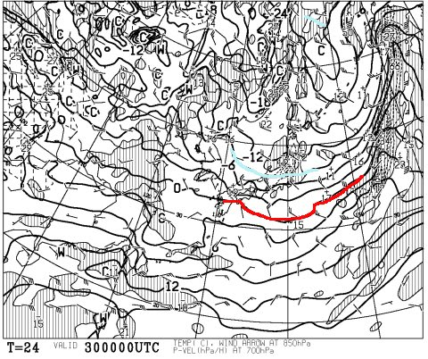
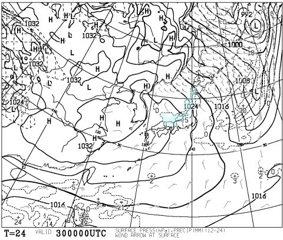
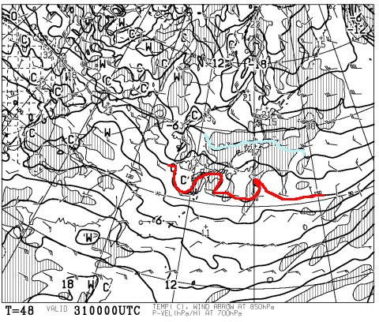
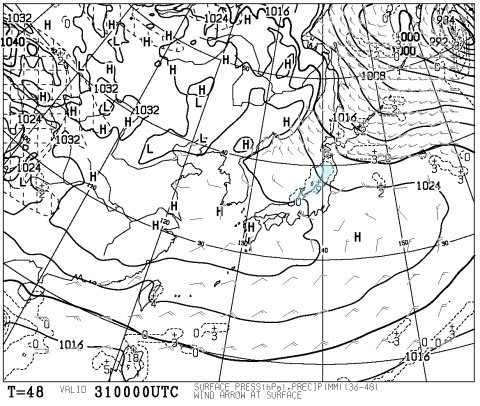
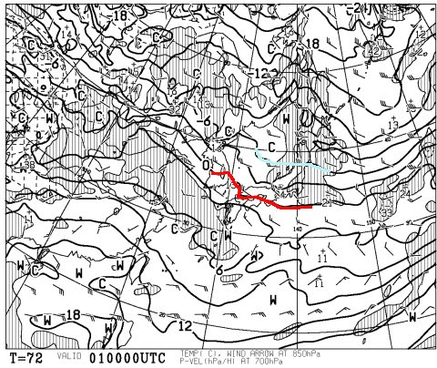
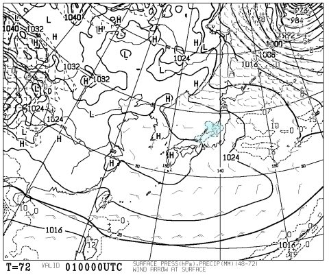
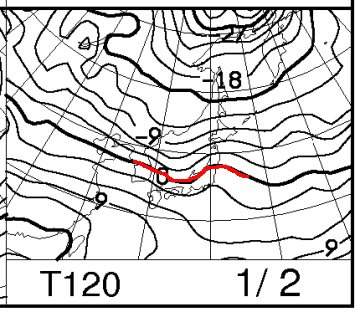
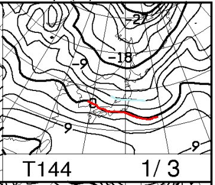
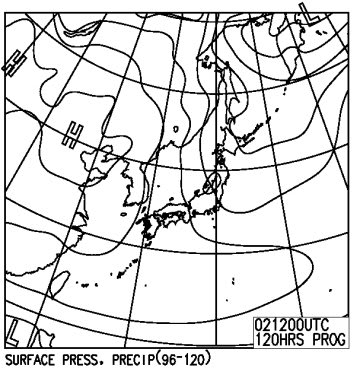
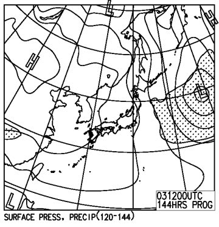

# この年末年始のスキー場の天気は？雪は積もるのか？パウダーデーはいつ？

📅 投稿日時: 2016-12-29 23:53:41

ということで．

明日から長期にわたり志賀高原に滞在予定の

Skier_Sです．

皆さんの気になる，年末年始の天気予想．

どどどっと行きましょうか～．

えー．

とりあえず．

今のところ．

明日30日は，朝はドカドカパウダーっぽいですよ～！！！！

今晩ガンガン降っているので．

30日の朝イチはパウダーねらい目ですよ～！！

30日の850hpa気温図は…

うむ．

水色の-9℃線が志賀より南に下がってそうなので．

朝の山頂は，-12℃レベルです．

冷え冷え最高のパウダーが楽しめそう！

地上天気図はこんな感じの冬型なので．

日本海側に，水色の降水エリアが予想されており．

この日は朝のうちまで20～30cmの積雪があります！

ただ，午前中で雪は弱まり，午後は西風になりそうなので，

午後は志賀高原は晴れ間も見えるかな～．

で．大晦日．

31日ですが…

この日も，赤くマークした0℃線ははるか南．

信州は水色で示した-6℃線と，-3℃線の間くらいなので…

30日ほど冷え冷えではないけど，十分な冷えですね．

地上天気図は…

一見，冬型が緩みそうですが．

日本海側に水色で塗った降水域が予想されているので．

朝にかけてうっすら積雪があるかも？

まぁ，ごくわずかです．

この日は一日，チラチラ雪がぱらつくことも

あるかもしれないけど，西風なので．

曇り時々晴れ間も，といった感じでしょうか．

そして．

元日．

850hpa図はこんな感じで．

大体大晦日とおなじかんじでしょうか…

朝イチは-7～8℃程度かな．

地上天気図はこんな感じなので．

うーむ．

高気圧に覆われて晴れそうですが．

日本海側に水色の降水域が予想されてます．

これは，おそらく大晦日の夜に降る分かな．

このままの天気図だったら，1日は晴れそうな予感！

上手くいけば，初日の出が拝めるか…

で．

続く2日，3日は．

うーむ．

2日は赤い0℃線はぎりぎり志賀高原近辺．

2日はちょっと気温が上がりそう…

ちょっときわどい気温ですね．

でも，3日はこんな感じで．

赤い0℃線ははるか南に下がるので．

また冷え込みは戻ってきます．

地上天気図は，2日はこんな感じなので．

降水域は長野にはかかっておらず．

まぁ，気温が上がっても降ることは無く．

雨の心配はいらないかな…

3日はこんな感じで．

ちょっと冬型になるので，今のままの

天気図なら，少し積もる程度の雪になるかも…

ってことで．

まとめると．

30日：朝は冷え冷えパウダー！非圧雪コースは

　スネパフ程度のパウダー！

　圧雪コースは，柔らかい圧雪の上に5～10cmパウダー．

　冷え冷えの最高雪質！

　朝まで強めに雪が降るけど，昼に向かって弱まり，午後は日も射すか？

　午後はコースがかなり荒れ荒れ凸凹になりそう…

31日：朝にかけてうっすら積もる程度の雪．

　朝イチは雪も止んで，気温も冷えて，最高の圧雪！

　この日は時折雪がぱらつくかもしれないけど，

　基本的に曇り，時々晴れ．

　昼間も気温はマイナスキープで雪質心配なし．

　30日ほどではないけど，午後はやはり凸凹が出てくるか…

1日：志賀高原は，朝は晴れている可能性大！

　天気図の予想が変われば，曇りか…

　朝イチは-10℃より高めだけど，いい感じの圧雪．

　晴れれば最高かっ飛ばしバーンで初滑りが

　できそう！

　昼間も気温が上がらず，マイナスキープ．

　雪質は心配なし．

　天気は終日，晴れ～曇り程度．

2日：微妙…気温が結構上がる．

　朝から雲が多いけど，雨が降るほどではない．

　午後から少し湿った雪が降り始めるか…

3日：朝イチは-10℃より高め．天気は雪がぱらつくか…

　終日気温はマイナスキープで雪質は心配なし．

　今の天気図のままだと，曇り時々雪，

　雪はそれほどドサドサ積もるほどではない感じ．

…といった感じでしょうか．

今のところ，30日しかドサドサパウダーが

期待できないのがちょっと残念だけど，

まぁ降ったりやんだりの天気が続くし．

気温も平年並みで，昨シーズンのような

雨や雪が解けちゃう異常高温もなさそうだし．

普通のいつもの年の年末年始，といった感じの

天気になりそうで．

とりあえず，一安心かな～．

では，これから3時間半後に出発です～！

＃また，睡眠時間が…（涙）．

## 💬 コメント一覧

### 💬 コメント by (こじろう)
**タイトル**: 本日 12/30
**投稿日**: 2016-12-30 07:21:53

Skier_S様

本日お会いできるのを楽しみにしていましたが実家で所用がありがとう滑らず帰ることになりました。今も雪が降っていますね。どうぞ朝イチパウダーを楽しんで満喫されて、良い年をお迎えください。来年もブログ、楽しみにしております。

### 💬 コメント by (Skier_S)
**タイトル**: こじろうさま
**投稿日**: 2016-12-30 22:14:10

ああ…

今日はいらっしゃらなかったのですね．

お会いできなくて残念です…

朝イチオリンピックコースは良かったですよ．

また，次の機会に！

良いお年を…

