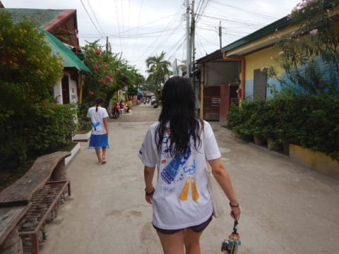

# 2019年8月，4度目のモアルボアル・小6の娘Cカード取得1周年！その33…モアルボアルラストナイト

📅 投稿日時: 2020-09-22 00:24:05

🏷️ カテゴリ: [ダイビング日記](ce3a7a8d424d112fce83ee85c81a0e344.md)

えー．

4連休の本日．

前半2日は天気が悪く，家で仕事をしてましたが．

本日はようやく，数週間ぶりに晴天の休日に

なりそう…っ！！

ということで．

前半2日で仕事も一区切りついたので．

今年初の山登りへ行ってきました～！！

…でも．

シーズン初に行く，リハビリの山としては

厳しすぎた…

これ，落ちたら死ぬよね！？？

という鎖場が次から次へ．

…この岩も，わかりにくいですが，

鎖を使って登らないといけなくて．

もう，体中が傷だらけです．

あそこのてっぺんまで行ってきたとは，

にわかに信じがたい…

景色が良かったので，楽しめたけど．

かなり怖い山登りでした…

また後日，レポートするかも…

ということで．

本日は山登りをしてきたので，焼額スキー場の

歴史の記事を書く暇がなく．

今日も書きためておいたダイビング旅行記です…

では，どうぞ～！

ーーー

3本潜った後の遅めのお昼ご飯を

食べ終わったのが，午後3時．

午後4時に，ログづけ＆器材回収で

ショップに立ち寄る予定ですが．

まだ1時間ほどあるので．

ちょっとぶらぶらしてみますか…

昨日の夜ご飯を食べたイタリアンの

お店は，ここですね．

「Cafe Gebuano」

周りはこんな感じのところです．

さらに，海沿いの道を進んで…

お土産屋さんエリアを抜けると…

こんな壁画があるエリアがあったり．

ちょっと戻って，さらにいつもの

ダイビングショップを通り抜けて．

さらにぶらぶらと歩いてみますが…

ダイビングショップやカフェや

レストランがある程度で．

特にこっちのエリアには，お土産屋さん

とか，そういうのはなさそうですね…

…ってことで．

1時間ほど歩くと，もうショップの

集合時間．

ショップで，今日のログづけをやった後は，

ダイビングフィーの清算をするわけですが…

えー．

何度でも書きますが．

フィリピンのダイブ料金，かなり安いです．

フィリピンのダイビングショップで

よくある，ぺスカドール島に行く場合は

追加料金が必要になり，それが結構な

出費になるパターンがありますが…

このエメラルドグリーン，モアルボアル店．

なんと，遠征追加料金がありません．

ハウスリーフでも，ぺスカドール島でも．

さらに，一日何本潜っても，税込み1ダイブ1750ペソ．

3500円強です…！！

1日2本潜って7000円ちょいなんですが…

さらに，リピーター割引で．かなりの

割合を引いてもらえるので．

リピーターなら，

「え？1日3本潜ってこのお値段？？」

という．

…端的に言って，沖縄の半額です．

…そして，モアルボアルのカバナリゾート．

2人部屋のルームチャージが1泊1万円くらい．

小学生添い寝で3人で泊まれば，一人3333円…

それで，現地の食費やら何やらが圧倒的に

安いんですから…

ということで．

パラオや沖縄に行ったときは，

ダイブフィーの清算料金を見て

「うぐぐぐぐ…しばらくご飯を抜いて水だけで

　生きていかないといけないな…（涙）」

となりますが．

モアルボアルだと

「うーん．これだけ潜ってこのお値段なら，

　納得…」

って感じです…

ってなことで．

清算している間，動物好きの娘は，

ダイブショップのトイプードルちゃんと

ひたすら遊んでましたが…

　

そろそろ遅くなったので，

干してあったダイビング器材を

回収！

ホテルまでは，スタッフが担いで

運んでくれます…

ありがとう…スタッフさん．

ホテルに戻ったら，

今日は曇り空だったので，

まだ乾ききっていない器材を

部屋の前に広げて干すわけですが…

この時点で，もう午後6時過ぎで

日が暮れちゃってます．

明日は帰りの飛行機が午前中の便で．

ホテル出発が早朝（深夜？）3時という

とんでもなく早い時間なので．

今日は外に食べに行かず，

ホテルの中のレストランで食事に

しましょうか…

いつも朝食を食べる，このホテルのレストラン．

意外とかなり本格的なイタリアン．

こいつはポークだったかな…

こいつはリングイネのアラビアータ．

ソースが本格的で，ゆで方もアメリカンな

グダグダの茹で方じゃないので．

アメリカで食べたやつよりよっぽど美味い…．

そして．

イタリアンなのに，なぜかパッタイを頼む

わが娘…

おまえ，それタイ料理だよ…

ってなことで．

気持ちよい風が吹き抜けるテラス席で，

日が暮れ行く海を見ながら．

ラストナイトの夕食をゆっくりと

楽しんで．

食後は，明日の朝も早いから，

速攻で布団に入った，わが一家

だったのでした…
