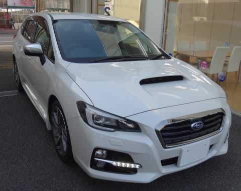
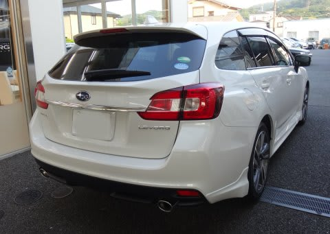

# LEVORG 1.6GT-Sと2.0GT-Sに試乗してみた…1.6GT-Sインプレッション編

📅 投稿日時: 2014-05-31 22:06:54

🏷️ カテゴリ: [車試乗](c07dec5709d34bd74e1f6cb9c8291061b.md)

ということで．

年初めから大々的に先行予約が開始され．

6月に納車が開始されるらしい，レヴォーグですが．

本日，試乗車が出たようなので．

さっそく乗ってきました…

それも，1.6GT-Sと2.0GT-Sの両方とも，

乗ってみましたので．

そのインプレッションをば…

SUBARU LEVORG 1.6GT-S 

基礎オールラウンド（なんのこっちゃ？）

えー．

内装的には，まぁこんな感じかな～，

といったレベルの仕上がり．

シートは結構よくできてるのが印象的！

で．

とりあえず，走り出した感じ，

アクセルペダルに対する実スロットル開度を

ちょっと大きめにしているのか，最初の出だしは

そこそこの軽快さ．

ターボラグも感じられず，回転数の立ち上がりとともに

1500RPM位から十分のトルクが出てきて．

…言われなきゃ，1.6リッタターボってわからんわ…

街乗りのアクセル開度がそれほどない領域では，

完全，NAの2.5Lと勘違いできるフィーリングです．

いや，むしろ．

アクセル開度の大きい領域では，低い回転数での

トルクが2.5LのNAより太い感じ．

1500～2500回転くらいまでは，LEVORGの方が

レガシィより軽快に感じますね～．

ただ，2500回転を超えてもトルクが盛り

上がっていかないので．

回転数の伸びとともに，加速感が伸びていく

感じは無く．

「あれ？ちょっと伸びが足りない…」

って思います．

いや，これは．1500回転ちょっとで十分な

トルクが出てしまうので．

その結果として，それ以上の伸びを感じないってだけで．

実際のトルクは十分なんです．

おそらく，1.6Lの非力さを訴える人は，

2000回転を超えて回転数が伸びていく領域で，

加速度がさらに増えていく感じがないという，

加加速度（速度2階微分）の低下感を

指してるんじゃないかな～．

実際は低速でトルクが出て，低い回転から

かなりの加速度が出てることによる錯覚

なんですが．

とりあえず．

このエンジン．

1.6Lと考えればかなりのエンジンです．

低回転アクセル開度大の領域では，2.5L以上の

トルク感を感じます．

町乗りで一番使う領域の回転数での最大トルクは，

2.5Lより太く感じました．

車の静粛性，ロードノイズは，2.5LのBRレガシィと

ほぼ同等かな．

街乗りでは，そこそこの静かさです．

ステアリングフィールも2.5LのBRレガシィと全く

同じ感じ．

そこそこよくできた電動パワステで，

フロントタイヤのインフォメーションが

ステアリングを通じてきちんと伝わってくる感じ．

ただ，試乗したのはGT-Sモデルで，ビルシュタイン

ダンパーのはずですが．

サスペンションは結構柔らかめのセッティング．

レガシィのノーマルグレードに近いぞ…

そして．

突き上げを食らった時のわずかなフロントサスのばたつき感，

ブッシュ容量の大きさを感じさせるタプタプ感があり，

ダンピングが一発で決まらない感じがあるところも，

BRレガシィE型のノーマルグレードに近い．

うーむ．

ここ，ちょっと惜しいっ！

って感じで．

パワー感や，サスのセッティングの方向性，

完成度などは，価格帯が同じのBRレガシィ

2.5Lと極めて近い…

というか，そっくりな乗り心地の車でした．

Eyesight ver.3のレーンキープアシストを

試せる状況がなかったのが，残念っ…！

って感じで．

2.0 GT-Sのインプレッションは，また明日…
