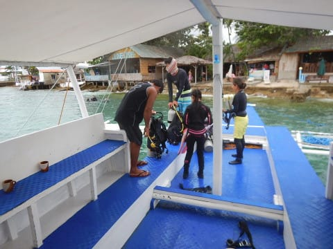
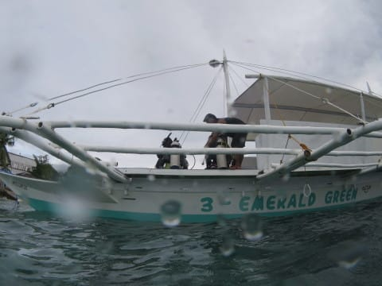
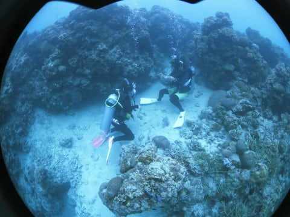
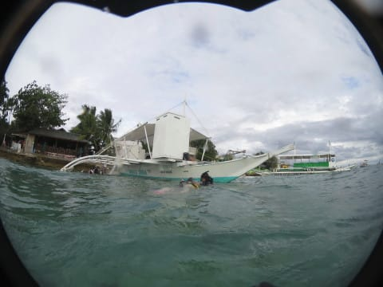
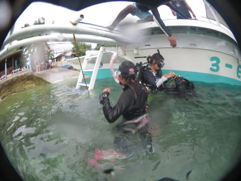

# 2018年8月，モアルボアルで小5の娘をダイバー化！その9…午後の後半は，娘の海洋実習に着いて行ってみた

📅 投稿日時: 2019-07-18 02:00:59

ってな感じで．

本日予定していた，3本のファン

ダイビングが終わり．

ボートはショップ前に戻ってきた

わけですが…

ファンダイブ組の皆さんは

下船しますが．

娘はまだ1本，海洋実習が残っています…

ここで，娘の実習をしてくれている，

インストラクターのアサミさんから，

「ショップで娘さんが終わるのを

　待ってるのもなんなので，一緒に

　海洋実習に着いてきますか？」

という，大変ありがたいお誘いを

受けたので．

…ここは二つ返事で，娘の海洋実習に

着いていくことにしました！

ってなことで．

ファインダイブ組がみんな下船した後．

娘とアサミさんで，次の実習の

内容を確認しているところを

見てみますが…

小学生の娘にも，実習でやることを

分かりやすく説明していただいている

ようで．

…このあたり，完全マンツーマンでの実習

ならでは．

1対1で，分かるまでしっかり教えてくれてます．

実習内容の確認が終わったら．

また，器材のセッティングを

やって…

もう，さすがに講習中なので，

基本に忠実に，

残圧計の破裂に備え，タンクの

バルブを開ける時は，ちゃんと

残圧計を向こう側に向けて

開けてますね…

ってなことで．

器材セッティングが終わったら，

私にとって，本日4本目のダイビング．

娘にとっては2本目の海洋実習の

エントリー！

ポイントは，ショップ前から10mほど

離れただけの場所．

…そうです．

ここがいつものイワシポイントなんです．

ってなことで．

ボートの端っこから，バックロール

エントリー！

…海洋実習から，バックロールってのは

レベルが高い気が…（笑）．

そして，実習スタート！

まずは，エア切れを想定した

緊急スイミングアセントの練習．

沖合のボートの係留ロープに沿って，

エア切れを想定しての浮上練習．

私は浮上するわけにいかないので

下から見守りますが…

息を吐き続け，

かつ浮上速度が早くなりすぎないよう，

コントロールしながら浮上して

いきます…

水面まで浮上したら，スイミングアセントの

練習終了！

また潜行してきて…

今度は浅瀬での項目なので，

一旦浅瀬へ移動．

完全にマンツーマンで，

いろいろ丁寧に実習をやって

くれてます…

私がCカードを取った時は，

4人くらいで実習を受けたので．

ここまで丁寧にやってもらった

思い出はないなぁ…

次は中性浮力の練習のようですが．

をを．

最初はなかなか上手くいかないピボット．

わが娘，一発で決めたようです．

そのあともなんだかいろいろ

実習をやっていましたが…

次は，深いところにやってきて，

中層でも中性浮力が取れる

ことを確認したら…

今度はフィンキックしても，深度を

変えずに水平に泳げることを

確認しているのかな…？？

ってな感じで．

どうやら，一通り講習が終わったのか．

残る時間は，ファンダイブで楽しむようです．

…でも．お前．

なんだか，海洋実習2本目にしては，

えらく安定した姿勢で泳いでるな…

しかし．

娘よ．

お前は，どれだけゼイタクな海で

海洋実習しているか，分かってるか？？

普通は，こんなイワシの大群を見ながらの

海洋実習って，ないからな！！

マンツーマンだし，ポイントは

朝にジンベエザメだって出た，

イワシポイントだし．

なんてゼイタクな海洋実習だ！！

…ってな感じで．

最後はまた浅瀬に戻ってきて…

今度は，オクトパスブリージングでの

浮上の練習のようです．

自分のレギュレータを外して，

インストラクターからの予備空気源を

もらって呼吸しながら…

二人一緒に，浮上！

無事浮上したところで，

本日の海洋実習，終了！

お疲れ様でした～！

エグジットしたのは，ショップの

目の前だったので．

ショップに係留されているボートに

一旦上がって．

最後は，また器材の片付けの練習．

そうそう．

ファーストステージのダストキャップを

忘れないようにね！

で．

このあとは，ショップへ戻り．

引き続き，本日の復習です…

まだまだ娘の本日の講習は続きます．
