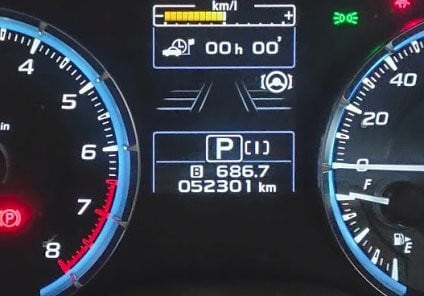

# VMG LEVORGで2シーズン，計32000km走ったスタッドレスタイヤ，YOKOHAMA iG5+はどのくらい減ったのか？

📅 投稿日時: 2020-05-03 01:07:25

ということで．

[一昨年の7月に購入](ecdca7ac058e50b9e3a2a3ae04e18b623.md)し，そろそろ1年9か月が経った

わがVMG LEVORG君．

走行距離は早くも52,000kmを超えた

わけですが…

でも．

すごく走ってるように見えますけど，

コロナ騒ぎのおかげで，この4月に入ってから

ほとんど走ってないため，普段と比べると

かなり走行距離が少なくなってます…

（順調にいけば，このGWまでに56,000kmは超えている予定だった…）

ってなことで．

[前回の記事](ec93897ef6cf7eeb86337bc866039674b.md)で交換を報告した，

2シーズン履いたスタッドレスタイヤ，

YOKOHAMAのiG-5 Plus．

このタイヤでの走行距離は，

1シーズン目の昨シーズンは，18,000km．

2シーズン目の今シーズンは，14,000km．

…今シーズンはコロナ騒ぎでスキーに

行けなかった分，走行距離が短くなってますが．

計32,000km走ったスタッドレス，

どのくらい減ったのかな？？

まず，負荷の高いフロント側から見てみると…

あれ？

アウト側，まだかなりプラットフォームまで

残ってますね…あと3mmくらいはありそう！

減りの早いイン側も…

え？これならまだ使えますよ！？？

まさか，負荷の高いフロント側で，

私が2シーズン履いてここまで残るとはっ！！

で，次にリア側を見ますが…

え？

リア側の方が減ってる？？

イン側はあと2mmあるかないか…

ただ，アウト側はもう少しありそうですね．

…このリア側のタイヤ，昨シーズンはフロントに

履かせていたので．

昨シーズンの方が4000kmほど走行距離が多いとなると，

今シーズンリヤに履いていたタイヤの方が

減りが早いのは当然

うーん．

このまま来シーズン，最初の10000kmを，

前後を今から入れ替えないまま履いて，

残りの距離，おそらく5000～7000kmを，

前後入れ替えて履けば．

ギリギリあと1シーズンもつかも…？？？

最後のGW付近に，本格ツルツル凍結路に

なったら，ちょっとヤバそうな感じだけど…

でも．

例年なら2シーズンで4万km近く走る我が車．

大体2シーズンでスタッドレスは死んじゃうけど．

[前回もYOKOHAMA iG-5 Plusは3シーズンもった](e055b5b744b654941d93c40de1fad1b0b.md)し．

今回は少な目の32,000kmとはいえ，パワーのある

VMG LEVORGで，3シーズンいけそうなくらい

もつとは…！！

うむ．

YOKOHAMA iG-5 Plus．

40,000kmくらいは余裕で走れる，

結構ライフが長いタイヤのようです…

志賀高原の上り下りも問題なくこなすし．

[かなりの雪でも問題なく脱出できる](e2abed604f2e4f1dccb1bb27fc362dfec.md)し．

[燃費も悪くない](cba0e8330b3f2ded7c1addfacc75d4547.md)し．

寿命も長いとくれば．

…これ，結構いいスタッドレスなんじゃないかな？

## 💬 コメント一覧

### 💬 コメント by (Goku)
**タイトル**: ＢＳは減りすぎ
**投稿日**: 2020-05-03 20:17:16

私のＶＲＸは過去のブリザックの中でも一番減るのが早い気がします。

２年10000ｋｍなのに、アイスガード32000ｋｍと同じ程度しか残っていません・・・

ずっとブリザックですが、次はアイスガードを真剣に考えてみます。

### 💬 コメント by (m&t)
**タイトル**: Unknown
**投稿日**: 2020-05-03 20:26:28

Sさん

お久しぶりです。ＧＷ明けの横手山渋峠に奇跡的希望を持っていましたが残念無念です。

我が家はIG SUV 075です。年間走行距離2万キロのうち半分以上が冬道ですが、4シーズン持ちました。残り溝1ミリでした。

今までずっとスタッドレスはBSでしたが、性能とコスパのバランスはＹＨの方が上ですね!

ホームアサマ2000のチェリーパークラインはカリカリのブラックアイスバーンの時がありますが、安心して走っていけます。スキーと一緒で、ずらしのコントロールがし易いのだと思います。

高速でも柔らかいBSよりもYHの方がコシがあり安定して走っていけます。

来シーズンは皆さんに遅れずについて行けるように、オフシーズンもトレーニングします。

今はじっと我慢ですが、来シーズン皆様とお会い出来る日を楽しみにしています。

### 💬 コメント by (ほっぽ)
**タイトル**: IG50+
**投稿日**: 2020-05-03 23:16:05

Ｓさん

アイスガードはIG50+になって性能とライフが更に一段向上したと

知り合いの北海道スキーヤーさんがインプレしていました。

やはり、長持ちするようですね。

我が家のアルハイ＋VRXは1シーズンでフロントの減りが激しく、

前後入れ替えて2シーズンといった感じです。

走行距離は7000kmでした。

Ｇｏｋｕさんの仰る通り、VRXは減りが早すぎだと思います。

VRX2になってライフが改善されたと聞いています。

そして、タイヤの減り方も割と均等ですね。

ＢＰレガシィの時は、フロント内側の減りが激しかったです。

ゴルフは前後、内外の減りがほぼ均等で、ＦＦベースの四駆にしてはバランスがいいなぁと感じました。

私も次は型落ち新品のIG50+にしようかと思っています。

Ｇｏｋｕさん

チャーリーさんがIG50+を北海道で使っていて、満足されていて

車を買い替えてもまたIG50+を使っています。

北海道のアイスバーンでも安心して使えるそうです。

### 💬 コメント by (Skier_S)
**タイトル**: iG5は減りが遅めです…
**投稿日**: 2020-05-04 01:06:00

＞Gokuさま

VRXは減るみたいですね～．

同じような発泡ゴム構造でも，YOKOHAMAは長持ちするのかな…

とりあえず，私は普段なら冬の走行距離が2万km弱と

半端じゃないので，もし1万kmで半分以上減っちゃうとすると，

我が家では2シーズンもちませんね（涙）

＞m&tさま

冬に1万km走って4シーズンもつなら，かなりのロングライフのタイヤですね…

で．

5末までの緊急事態宣言延長，残念ながら渋峠の復活はなさそうですね（涙）

来シーズンには，ぜひヤケビ朝礼メンバーの爆走に参加してください！

＞ほっぽさま

私も前はiG20を履いたことがあるのですが，iG20は

寿命は極めて普通でした…

しかし，VRXは7000kmでアウトですか！？？

アルハイは車重が重いから，タイヤ負荷は高いと思いますが，

それにしてもかなり厳しいですね．

私も今まで何種類かのスタッドレスを履きましたが，

iG5+はスタッドレスで長距離を走る人にとっては，

かなりコストパフォーマンスが高いタイヤだと思います…

### 💬 コメント by (いか)
**タイトル**: Unknown
**投稿日**: 2020-05-05 01:51:33

VRXの減りの早さは車重もきいているのでしょうか、、、？　私のVMGでは3シーズン35,000kmでちょうどPFが出るかどうか、という感じです。すぐなくなる、と言われている割には頑張った印象です笑　

ただ、今年は夏冬ともにタイヤ新調になりそうな、、、orz

### 💬 コメント by (Skier_S)
**タイトル**: ＞いかさま
**投稿日**: 2020-05-05 04:07:52

え？VRX，VMGでも35000kmもつのですね…！

iG5 PlusもVMGなら4万km程度だと思うので，それほど

大きな差は無いのかも…

しかし，夏タイヤも交換ですか！！

18インチ，高いですよね（涙）

