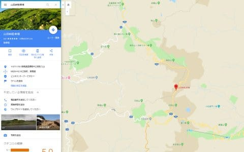
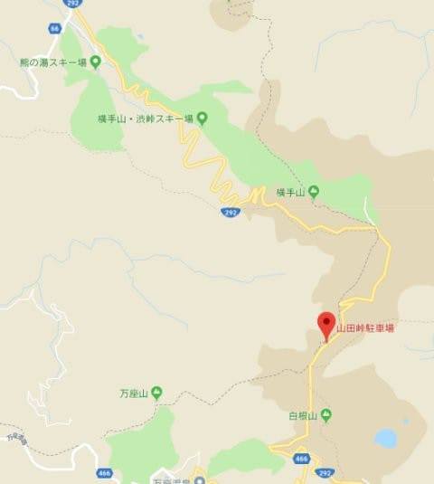
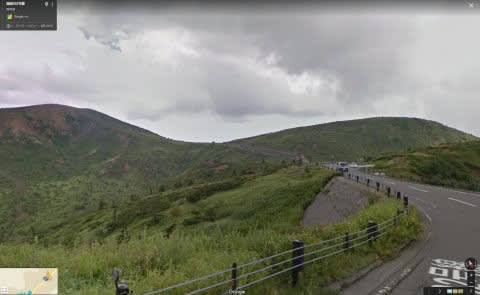
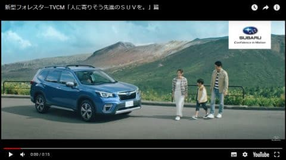
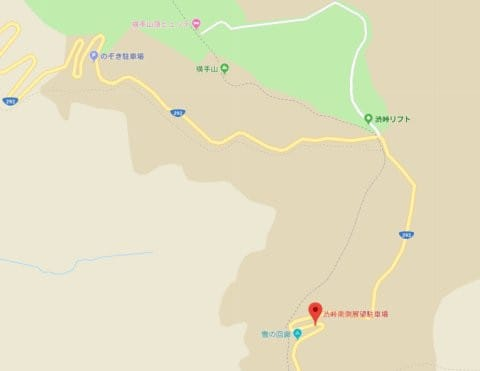
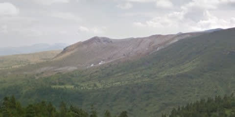

# あれ？新型フォレスターのCMって，志賀高原のそばで撮影したの？

📅 投稿日時: 2018-09-16 18:33:55

🏷️ カテゴリ: [車](cba0e8330b3f2ded7c1addfacc75d4547.md)

えー．

昨日は久々にスキーネタでしたが．

今日は車ネタかスキーネタか，微妙なネタをば…

ってなわけで．

最近発売になった，[新型フォレスター](e2e65af0ff6614f3327d110340b5df5ae.md)．

…焼額の常連さんでも数名，買った方がいらっしゃるという．

まさにスキーにうってつけのこの車ですが．

…本日．

[横手山のホームページ](http://yokoteyama2307.com/index.html)を見たとき．

そこに埋め込まれていた，[横手山Facebook](https://www.facebook.com/yokoteyama2305/posts/1565532150213355)に書かれていたのは…

（横手山Facebookより）

え？？？

山田峠？？

草津越えのときに通る，草津～志賀の間の

あの山田峠？？？

…GW前後に志賀高原に行くとき，いつも通る

通いなれた道で，このCMを撮ったってこと？？

とりあえず．

スバルのホームページから，このCMを改めてみてみると…

（[スバルHP，ムービーギャラリー](https://www.subaru.jp/forester/forester/special/movie.html)より引用）

…これって．

確かに白根火山から渋峠の間で通る

道のような気もする…

ホントにそうか，Google mapで確認してみましょう！！

えーっと．

山田峠って，横手山からすぐの，

ここだよな…

このあたりを，ストリートビューで見てみると…

…確かに，これ，ここだわ！！

…そして．

このCMの一番最初のシーンも…

（[スバルHP，ムービーギャラリー](https://www.subaru.jp/forester/forester/special/movie.html)より引用）

ここからわずかに移動した，ここ．

「渋峠南側展望駐車場」

ここからの景色が…

うん．

間違いない．

最近きれいに舗装されて，確か駐車場の手すりも

こんな形になってたはず…

ってことで．

新型フォレスターのCM．

なんと．

志賀高原，横手山のすぐそばで撮影

されていたようです…！

フォレスターを買った志賀高原常連の方は，

ぜひ聖地巡礼しないとダメですね(笑)．

## 💬 コメント一覧

### 💬 コメント by (Goku)
**タイトル**: Unknown
**投稿日**: 2018-09-16 20:04:47

志賀高原・チームフォレスターのGokuraku Skierです。

いや～全く気が付きませんでした！

明日早速行って、同じ動画をYouTubeにアップしたいと思います(笑)

でも、我が家のフォレスターはe-boxerじゃないんですよ～

### 💬 コメント by (Skier_S)
**タイトル**: Gokuさま
**投稿日**: 2018-09-17 00:44:09

私も，横手山スキー場のFacebookを見るまで

全く気付きませんでした…

指摘されて「確かにそうかも」と確認したら，

確かにその通りでした…

さっそく明日，聖地巡礼ですか（笑）

Youtube楽しみにしてます～！

### 💬 コメント by (もりや)
**タイトル**: Unknown
**投稿日**: 2018-09-17 07:07:06

志賀高原・チームフォレスターの、もりやです(笑)綺麗な景色だなーなんて思っていたら、志賀高原山田峠でしたか〜。夏休みに志賀高原へ遊びに行って山田峠でレジャーシートを広げてお昼を食べましたよ。まさか、この場所がCMで使われていたとは驚きです。

### 💬 コメント by (Goku)
**タイトル**: 聖地巡礼
**投稿日**: 2018-09-17 09:10:44

本日、渋峠のライブカメラで見ると志賀高原は霧でなにも見えません。

紅葉シーズンの天気がいい日に行きたいと思います。

### 💬 コメント by (しんちゃん)
**タイトル**: 聖地動画
**投稿日**: 2018-09-17 11:48:30

聖地動画、楽しみにしています!!(*^^*)

志賀高原の近くと気付く感性・情報収集力が凄い！今流行りのAI技術を凌駕してますね(笑)

### 💬 コメント by (Skier_S)
**タイトル**: 聖地巡礼は，葉っぱが緑のうちに…
**投稿日**: 2018-09-18 02:20:40

＞もりやさま

あ，山田峠，夏休みにちょうど行ってらしたんですね．

まさにそこでCM撮影やっていたようですよ…

私は，てっきり海外で撮影したCMだと思い込んでました…

確かにあのあたり，ちょっと日本離れした景色かもしれませんね．

＞Gokuさま

あら…

聖地巡礼，延期ですか．

残念でしたね…

山の紅葉が始まっちゃうと景色が変わっちゃうでしょうから，早いうちに

リベンジしないと！

＞しんちゃんさま

いや～．

私も横手山のホームページを見るまで気づきませんでしたが…

この時期は，シーズンオープンの情報を早く得ようと，

かなり頻繁にスキー場のサイトを巡回しています（笑）

