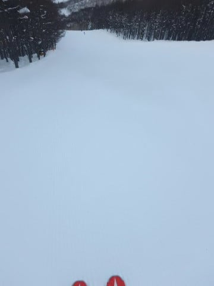
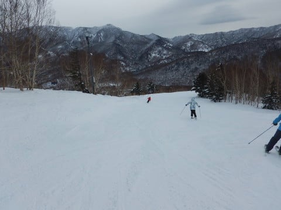
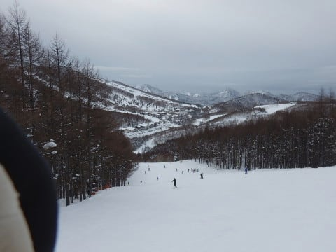
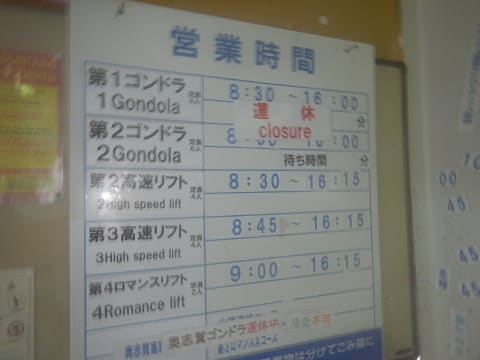

# 1月8日，3連休最終日の志賀高原詳細モード…午前中はゴンドラ運休，午後は雨のダブルパンチの一日（涙）

📅 投稿日時: 2018-01-10 04:16:36

ということで．

昨日速報モードでお伝えした，

3連休最終日の1月8日の志賀高原．

本日は，詳細レポートです！

えー．

まず．

朝，宿から焼額に向かって車を走らせていたとき．

すれ違ったGokuraku Skierさんから

「1ゴン，2ゴンともに止まってます！！」

という悲しい情報が…

ガガガガーーーん

…な，なんということだ…っ！！（涙）（涙）（涙）

すでに4日の段階で

　　焼額第2ゴンドラ，奥志賀ゴンドラは運休の可能性．

と予想していたので．

2ゴンが動かないのは納得できるのですが…

まさか．

まさか，風に比較的強い第1ゴンドラすら止まるとは…！

想定外っ！！

麓にいる分では，そんなに風がありそうじゃないのに…

…とりあえず．

リフトは動いているようなので．

今日は第2高速リフトスタートにしますか…

朝イチは，第2高速リフトはガラガラ．

山頂では，動いてない第2ゴンドラ側に人が

下りないように，

パトロールさんが見張ってます…

で．

朝イチのゲレンデは…

とりあえず，シマシマっ！！

曇り空で，ちょっと気温が高めだけど…

シマシマ圧雪！

人がいない朝イチはいい感じで

シマシマ攻略できるよ！！

だけど…

ゴンドラ運休を知らない人が，一の瀬方面から

いっぱい流れ込んできて．

営業開始30分後には，結構混み始めてきて…

ちょっとリフト待ちが出てきました（涙）

これは，一の瀬から次々人が流れてくるから

第2高速は混みそう…

と，第3高速リフト側の，イーストコースへ逃げてみますが．

ここも10時ごろにはすごい列に…（涙）

うーむ．

一の瀬方面に逃げようかな？？

と，思ったけど．

ゴンドラ運休を知って，多くの人が

一の瀬方面に帰っていったのか…

こういう混雑は，10時過ぎには解消して．

10時過ぎには，結構人が減ってきましたね～．

だもんで，焼額を脱出するのはもう少し

待とう…

と，焼額引きこもりの私としては思ったわけで．

そこでしばらくリフトを滑っていたら…

11時半に第1ゴンドラ営業開始の案内が！

（減速運転だけど）

ふはははは．

信じる者は救われるのだ！

焼額を信じて残っていて良かったのだ！

第2ゴンドラは終日止まるのはやむなしだけど，

第1ゴンドラは動く…と信じていたのだ！←半分以上諦めてたけど

ということで，動き始めた第1ゴンドラに飛び乗って，

山頂へ向かうと…

昼間の第1ゴンドラ山頂の気温は，-2℃ですか…

一応，まだ気温はマイナスのようですね．

そして，焼額は第1ゴンドラが動きだしたけど．

奥志賀は第3，第4リフトとゴンドラがまだ止まったままですか…

（結局奥志賀は終日第1，第2の2本しか動かなかったみたい）

で．

運転開始したばかりの1ゴンで山頂にあがると．

そこには当然，まだ誰も滑っていないシマシマバーンがっ！！

そして，ゴンドラ運転開始を祝福するかのように，

空が晴れ上がってきましたよ！？？？

ふはははははは！

日ごろの行いが良い私のために，

神が祝福してくれたのだ！！

天気が崩れる予報だったところ，

私のために晴れにしてくれたのだ！←絶対違うから

雨予想の日の昼間に，

こんな晴れのシマシマバーンを滑れて，

いいんですかっ！！？？

もう，最高っ！

ゴンドラ運休のため，人が少なくなっていた焼額．

こんなガラガラゲレンデのフラットバーンを，

昼過ぎに楽しめるなんて…

最高！

最高なんですけど？？

そして．

1ゴンメインのGSコースがシマシマじゃなくなった後は．

1ゴンからは行きにくい

2ゴン側のパノラマコースや

白樺コースに行くと…

まだシマシマが楽しめるっ！

素晴らしい！

人が少ないので，3本4本滑っても

まだシマシマが残ってるよ！！

…と．

楽しい快感をむさぼっていられたのも，

1ゴン営業再開の11:30からわずか1時間ちょい．

午後2時ごろには…

あれれれれ？？

いきなり雪が降り始めてきましたよ…

…でも．

まだ雨じゃなく雪だからいいよね…

うん．

液体が降ってくる予想だったのが．

雪になっただけマシだよね…

と思ったけど．

雪はかなりの湿った雪…

というか，麓ではほぼ雨（涙）．

ウエアに着くとびしょ濡れになってしまう，

こんなべちゃべちゃ雪が激しく降り続け．

スキーヤーの戦闘意欲を激しく

失わせます（泣）．

でも．

おかげでゲレンデはがら空きになったから

いいんだい！

ゲレンデを滑っている間は濡れるけど，

ゴンドラが動いているから，ゴンドラなら

濡れずに山頂に行けるんだ！

…と，思っていたところ．

にわかに風が強くなった，午後3時過ぎ．

…へ？？？

1ゴン，再び運休だぁ！？？？（激涙）．

ということで．

「ゴンドラ運休です～」

というパトロールさんの誘導に従い，

リフトの方へ向かいますが…

もう，コース上は強風で飛ばされた木の枝が

飛び散っていて．

そして，空から降ってくるものは，

当たってほしくない予想通りに，

完全に液体と化し（涙）

滑っていても，リフトに乗っていても

びしょ濡れになるような状況の中．

「なぜ，自分はこんな状況の中で滑っているんだろう…」

という自問自答をしつつ．

もうダメだ，次こそラスト1本，

次こそ…

というラスト1本を繰り返しているうちに．

やはりいつもの営業終了まで滑り続けて

しまっていたのでした…

ということで．

ゴンドラ運休→混雑→ゴンドラ運転後の一瞬だけのシアワセ→

再びゴンドラ運休→雨の中リフトで滑り続ける…

という感じの，状況が激しく流転した一日でしたが．

一瞬のシアワセは良かった．

昼間に，日が射したガラガラの最高圧雪を飛ばした

数本．

これだけでも，今日滑った価値はあった…

と，自分に言い聞かせるSkier_Sだったのでした…

## 💬 コメント一覧

### 💬 コメント by (タカ)
**タイトル**: Unknown
**投稿日**: 2018-01-10 19:09:45

雨にも負けず風にも負けずを体現なさってますね。尊敬致します。ラスト一本からの終わらない現象はよくありますよね。あ、12日日帰りで志賀高原に出動しますので、恒例の天気予報に金曜日も加えて下さい←切なる願い(笑)

### 💬 コメント by (かず)
**タイトル**: Unknown
**投稿日**: 2018-01-10 19:33:47

予定どうり木金土日です　少し期待外れの予感が...

### 💬 コメント by (Skier_S)
**タイトル**: 金曜の予想もしてみました
**投稿日**: 2018-01-11 04:36:11

＞タカさま

リクエストに応えて，金曜の予想も

してみました～！

冷え冷えですが，そんなに雪は積もらないかな．

下地のアイスバーンがところどころ出てきそうですが…

＞かずさま

そうですね…

この週末は，パフパフパウダーは期待できず．

せいぜいブーツパフ行けばいいかな，という

感じです…

ブーツパフでも2-3日続けば，

下地の固いのは隠れてくれるんですが．

8-9日の雨のアイスバーンが残りそうな

感じです…

