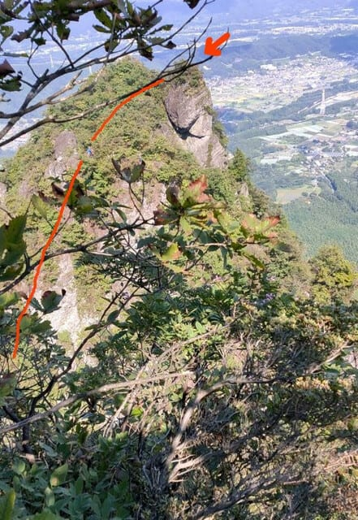
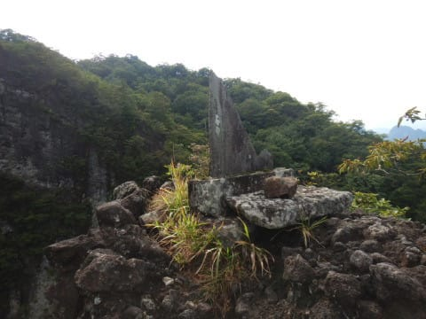
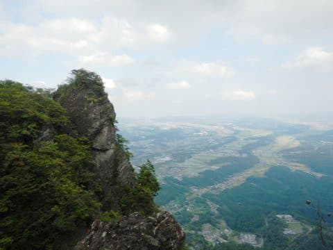

# 上信越道から見える，あの妙義山へ登ってみた，その4

📅 投稿日時: 2020-10-07 03:41:31

🏷️ カテゴリ: [登山・旅行](c1d637a11a25b457ac978d197adbdafc5.md)

ということで．

[前回書いたように](e367b9762221c0ce5ede0fdc3eaabd820.md)．

どうやら，恐怖心を抱かせるに十分な

あそこのてっぺんを超えていかねば

ならないことを知って，かなり

ビビりましたが．

まぁ，行けるところまで行って，

ダメなら戻ろう…

ということで．

この岩場の麓へ向かって進んで行きます…

…すると．

いきなり目の前に現れた絶壁！

…そして．その絶壁に鎖がぶら下がって

いて．

…なんと．上から人が降りてきてます…！！

…こ，ここを登るのかっ！

4人ほどの団体さんが降りてきましたが．

途中の1名，かなり体力が売り切れていた

らしく…

下りの途中で腕が攣ったとか．

降りきるまでに10分ほどかかっていて．

かなり大変な様子でした…

まぁ．

鎖場は降りるより登る方が楽だよな…

ということで．

いざ，恐怖のてっぺんへ！

鎖場の一番下から見上げると…

かなり，高さがありますね…

10mほどの，ほぼ垂直の絶壁．

とりあえず，登る！

よーし．そろそろてっぺんだぞ…

と．

上の写真の，一番上の地点にたどり着いたら…

え？

まだ終わらない？？

まだここからこんなに鎖場が

続くの…！？？

2段目は，1段目より斜度は緩くなった

ものの．

鎖をサポートに足で登るというより，

鎖を腕力で引っ張らないと登れない

レベル．

…そして，この2段目を，上の写真の木の

根っこのあたりまで登ると…

…

…

噓でしょ．

まだこんなに続くのっ！？？？

ということで．

計3段，約30mの鎖場を登り切り…

（登ってる途中は下を見なかったからいいけど，

　登り終わったところから改めて振り返って

　下を見ると…うひゃーーー！怖い！！）　

到着したのは，大のぞき！！

この写真の，矢印部分に到着です！

大のぞきからの景色は…

悪くないんですが…

あ，さっき登っていた天狗岩も

見えますね．

あの絶壁のてっぺんが天狗岩ですね…

あんなところ通ってきたんですね…

でも．

でも．

このてっぺん，すごく狭いし．

石碑の周りも，決して平坦な場所が

あるわけでも無く，落ちそうで

ちょっと落ち着かない感じ…

なので．

早々に大のぞきから先に進みますが…

大のぞきから3分ほどしか歩かない

うちに…

また，岩に突き当たりました．

え？

この先，どこがルート？？

…と．

上を仰ぎ見ると．

やっぱり，この岩を登らないと

いけないのか…（涙）

分かりにくいのですが．

赤い線に沿って，鎖がつけられており．

この岩をてっぺんまで登らないと

いけないようです…（泣）

いや．

もう驚かない．

驚かないぞ！

ってなことで．

ここも20mほどよじ登ると…

てっぺんまでやってきました！

…でも．

もう，なんだかすごい両側が切り立ったリッジ状の

岩の上で．

左はこんなだし．

右も絶景の絶壁だし．

…落ち着かないこと，この上ない．

この岩の上をちょっと進むと…

今度は．

かなり細いリッジを降りる鎖場へ

出ました！

…鎖場のてっぺんで，写真を

撮ってなかったのが残念ですが．

「え？ここ下りるの？？」と必死で，

写真をとる余裕がなかったというのが

真実のところです…

鎖場を降りきったところで，振り返って

写真をとると…

その名の通り，背びれ岩．

左側は絶壁で．

落ちたら果てしなく下まで行きそうだし．

右側も絶壁で…

上りならまだしも，これが下りで，

下を見ながら降りて行かねばならず．

おそらく，この行程で私が一番怖かった

ポイントが，ここでした…（涙）

あぁ，怖かった…

でも．

背びれ岩を降りても，

真横はまだ崖のままだし．

そして．

まだ，あの矢印の尖がった岩の横に

張り付くように回り込んで，

さらに，あの先端まで行かなくては

ならないということを知っても．

もう，驚かないし．

怖いものなどない…っ！！

と，思ったSkier_Sなのだった…

（[まだ続く](edc388bf9f2e70f38f9ba51f88c690b5d.md)）

## 💬 コメント一覧

### 💬 コメント by (Unknown)
**タイトル**: Unknown
**投稿日**: 2020-10-07 13:54:00

怖い！！

ゼッタイ自分には無理です…

### 💬 コメント by (Skier_S)
**タイトル**: ＞Unknownさま
**投稿日**: 2020-10-08 01:10:49

見た瞬間，私も無理だと思いましたが…

「ここまで来たからには，行かずばなるまい」と，進んでしまいました…

背びれ岩の上では，来たことを軽く後悔していましたが，

実際踏破してみると，達成感が半端ない山でした…！

